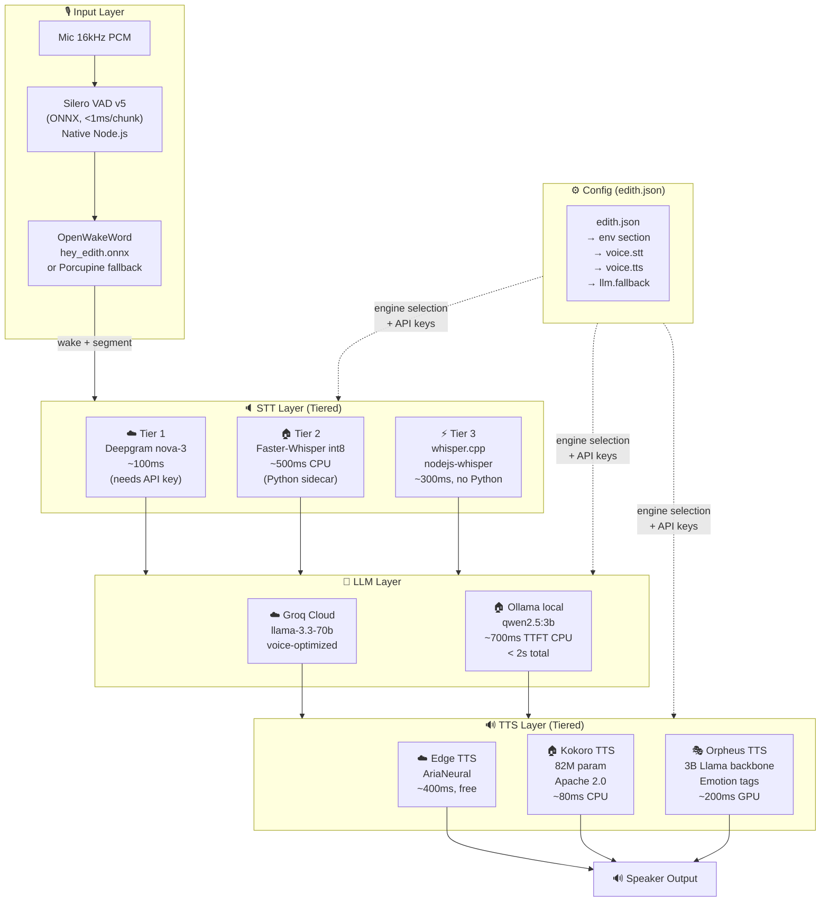
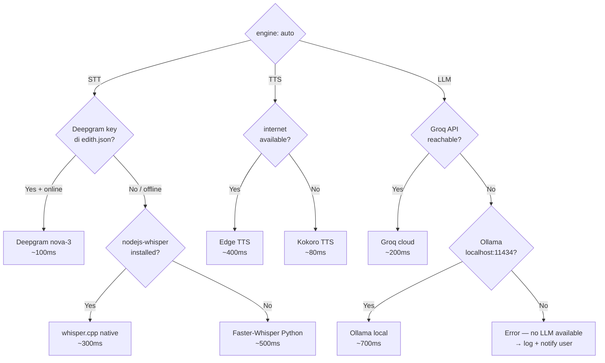
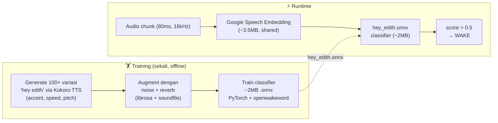
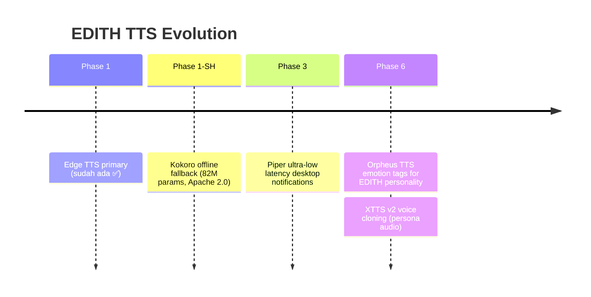
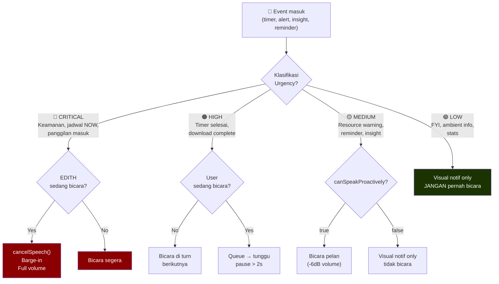
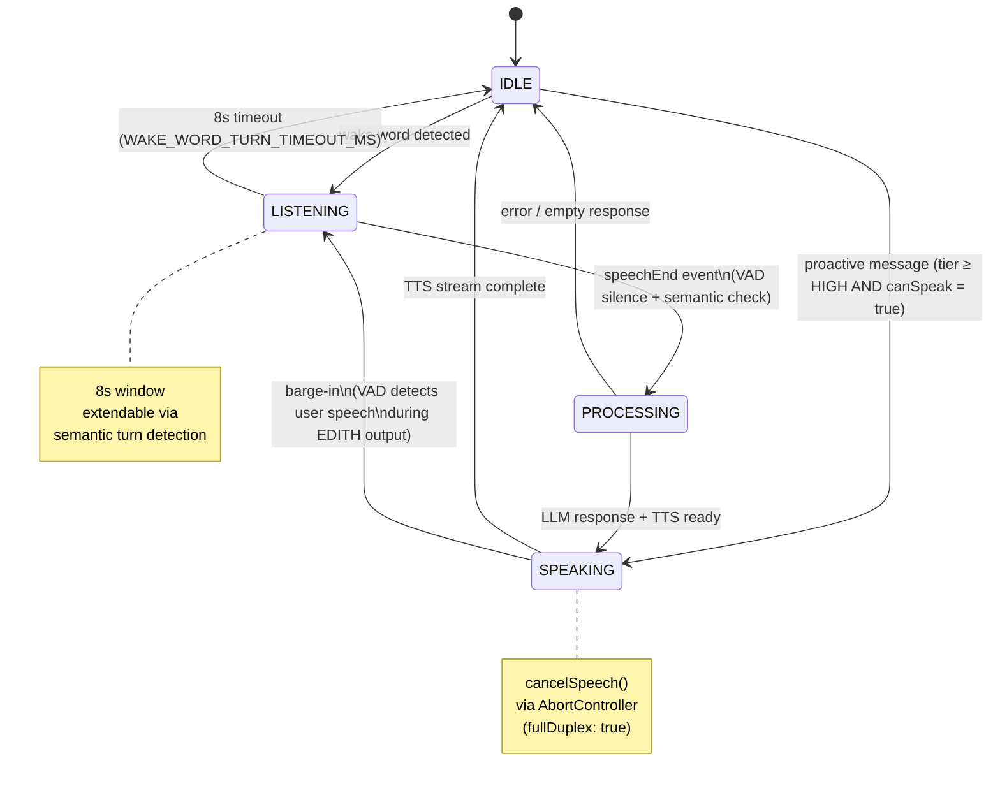
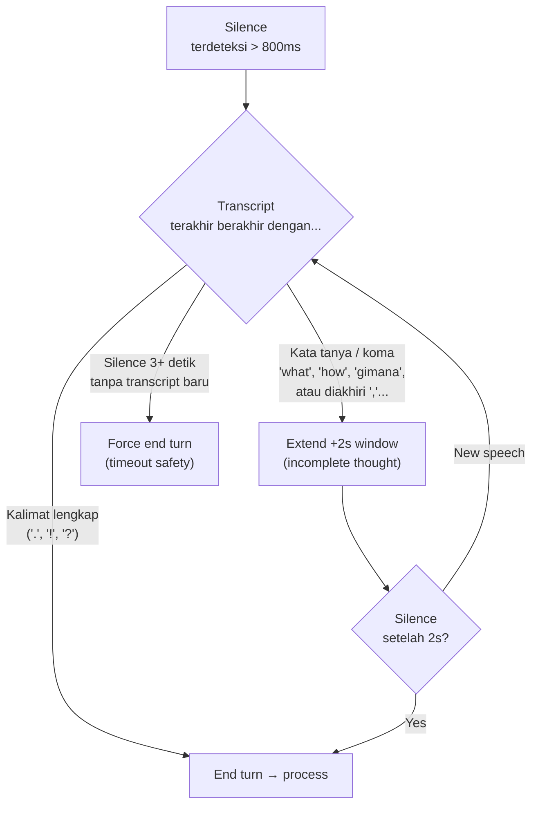
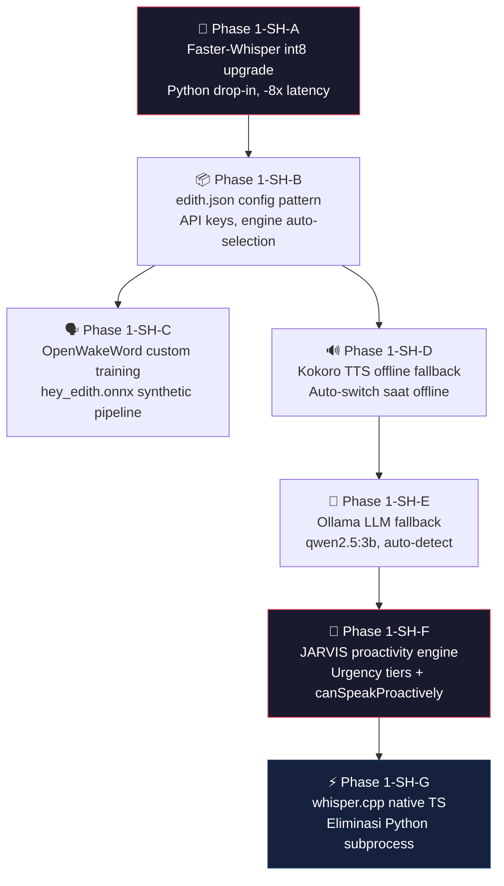

# Phase 1-SH — Voice Self-Hosted Stack & JARVIS Intelligence

**Prasyarat:** Phase 1 selesai (VAD ✅ Wake Word ✅ STT ✅ TTS ✅ Full-Duplex ✅)
**Prioritas:** 🟠 HIGH — Transformasi dari "voice assistant" ke "JARVIS"
**Tujuan inti:** Fully offline-capable, zero cloud dependency, EDITH berbicara proaktif tapi tidak mengganggu

---

## 1. Tujuan

Phase 1 membangun pipeline voice yang *berfungsi*. Phase 1-SH mengubahnya menjadi:

1. **Self-hosted** — setiap komponen bisa jalan tanpa internet
2. **Konfigurasi terpusat di `edith.json`** — bukan `.env` untuk API self-hosted
3. **JARVIS-style proactivity** — EDITH bicara duluan ketika relevan, tidak spam
4. **Latency budget terpenuhi** — end-to-end < 2s pada hardware consumer
5. **Suara & kepribadian** — EDITH punya karakter, bukan asisten robotik

---

## 2. Arsitektur Self-Hosted End-to-End



---

## 3. `edith.json` — Pola Config Self-Hosted

### 3.1 Mengapa Bukan `.env`

| Aspek | `.env` (12-factor) | `edith.json` (EDITH pattern) |
|-------|-------------------|------------------------------|
| Struktur | Flat key=value | Nested JSON + Zod validation |
| Multi-service tokens | Manual naming | Channel-aware auto-mapping |
| Validasi | Tidak ada | Schema validation dengan defaults |
| AI tool context | Tidak bisa di-import | Bisa `@edith.json` di CLAUDE.md |
| Self-hosted endpoints | Scatter di mana-mana | Satu tempat, terstruktur |
| Secrets isolation | File terpisah, gitignore | Section `env` dalam config |

Fungsi `injectEdithJsonEnv()` di `edith-config.ts:456` sudah inject section `env` ke `process.env` saat startup — **API keys dari config langsung jadi env var, tanpa tambahan `.env` file**.

### 3.2 Template `edith.json` untuk Voice Self-Hosted

```json
{
  "_comment": "Copy ini ke edith.json (gitignored). Jangan commit file ini.",

  "env": {
    "DEEPGRAM_API_KEY": "",
    "GROQ_API_KEY": "",
    "PICOVOICE_ACCESS_KEY": "",
    "OPENAI_API_KEY": ""
  },

  "voice": {
    "enabled": true,
    "mode": "always-on",

    "stt": {
      "engine": "auto",
      "language": "auto",
      "whisperModel": "base",
      "providers": {
        "deepgram": {
          "apiKey": "",
          "model": "nova-3"
        }
      }
    },

    "tts": {
      "engine": "auto",
      "voice": "en-US-AriaNeural",
      "kokoroVoice": "af_heart",
      "rate": "-8%",
      "pitch": "-5Hz"
    },

    "wake": {
      "engine": "openwakeword",
      "keyword": "hey-edith",
      "modelPath": "models/hey_edith.onnx",
      "providers": {
        "picovoice": {
          "accessKey": "",
          "keywordPath": "config/hey-edith.ppn"
        }
      }
    },

    "vad": {
      "engine": "silero",
      "modelPath": "models/silero_vad.onnx",
      "speechThreshold": 0.5,
      "silenceThreshold": 0.35,
      "speechPadMs": 400
    },

    "proactivity": {
      "enabled": true,
      "minIdleMs": 30000,
      "urgencyThreshold": "medium"
    }
  },

  "llm": {
    "provider": "auto",
    "model": "groq/llama-3.3-70b-versatile",
    "voiceModel": "ollama/qwen2.5:3b",
    "fallback": {
      "provider": "ollama",
      "baseUrl": "http://localhost:11434",
      "model": "qwen2.5:3b"
    }
  }
}
```

### 3.3 Cara Kerja `engine: "auto"`



---

## 4. Self-Hosted Model Stack

### 4.1 STT: Faster-Whisper (Upgrade Segera)

**Repo:** https://github.com/SYSTRAN/faster-whisper
**Paper:** CTranslate2 — Optimized Inference Engine for Transformer Models

Ganti backend Python di `delivery/voice.py` — **drop-in, 2-8x speedup, akurasi identik**:

```python
# BEFORE
import whisper
model = whisper.load_model("base")
result = model.transcribe(audio_path)

# AFTER — faster_whisper drop-in
from faster_whisper import WhisperModel
model = WhisperModel("base", device="auto", compute_type="int8")
segments, _ = model.transcribe(audio_path, beam_size=5)
result_text = " ".join(s.text for s in segments)
```

**Benchmark (5s audio clip, RTX 3070 Ti):**

| Backend | Latency | VRAM | Notes |
|---------|---------|------|-------|
| whisper (fp16) | ~3.0s | ~2 GB | Current |
| faster-whisper (fp16) | ~1.3s | ~2 GB | 2.3x faster |
| faster-whisper (int8) | ~0.5s | ~400 MB | **8.4x faster, recommended** |
| whisper.cpp (base, CPU) | ~0.4s | 388 MB RAM | Native TS, no Python |
| Deepgram nova-3 | ~100ms | 0 (cloud) | Needs API key |

```bash
pip install faster-whisper
```

### 4.2 STT: whisper.cpp (Native TypeScript, Long-term)

**Repo:** https://github.com/ggerganov/whisper.cpp
**Node.js binding:** `nodejs-whisper` (npm)

Eliminates Python subprocess untuk STT — production target Phase 1-SH:

```bash
pnpm add nodejs-whisper
npx nodejs-whisper download base
```

```typescript
import { nodewhisper } from 'nodejs-whisper'

const text = await nodewhisper(audioPcmPath, {
  modelName: 'base',
  whisperOptions: {
    language: 'auto',   // auto-detect: id / en / etc
    word_timestamps: false,
  }
})
```

**Model size — whisper.cpp:**

| Model | Disk | RAM | WER (English) |
|-------|------|-----|---------------|
| tiny | 75 MB | 273 MB | ~15% |
| base | 142 MB | 388 MB | ~10% |
| small | 466 MB | 852 MB | ~6% |
| medium | 1.5 GB | 2.1 GB | ~4% |

### 4.3 Wake Word: Custom "Hey EDITH" via OpenWakeWord

**Repo:** https://github.com/dscripka/openWakeWord
**Keunggulan utama:** Train dari synthetic speech — **tidak perlu rekam audio sama sekali**.



**Benchmark:** <5% FRR, <0.5 false accepts/hour, <50ms inference, 15-20 models jalan bersamaan di RPi 3 single core.

```bash
# Install
pip install openwakeword datasets torch kokoro soundfile librosa

# Training script (EDITH-ts/scripts/train_wakeword.py)
python scripts/train_wakeword.py \
  --keyword "hey edith" \
  --output-model models/hey_edith.onnx \
  --num-samples 200 \
  --augment-noise
```

### 4.4 TTS: Kokoro (Offline Primary Fallback)

**Repo:** https://github.com/hexgrad/kokoro
**License:** Apache 2.0 (commercial use OK)
**Specs:** 82M params, 24kHz output, ~80ms TTFA on CPU

```python
# EDITH-ts/src/voice/python/tts_kokoro.py
from kokoro import KPipeline
import soundfile as sf
import io

_pipeline = None

def get_pipeline():
    global _pipeline
    if _pipeline is None:
        _pipeline = KPipeline(lang_code='a')  # 'a' = American English
    return _pipeline

def synthesize(text: str, voice: str = 'af_heart', speed: float = 1.0) -> bytes:
    """Returns WAV bytes, 24kHz mono float32."""
    audio, _ = get_pipeline()(text, voice=voice, speed=speed)
    buf = io.BytesIO()
    sf.write(buf, audio, 24000, format='WAV')
    return buf.getvalue()
```

**Kokoro voice options:**
| Voice | Style |
|-------|-------|
| `af_heart` | American Female, warm |
| `af_sky` | American Female, bright |
| `am_adam` | American Male |
| `bf_emma` | British Female |
| `bm_george` | British Male |

**Future TTS upgrade path:**



### 4.5 LLM: Ollama Local Fallback

**Repo:** https://github.com/ollama/ollama
**API:** OpenAI-compatible REST di `http://localhost:11434`

**Model recommendations untuk voice (prioritas TTFT rendah):**

| Model | Download | VRAM | TTFT(CPU) | TTFT(GPU) | Indo support |
|-------|----------|------|-----------|-----------|--------------|
| `qwen2.5:3b` | 1.9 GB | 2 GB | ~700ms | ~130ms | ⭐⭐⭐ |
| `llama3.2:3b` | 2.0 GB | 2 GB | ~800ms | ~150ms | ⭐⭐ |
| `gemma3:4b` | 2.5 GB | 3 GB | ~1.2s | ~200ms | ⭐⭐ |
| `phi4-mini:3.8b` | 2.5 GB | 3 GB | ~900ms | ~160ms | ⭐⭐ |

**`qwen2.5:3b` recommended** — best Bahasa Indonesia support di class ini.

```bash
ollama pull qwen2.5:3b
```

```typescript
// Auto-fallback logic di edith-config.ts
async function getLLMClient(config: EdithConfig): Promise<LLMClient> {
  if (config.llm.provider === 'auto') {
    const groqReachable = await checkGroqHealth()
    if (groqReachable && config.env.GROQ_API_KEY) {
      return new GroqClient(config.env.GROQ_API_KEY, config.llm.model)
    }
    const ollamaReachable = await checkOllamaHealth(config.llm.fallback.baseUrl)
    if (ollamaReachable) {
      return new OllamaClient(config.llm.fallback.baseUrl, config.llm.voiceModel)
    }
    throw new Error('No LLM provider available. Start Ollama or set GROQ_API_KEY.')
  }
}
```

---

## 5. JARVIS Proactivity Framework

### 5.1 Prinsip Dasar

Sumber: Horvitz, E. (1999). "Principles of Mixed-Initiative User Interfaces." CHI '99.

```
Interrupt jika: value(message) > cost(interrupt) + threshold(urgency)
```

`cost(interrupt)` naik ketika:
- User sedang mengetik (keystroke < 30s yang lalu)
- Musik/video sedang main di foreground
- Video call app aktif (Zoom, Teams, Discord, Meet)
- EDITH sendiri sedang berbicara (`isSpeaking = true`)
- Baru 5 menit setelah system wake

### 5.2 Urgency Tier State Machine



### 5.3 `canSpeakProactively()` Implementation

```typescript
// EDITH-ts/src/os-agent/proactivity.ts

const MUSIC_THRESHOLD = 0.3       // audio level 0.0-1.0
const TYPING_COOLDOWN_MS = 30_000 // 30 detik sejak last keystroke
const CALL_APPS = /zoom|meet|teams|discord|skype|webex|facetime/i

export async function canSpeakProactively(
  fusion: PerceptionFusion,
  voiceState: VoiceState
): Promise<boolean> {
  if (voiceState.isSpeaking) return false    // EDITH sedang bicara
  if (voiceState.isListening) return false   // User baru bicara ke EDITH

  const snap = await fusion.getSnapshot()

  // Hard blocks
  if (snap.screen?.activeApp?.match(CALL_APPS)) return false
  if ((snap.audio?.outputLevel ?? 0) > MUSIC_THRESHOLD) return false

  // Soft blocks
  const msSinceKeystroke = Date.now() - (snap.system?.lastKeystrokeAt ?? 0)
  if (msSinceKeystroke < TYPING_COOLDOWN_MS) return false

  return true
}
```

### 5.4 Voice State Machine Full-Duplex



### 5.5 Semantic Turn End Detection

VAD murni sering cut user mid-sentence saat pause. Perbaikan:



### 5.6 JARVIS Phrasing Patterns

EDITH punya suara, bukan announcement system:

```
Tier CRITICAL:  "Sir, [pesan singkat]."
Tier HIGH:      "Apologies for the interruption — [pesan]."
Tier MEDIUM:    "Whenever you're ready — [pesan]."
Proactive ask:  "Shall I [aksi]?" → tunggu konfirmasi ya/tidak
Ambient info:   [volume -6dB, tone lebih pelan]
Koreksi diri:   "[pause] — actually, [koreksi]."
```

---

## 6. Latency Budget End-to-End

```mermaid
gantt
    title E2E Voice Latency Budget (target: < 2s)
    dateFormat X
    axisFormat %s ms

    section Input
    VAD cutoff (end of speech)   : 0, 300
    Wake word processing         : 0, 50

    section STT
    Faster-Whisper int8 (base)   : 300, 800
    whisper.cpp native (target)  : 300, 600

    section LLM
    Groq TTFT                    : 800, 1000
    Ollama qwen2.5:3b TTFT       : 800, 1500

    section TTS
    Edge TTS TTFA                : 1000, 1400
    Kokoro TTFA (offline)        : 1000, 1100

    section Output
    Audio playback starts        : 1400, 2000
```

| Komponen | Cloud path | Self-hosted path |
|----------|-----------|-----------------|
| VAD cutoff | ~300ms | ~300ms |
| STT | ~100ms (Deepgram) | ~500ms (Faster-Whisper) |
| LLM TTFT | ~200ms (Groq) | ~700ms (Ollama qwen2.5:3b) |
| TTS TTFA | ~400ms (Edge) | ~80ms (Kokoro) |
| **Total** | **~1.0s** | **~1.6s** |

Target: < 2s end-to-end **pada kedua path**.

---

## 7. Sub-Phase Implementation Plan



### 1-SH-A: Faster-Whisper Upgrade

**File:** `EDITH-ts/src/voice/python/voice_pipeline.py`
**Impact:** High (immediate 8x STT latency reduction)
**Effort:** Rendah (drop-in replacement)

```bash
pip install faster-whisper
```

**Change:** Ganti `whisper.load_model()` → `WhisperModel(..., compute_type="int8")`.

---

### 1-SH-B: `edith.json` Config Pattern

**Files:**
- `EDITH-ts/src/config/edith-config.ts` → extend `VoiceIOConfigSchema` untuk support `engine: "auto"`, `kokoroVoice`, proactivity settings
- `EDITH-ts/src/core/startup.ts` → panggil `injectEdithJsonEnv()` sebelum voice init
- `docs/EDITH.md` → tambah section "Voice Self-Hosted Config" dengan template `edith.json`

**EDITH.md structure** (bukan `.env`):
```markdown
## Self-Hosted API Keys

All API keys for EDITH go into `edith.json` (gitignored), NOT `.env`.

The `env` section of `edith.json` is injected into `process.env` at startup
by `injectEdithJsonEnv()` in `edith-config.ts`.

### Required for Cloud Features
- `GROQ_API_KEY` — LLM cloud (groq.com, free tier generous)
- `DEEPGRAM_API_KEY` — STT cloud (deepgram.com, 200 min/mo free)

### Required for Wake Word (pick one)
- `PICOVOICE_ACCESS_KEY` — if using Porcupine engine (console.picovoice.ai)
- (none needed for OpenWakeWord)

### Optional Self-Hosted Endpoints
- All local services (Ollama, llama.cpp, Kokoro) auto-discovered via localhost
- No keys needed — just make sure the service is running
```

---

### 1-SH-C: Custom Wake Word Training

**Script:** `EDITH-ts/scripts/train_wakeword.py`
**Output:** `EDITH-ts/models/hey_edith.onnx`

```bash
# One-time training (5-10 menit pada CPU)
python EDITH-ts/scripts/train_wakeword.py \
  --keyword "hey edith" \
  --tts-voice "af_heart" \
  --num-samples 200 \
  --output EDITH-ts/models/hey_edith.onnx
```

Phrasa yang di-generate untuk training:
- "hey edith" (neutral)
- "hey, edith" (pause)
- "hey EDITH" (stressed)
- "hey Edith" (soft)
- Variasi: slow/fast, noise augmentation, reverb

---

### 1-SH-D: Kokoro TTS Offline Fallback

**File:** `EDITH-ts/src/voice/python/tts_kokoro.py` (baru)
**Integration:** `EDITH-ts/src/voice/bridge.ts` → check `tts.engine === "auto"` → test network → pilih Edge atau Kokoro

```bash
pip install kokoro soundfile
```

---

### 1-SH-E: Ollama LLM Fallback

**File:** `EDITH-ts/src/config/edith-config.ts` → extend LLM config schema
**File:** `EDITH-ts/src/core/llm-client.ts` → `auto` provider resolution dengan health check

```bash
# User setup (satu kali)
ollama pull qwen2.5:3b
```

---

### 1-SH-F: Proactivity Engine

**Files baru:**
- `EDITH-ts/src/os-agent/proactivity.ts` → `canSpeakProactively()`, urgency tier enum, `ProactiveMessage` interface
- `EDITH-ts/src/os-agent/voice-io.ts` → integrate proactivity check sebelum setiap `speak()` proactive

**Interface:**
```typescript
// EDITH-ts/src/os-agent/proactivity.ts

export enum UrgencyTier {
  CRITICAL = 'critical',  // interrupt anything
  HIGH     = 'high',      // speak at next turn end
  MEDIUM   = 'medium',    // speak only if idle
  LOW      = 'low',       // visual notif only, never speak
}

export interface ProactiveMessage {
  tier: UrgencyTier
  text: string
  source: string           // e.g. "timer:5min", "system:cpu-high"
  expiresAt?: number       // drop if user busy and this timestamp passes
}
```

---

### 1-SH-G: whisper.cpp Native TS (Long-term)

**Goal:** Eliminasi Python subprocess untuk STT.
**File:** `EDITH-ts/src/os-agent/voice-io.ts` → ganti Python bridge untuk STT dengan `nodejs-whisper`

```bash
pnpm add nodejs-whisper
npx nodejs-whisper download base
```

---

## 8. Dependency Tree

```
Python (existing venv):
├── faster-whisper         # Drop-in Whisper upgrade (1-SH-A)
├── kokoro                 # Offline TTS (1-SH-D)
├── soundfile              # Audio I/O untuk Kokoro
├── openwakeword           # Wake word training (1-SH-C)
└── (onnxruntime sudah ada via silero-vad)

Node.js:
├── nodejs-whisper         # whisper.cpp bindings (1-SH-G, long-term)
└── (onnxruntime-node sudah ada dari Phase 1)

External Services (semua optional):
├── Ollama                 # ollama.com/download — local LLM runtime
└── (tidak perlu install lain — semua self-hosted via localhost)
```

---

## 9. Referensi

| Komponen | Paper / Repo | Notes |
|----------|-------------|-------|
| Silero VAD | [github.com/snakers4/silero-vad](https://github.com/snakers4/silero-vad) | MIT, <1ms/chunk |
| Faster-Whisper | [github.com/SYSTRAN/faster-whisper](https://github.com/SYSTRAN/faster-whisper) | CTranslate2 int8, 8x faster |
| whisper.cpp | [github.com/ggerganov/whisper.cpp](https://github.com/ggerganov/whisper.cpp) | C++ native, Node.js binding |
| OpenWakeWord | [github.com/dscripka/openWakeWord](https://github.com/dscripka/openWakeWord) | Synthetic training, Apache 2.0 |
| Kokoro TTS | [github.com/hexgrad/kokoro](https://github.com/hexgrad/kokoro) | 82M params, Apache 2.0 |
| Orpheus TTS | [github.com/canopyai/Orpheus-TTS](https://github.com/canopyai/Orpheus-TTS) | 3B Llama, emotion tags |
| Ollama | [github.com/ollama/ollama](https://github.com/ollama/ollama) | OpenAI-compatible local LLM |
| Horvitz (1999) | Principles of Mixed-Initiative User Interfaces, CHI '99 | Proactivity cost model |
| RealtimeSTT/TTS | [github.com/KoljaB/RealtimeSTT](https://github.com/KoljaB/RealtimeSTT) | Reference pipeline (Whisper+VAD+WW) |

---

## 10. File Changes Summary

| File | Action | Phase |
|------|--------|-------|
| `EDITH-ts/src/voice/python/voice_pipeline.py` | Upgrade ke faster-whisper int8 | 1-SH-A |
| `EDITH-ts/src/config/edith-config.ts` | Extend VoiceIOConfigSchema (auto engine, proactivity) | 1-SH-B |
| `docs/EDITH.md` | Tambah "Self-Hosted Voice Config" section dengan template edith.json | 1-SH-B |
| `EDITH-ts/src/core/llm-client.ts` | Auto provider resolution + Ollama health check | 1-SH-E |
| `EDITH-ts/scripts/train_wakeword.py` | NEW: OpenWakeWord synthetic training script | 1-SH-C |
| `EDITH-ts/src/voice/python/tts_kokoro.py` | NEW: Kokoro TTS sidecar | 1-SH-D |
| `EDITH-ts/src/os-agent/proactivity.ts` | NEW: Proactivity engine + urgency tiers | 1-SH-F |
| `EDITH-ts/src/os-agent/voice-io.ts` | Integrate proactivity, semantic turn detection | 1-SH-F |
| `EDITH-ts/models/hey_edith.onnx` | Generated by training script | 1-SH-C |
| `EDITH-ts/models/silero_vad.onnx` | Already exists (from Phase 1) | ✅ |
| **Total new code** | | **~600 lines** |
