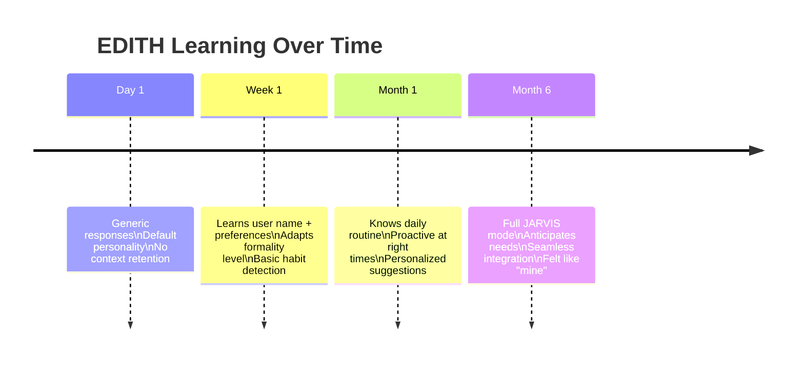
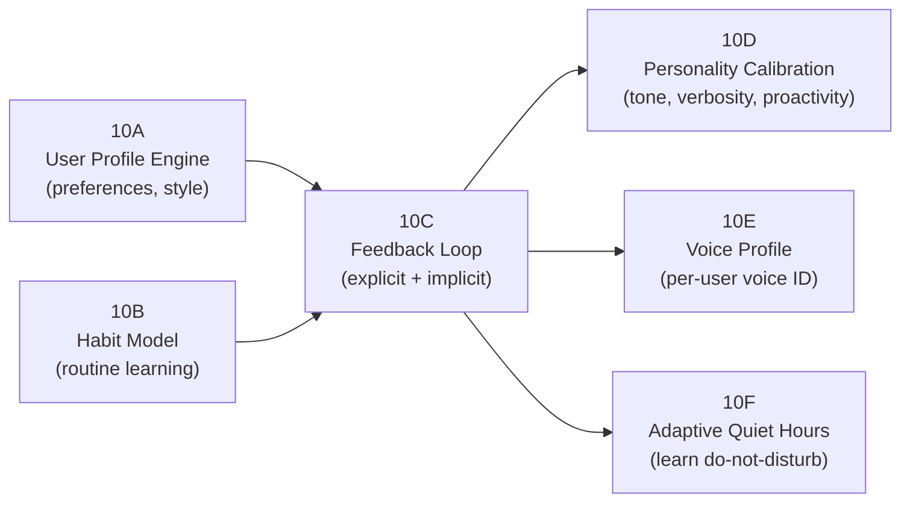
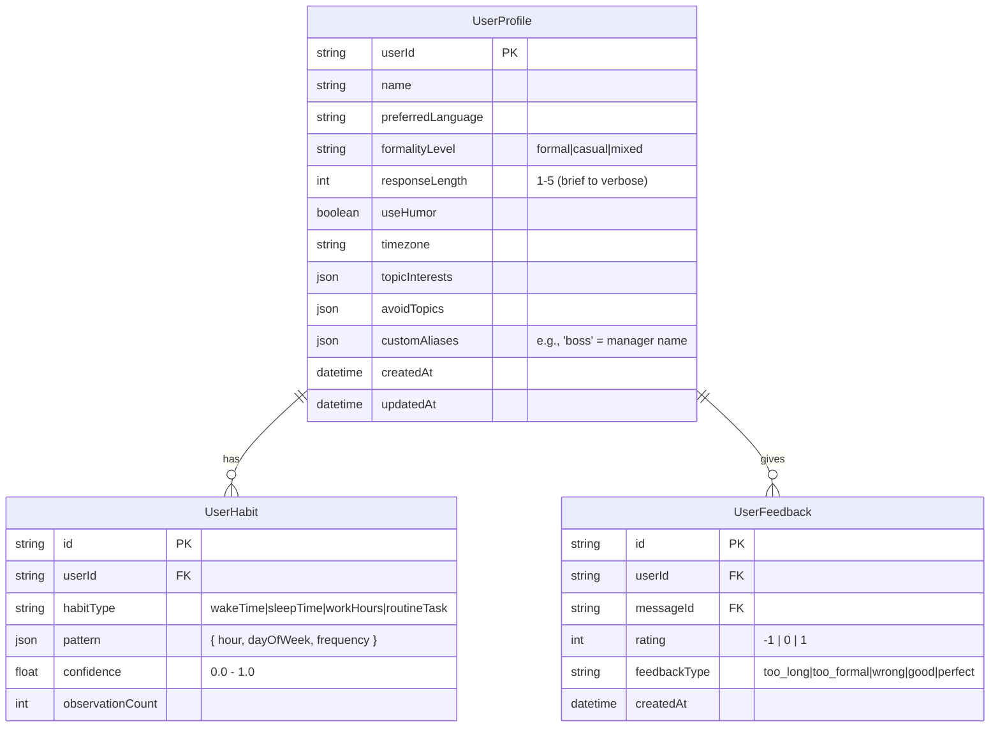
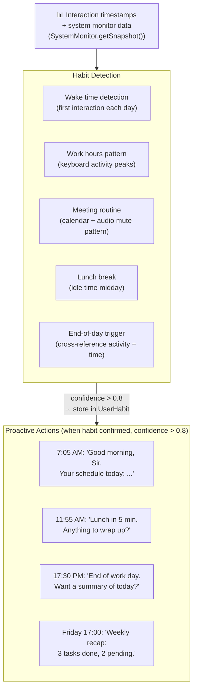
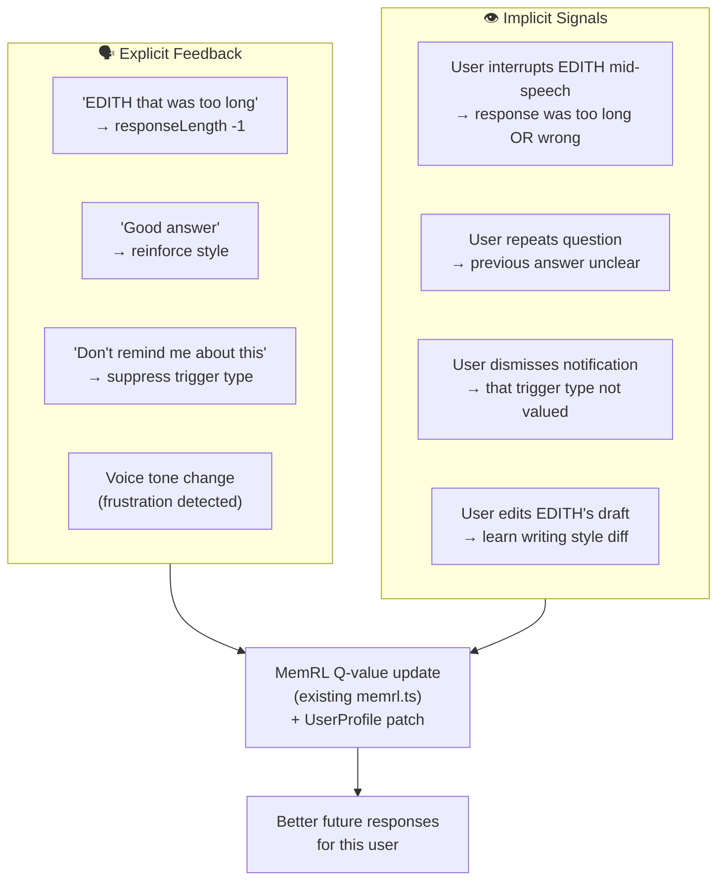
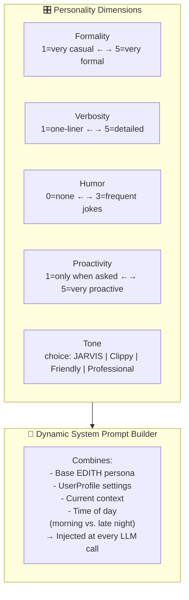
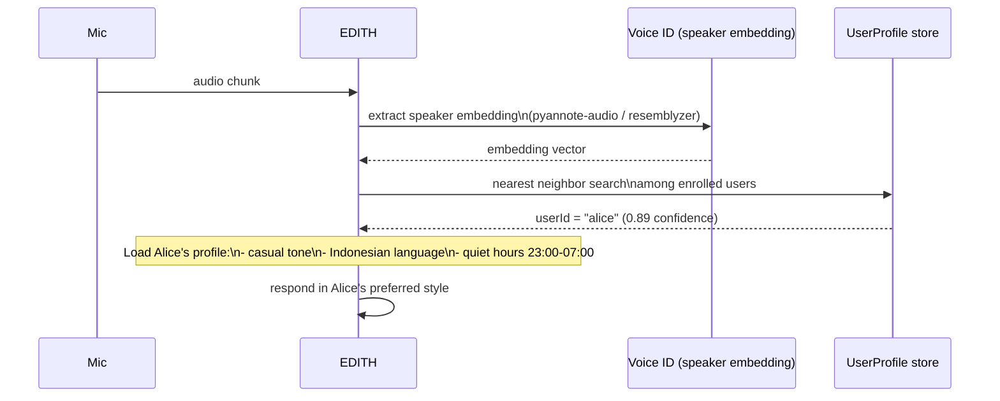
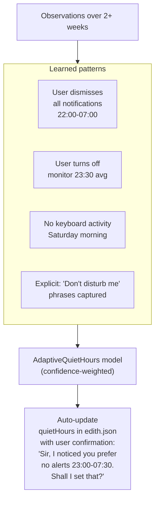

# Phase 10 — Personalization & Adaptive Learning

**Prioritas:** 🟡 MEDIUM — Bikin EDITH benar-benar "milik kamu", bukan generic assistant
**Depends on:** Phase 1 (voice persona), Phase 6 (macro engine), Phase 9 (local LLM)
**Status Saat Ini:** MemRL Q-values ✅ | User preference learning ❌ | Habit model ❌ | Personality calibration ❌ | Voice profile per-user ❌

---

## 1. Tujuan

EDITH saat ini melayani semua user dengan cara sama. Phase ini membuatnya **belajar dari setiap interaksi** — seperti JARVIS yang setelah 6 bulan sudah tahu Tony Stark suka kopi jam 7 pagi, panik soal deadline, dan tidak suka diinterupsi saat coding.



---

## 2. Sub-Phase Breakdown



---

### Phase 10A — User Profile Engine

**Goal:** Buat persistent user preference store yang di-update dari setiap interaction.



**Auto-inference from conversation:**
```typescript
// After each interaction, LLM infers preferences
const inference = await llm.generate(`
  Based on this conversation, what can you infer about the user's:
  - Preferred response length
  - Formality level
  - Interests mentioned
  - Any corrections they gave

  Conversation: ${lastNMessages}
  Current profile: ${currentProfile}

  Return JSON diff of profile changes (only fields that changed).
`)
await userProfileStore.patch(userId, inference)
```

**File:** `EDITH-ts/src/memory/user-profile.ts` (NEW, ~200 lines)

---

### Phase 10B — Habit Model (Routine Learning)

**Goal:** EDITH deteksi pola kebiasaan user dan gunakan untuk proactivity yang tepat waktu.



**Algorithm:** Simple frequency analysis with decay:
```typescript
// Each day at same time increases confidence
// Missing days decrease confidence (habit decay)
habit.confidence = (habit.observationCount / habit.expectedCount) * decayFactor
```

**File:** `EDITH-ts/src/background/habit-model.ts` (NEW, ~150 lines)

---

### Phase 10C — Feedback Loop (Explicit + Implicit)

**Goal:** EDITH belajar dari feedback user — baik yang diucapkan langsung maupun yang implisit dari behavior.



**Implicit signal detection from voice (integrates with Phase 1E):**
- Barge-in during TTS → mark response as "too long" (implicit)
- "No, that's wrong" → negative feedback on previous memory retrieval
- Long silence after EDITH speaks → confusion signal

**File:** `EDITH-ts/src/memory/feedback-store.ts` (NEW, ~120 lines)
**Modify:** `EDITH-ts/src/core/message-pipeline.ts` — add feedback signal collection

---

### Phase 10D — Personality Calibration

**Goal:** User bisa tune EDITH personality via config atau conversation.



**edith.json personality config:**
```json
{
  "personality": {
    "name": "EDITH",
    "tone": "jarvis",
    "formality": 3,
    "verbosity": 2,
    "humor": 1,
    "proactivity": 3,
    "useTitle": true,
    "titleWord": "Sir",
    "language": "auto",
    "customTraits": [
      "Always acknowledge urgency directly",
      "Never apologize excessively",
      "Use metric units"
    ]
  }
}
```

**Preset tones:**
| Tone | Description | Example greeting |
|------|-------------|-----------------|
| `jarvis` | Professional, British, efficient | "Good morning, Sir. All systems operational." |
| `friday` | Warmer JARVIS, slightly playful | "Hey! Everything's looking good today." |
| `cortana` | Helpful, clear, gender-neutral | "Good morning. You have 3 things to review." |
| `hal` | Minimal, slightly eerie | "Good morning." |
| `edith-custom` | User-defined via traits | Per customTraits array |

**File:** `EDITH-ts/src/core/personality-engine.ts` (NEW, ~150 lines)

---

### Phase 10E — Voice Profile (Per-User Voice ID)

**Goal:** Ketika beberapa orang bisa trigger EDITH (family, team), EDITH kenali **siapa yang bicara** dan respond sesuai preferensi masing-masing.



**Self-hosted speaker ID:**
- `resemblyzer` (Python) — speaker embeddings, ~5MB, MIT
- `pyannote-audio/speaker-embedding` (Python) — SOTA, 8MB model

**Enrollment:**
```bash
# User says "Hey EDITH, my name is Alice" 3 times
# EDITH captures voice samples, trains embedding
# Stored in UserProfile.voiceEmbedding (binary blob in SQLite)
```

**File:** `EDITH-ts/src/voice/speaker-id.ts` (NEW, ~100 lines)
Add to `python/delivery/streaming_voice.py`: speaker embedding extraction

---

### Phase 10F — Adaptive Quiet Hours

**Goal:** EDITH belajar kapan user tidak mau diganggu, TANPA harus manual set di config.



**Fallback:** Jika tidak ada pattern (new user), use timezone-based defaults:
- Weekdays: quiet 23:00 - 07:00
- Weekends: quiet 00:00 - 09:00

**File:** `EDITH-ts/src/background/quiet-hours.ts` — extend existing QuietHours class

---

## 3. File Changes Summary

| File | Action | Est. Lines |
|------|--------|-----------|
| `EDITH-ts/src/memory/user-profile.ts` | NEW | +200 |
| `EDITH-ts/src/background/habit-model.ts` | NEW | +150 |
| `EDITH-ts/src/memory/feedback-store.ts` | NEW | +120 |
| `EDITH-ts/src/core/personality-engine.ts` | NEW | +150 |
| `EDITH-ts/src/voice/speaker-id.ts` | NEW | +100 |
| `EDITH-ts/src/background/quiet-hours.ts` | Extend adaptive learning | +60 |
| `EDITH-ts/src/core/message-pipeline.ts` | Inject personality + collect feedback | +50 |
| `EDITH-ts/src/config/edith-config.ts` | Add personality schema | +40 |
| `prisma/schema.prisma` | Add UserHabit, UserFeedback tables | +30 |
| `EDITH-ts/src/__tests__/personalization.test.ts` | NEW | +150 |
| **Total** | | **~1050 lines** |

**New deps:**
```bash
pip install resemblyzer   # speaker voice ID (Python sidecar)
```
