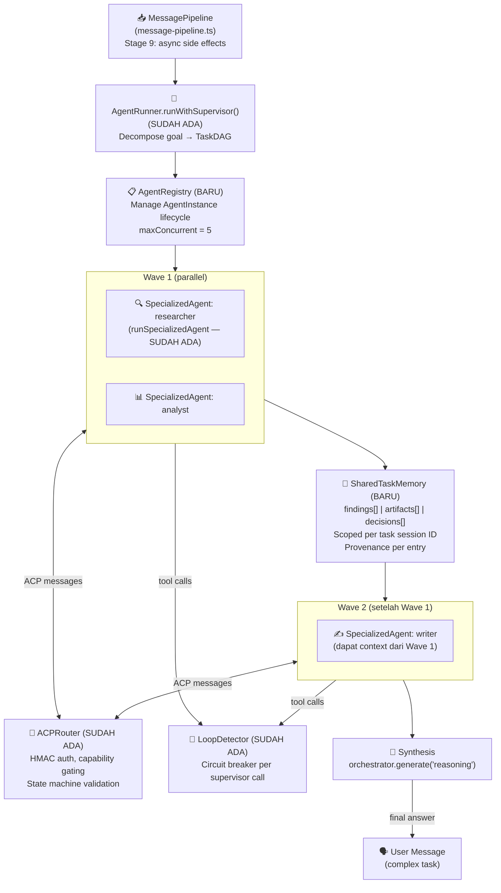
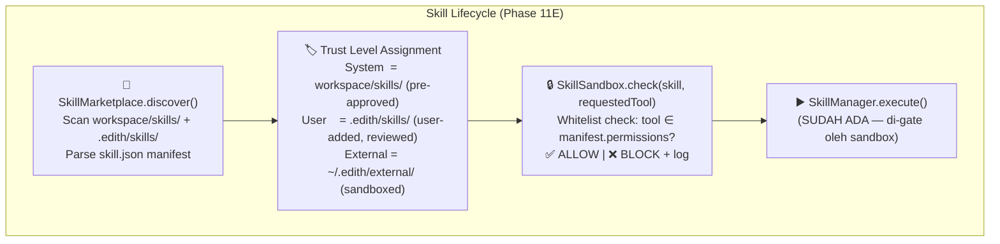

# Phase 11 — Multi-Agent Orchestration & Secure Skill Marketplace

**Prioritas:** 🟢 MEDIUM — Scalability untuk complex tasks  
**Depends on:** Phase 6 (LoopDetector, CaMeL), Phase 7 (LATS, AgentRunner), Phase 9 (Ollama local LLM)  
**Status Saat Ini:** Sebagian besar infrastruktur sudah ada — detail audit di bawah.

---

## 0. First Principles: Kenapa Kita Butuh Ini?

### 0.1 Masalah yang Dipecahkan

EDITH saat ini adalah **single agent** — satu LLM call per turn, dengan tools tersedia secara synchronous. Ini cukup untuk pertanyaan & task sederhana. Tapi untuk task kompleks:

```
User: "Analisa 5 kompetitor kita, buat laporan eksekutif, dan kirim ke email."

Single Agent (sekarang):
  LLM → step 1 → step 2 → step 3 → ... → done
  Total: ~60s, bottlenecked di setiap step

Multi-Agent (Phase 11):
  Orchestrator decomposes → Research + Data + Writer berjalan PARALLEL
  Research selesai → Writer mulai
  Total: ~20s, quality naik secara signifikan
```

Research empiris mengkonfirmasi ini bukan sekedar teori. Sistem multi-agent menunjukkan peningkatan drastis dalam kualitas output: 100% rekomendasi actionable vs 1.7% pada single-agent, dengan nol variance di 348 trial (arXiv:2511.15755). Keunggulan bukan di kecepatan, tapi di **kualitas dan determinisme**.

### 0.2 Masalah Kedua: Extensibility

EDITH punya `SkillManager` tapi skill-nya statis (YAML di `.edith/skills/`). Tidak ada cara untuk:
- Install skill baru tanpa deploy ulang
- Kontrol permission per skill
- Validasi bahwa skill aman sebelum dijalankan

Research terbaru menunjukkan ini bukan masalah convenience saja — ini **masalah keamanan serius**: 26.1% skill di marketplace publik mengandung minimal satu vulnerability (arXiv:2601.10338), dan skill dengan executable scripts 2.12× lebih berisiko dibanding instruction-only skills.

### 0.3 Batasan Design (Non-Negotiable)

1. **EXTEND, JANGAN REPLACE**: `AgentRunner`, `ACPRouter`, `TaskPlanner`, `LoopDetector`, `SpecializedAgents` — semua sudah jalan dan sudah teruji. Kita tambah lapisan di atas, bukan ganti.
2. **In-process first**: Sub-agent bukan separate process. EventEmitter-based, dalam memory yang sama. Performance > flexibility untuk sekarang.
3. **Zero new npm deps**: Semua TypeScript pakai package yang sudah ada.
4. **Skill sandbox = capability whitelist**: Skill hanya bisa pakai tool yang dia deklarasikan di manifest. Tidak ada capability declaration = tidak bisa dijalankan.
5. **Local skills only**: Tidak ada download dari internet. Discovery = scan direktori lokal. User install manual, bukan auto-install dari marketplace.

---

## 1. Audit: Apa yang Sudah Ada

> **BACA INI DULU** sebelum implement apapun.

### ✅ SUDAH SEPENUHNYA ADA (JANGAN DIUBAH TANPA ALASAN KUAT)

| File | Isi | Status |
|------|-----|--------|
| `src/acp/protocol.ts` | ACPMessage types, HMAC signature, state machine (idle→requested→approved→executing→done→failed) | ✅ Production-ready |
| `src/acp/router.ts` | ACPRouter: registerAgent, send, request, capability gating, state transition validation, audit trail | ✅ Production-ready |
| `src/agents/runner.ts` | AgentRunner: runSingle, runParallel, runSequential, runWithSupervisor (DAG), runWithLATS | ✅ Production-ready |
| `src/agents/task-planner.ts` | TaskPlanner: LLM-based DAG planning, 6 agent types, cycle detection, wave-based execution order | ✅ Production-ready |
| `src/agents/execution-monitor.ts` | ExecutionMonitor: executeNode dengan retry, LoopDetector integration, multi-agent context sharing | ✅ Production-ready |
| `src/agents/specialized-agents.ts` | 6 agent presets (researcher, coder, writer, analyst, executor, reviewer) + runSpecializedAgent | ✅ Production-ready |
| `src/core/loop-detector.ts` | LoopDetector: 3 patterns (identical-calls, no-progress, ping-pong), circuit breaker | ✅ Production-ready |

### 🔶 SUDAH ADA TAPI PERLU DIPERLUAS

| File | Yang Ada | Yang Kurang |
|------|----------|------------|
| `src/skills/manager.ts` | YAML loading, register/unregister, trigger matching | Tidak tahu trust level skill, tidak ada capability validation |
| `src/skills/loader.ts` | Membaca SKILL.md dari filesystem | Belum ada manifest parsing, belum ada permission checking |
| `src/plugin-sdk/types.ts` | `EDITHPlugin` interface | Tidak ada skill-level capability declaration |

### ❌ BELUM ADA (Target Phase 11)

| File | Keterangan |
|------|-----------|
| `src/acp/agent-registry.ts` | AgentInstance lifecycle: spawn, collect, terminate, maxConcurrent guard |
| `src/acp/shared-memory.ts` | SharedTaskMemory scoped per task session dengan provenance |
| `src/skills/marketplace.ts` | Local skill discovery, trust level assignment, listing |
| `src/skills/sandbox.ts` | Capability-based permission enforcement sebelum skill execution |

---

## 2. Arsitektur Target





---

## 3. Research Basis

| Paper | ID | Kontribusi ke Implementasi |
|-------|----|-----------------------------|
| Multi-Agent Collaboration Mechanisms Survey | arXiv:2501.06322 (Jan 2025) | 4 topologi komunikasi (bus, star, ring, tree) → kita pakai star (orchestrator sentral) sesuai use case EDITH |
| Collaborative Memory | arXiv:2505.18279 (May 2025) | 2-tier memory (private per-agent + shared task), provenance attributes (agent ID + timestamp + resource accessed) → basis `SharedTaskMemory` |
| Multi-Agent LLM Achieves Deterministic Quality | arXiv:2511.15755 (Nov 2025) | 100% actionable vs 1.7% single-agent, Decision Quality metric → justifikasi utama Phase ini |
| Agent Skills for LLMs: Architecture, Security | arXiv:2602.12430 (Feb 2026) | 4-tier permission model: system→verified→community→untrusted; progressive context loading → basis trust level di `SkillMarketplace` |
| Agent Skills in the Wild: Security at Scale | arXiv:2601.10338 (Jan 2026) | 26.1% skills vulnerable, 14 vulnerability patterns, SkillScan methodology → 3 permission categories di `SkillSandbox` |
| SkillFortify: Formal Analysis & Supply Chain Security | arXiv:2603.00195 (Mar 2026) | Capability-based sandboxing dengan confinement proof; capability declaration sebelum runtime → core design `SkillSandbox` |

---

## 4. Implementation Atoms

> Implement dalam urutan ini. 1 atom = 1 commit.

### Atom 0: `src/acp/shared-memory.ts` (~180 lines)

**Tujuan:** Shared state antar sub-agents dalam satu task session, dengan provenance tracking.

**Basis:** Collaborative Memory (arXiv:2505.18279) — 2 tier memory: private (per agent) + shared (semua agent dalam session bisa baca).

```typescript
/**
 * @file shared-memory.ts
 * @description Shared task memory scoped per supervisor session.
 *
 * ARCHITECTURE:
 *   Dipakai oleh AgentRegistry dan ExecutionMonitor untuk shared context.
 *   WorkingMemory yang ada (src/memory/working-memory.ts) adalah per-user.
 *   SharedTaskMemory ini adalah per-task-session, ephemeral.
 *
 * PAPER BASIS:
 *   - Collaborative Memory: arXiv:2505.18279 — private + shared tiers, provenance attributes
 */

export interface MemoryEntry {
  /** Agent yang menulis entry ini */
  agentType: AgentType
  /** Task node ID yang menghasilkan entry ini */
  nodeId: string
  /** Isi entry */
  content: string
  /** Category: 'finding' | 'artifact' | 'decision' | 'error' */
  category: 'finding' | 'artifact' | 'decision' | 'error'
  /** Hanya readable oleh agent yang ditulis (private) atau semua (shared) */
  visibility: 'private' | 'shared'
  timestamp: number
}

export class SharedTaskMemory {
  private readonly sessionId: string
  private entries: MemoryEntry[] = []

  constructor(sessionId: string) { ... }

  /** Tulis entry. Private = hanya ownerAgentType yang bisa baca. */
  write(entry: Omit<MemoryEntry, 'timestamp'>): void

  /** Baca semua shared entries + private entries milik agentType ini. */
  readFor(agentType: AgentType): MemoryEntry[]

  /** Baca semua shared entries (untuk orchestrator synthesis). */
  readAll(): MemoryEntry[]

  /** Format entries jadi string context yang bisa diinject ke prompt. */
  buildContextFor(agentType: AgentType, maxChars?: number): string

  /** Clear semua entries (setelah session selesai). */
  clear(): void

  /** Summary stats untuk logging. */
  stats(): { total: number; shared: number; private: number; byCategory: Record<string, number> }
}

/** Factory: buat atau ambil session yang ada */
export function getOrCreateSession(sessionId: string): SharedTaskMemory
export function clearSession(sessionId: string): void
```

**Integrasi:** `execution-monitor.ts` sudah punya `completedResults: Map<string, TaskResult>` — `SharedTaskMemory` adalah pengganti yang lebih struktural. Ubah `executeNode()` untuk write ke SharedTaskMemory setelah setiap node selesai.

---

### Atom 1: `src/acp/agent-registry.ts` (~200 lines)

**Tujuan:** Lifecycle management untuk sub-agents. Pastikan tidak lebih dari N agent concurrent.

```typescript
/**
 * @file agent-registry.ts
 * @description AgentInstance lifecycle: spawn, wait, terminate, concurrency guard.
 *
 * ARCHITECTURE:
 *   Lapisan di atas ACPRouter + SpecializedAgents.
 *   AgentRunner.runWithSupervisor() akan pakai registry ini.
 *   Tidak spawn proses baru — semua in-process (Promise-based).
 *
 * PAPER BASIS:
 *   - Multi-Agent Collaboration Mechanisms: arXiv:2501.06322 — star topology orchestration
 */

export type AgentStatus = 'idle' | 'running' | 'done' | 'failed' | 'terminated'

export interface AgentInstance {
  id: string           // UUID
  nodeId: string       // TaskNode.id
  agentType: AgentType
  status: AgentStatus
  startedAt: number
  finishedAt?: number
  result?: TaskResult
  abort?: () => void   // AbortController signal untuk cancel
}

export class AgentRegistry {
  /** Default: max 5 agents concurrent (configurable via config.ts AGENT_MAX_CONCURRENT) */
  private readonly maxConcurrent: number
  private agents: Map<string, AgentInstance> = new Map()

  /**
   * Spawn agent untuk satu TaskNode.
   * Blocks (dengan queue) jika sudah maxConcurrent agents running.
   * Returns agentId untuk tracking.
   */
  async spawn(node: TaskNode, memory: SharedTaskMemory): Promise<string>

  /**
   * Tunggu hingga agent selesai, return result-nya.
   * Timeout: node.maxSeconds ?? 60s.
   */
  async collect(agentId: string): Promise<TaskResult>

  /** Cancel agent yang sedang running. */
  async terminate(agentId: string): Promise<void>

  /** Berapa agents yang sedang running? */
  get runningCount(): number

  /** List semua instances (untuk logging/debug). */
  list(): AgentInstance[]

  /** Cleanup: hapus instances yang sudah done/failed/terminated. */
  cleanup(): void
}

export const agentRegistry = new AgentRegistry()
```

**Integrasi:** `AgentRunner.runWithSupervisor()` saat ini pakai `Promise.all(wave.map(...))`. Ganti dengan `agentRegistry.spawn()` + `agentRegistry.collect()` per wave, dan inject `SharedTaskMemory` ke setiap node.

---

### Atom 2: `src/skills/sandbox.ts` (~150 lines)

**Tujuan:** Capability-based permission enforcement. Skill hanya bisa pakai tool yang ada di manifest.

**Basis:** SkillFortify (arXiv:2603.00195) — capability-based sandboxing + confinement guarantee. Hanya 3 permission categories karena EDITH tidak punya remote execution.

```typescript
/**
 * @file sandbox.ts
 * @description Capability-based permission checking for skills.
 *
 * ARCHITECTURE:
 *   Dipakai oleh SkillManager.execute() sebelum setiap skill execution.
 *   Tidak ada sandbox process isolation — kita pakai whitelist check (capability confinement).
 *   Security guarantee: skill hanya bisa request tool yang sudah dideklarasikan.
 *
 * PAPER BASIS:
 *   - SkillFortify: arXiv:2603.00195 — capability-based sandboxing dengan confinement proof
 *   - Agent Skills in the Wild: arXiv:2601.10338 — 3 vulnerability categories: exfiltration, escalation, supply chain
 *   - Agent Skills Architecture: arXiv:2602.12430 — 4-tier permission model
 */

/** Permission categories yang bisa diminta skill */
export type SkillPermission =
  | 'read_file'    // fileReadTool, fileListTool
  | 'write_file'   // fileWriteTool
  | 'network'      // searchTool, httpTool, browserTool
  | 'execute_code' // codeRunnerTool, terminalTool
  | 'memory_read'  // memoryQueryTool
  | 'memory_write' // (implicit dari pipeline)
  | 'channel_send' // channelSendTool
  | 'system'       // systemTool (elevated — butuh trust level >= user)

/** Map dari permission ke tool names yang diizinkan */
export const PERMISSION_TOOL_MAP: Record<SkillPermission, string[]> = {
  read_file:    ['fileReadTool', 'fileListTool', 'fileAgentTool'],
  write_file:   ['fileWriteTool'],
  network:      ['searchTool', 'httpTool', 'browserTool'],
  execute_code: ['codeRunnerTool', 'terminalTool'],
  memory_read:  ['memoryQueryTool'],
  memory_write: [],
  channel_send: ['channelSendTool', 'channelStatusTool'],
  system:       ['systemTool'],
}

export interface SkillManifest {
  name: string
  version: string
  description: string
  permissions: SkillPermission[]
  /** 'system' = workspace/skills (trusted), 'user' = .edith/skills (semi-trusted), 'external' = ~/.edith/external (sandboxed) */
  trustLevel: 'system' | 'user' | 'external'
}

export interface SandboxCheckResult {
  allowed: boolean
  reason?: string
  /** Permission yang dideklarasikan tapi tidak dipakai (untuk peringatan) */
  unusedPermissions?: SkillPermission[]
}

export class SkillSandbox {
  /**
   * Cek apakah skill boleh menggunakan tool ini.
   * Dipanggil sebelum setiap tool call dari dalam skill execution.
   */
  check(manifest: SkillManifest, requestedTool: string): SandboxCheckResult

  /**
   * Buat tool set yang sudah di-filter sesuai manifest permissions.
   * Kembalikan subset dari edithTools yang diizinkan.
   */
  filterTools(manifest: SkillManifest, allTools: Record<string, unknown>): Record<string, unknown>

  /**
   * Validasi manifest sebelum install:
   * - 'external' skill tidak boleh minta permission 'system'
   * - 'external' skill tidak boleh minta 'execute_code' + 'network' sekaligus
   * - Warn jika skill minta lebih dari 3 permissions
   */
  validateManifest(manifest: SkillManifest): { valid: boolean; warnings: string[]; errors: string[] }
}

export const skillSandbox = new SkillSandbox()
```

---

### Atom 3: `src/skills/marketplace.ts` (~180 lines)

**Tujuan:** Local skill discovery, manifest parsing, trust level assignment. **Tidak ada download dari internet.**

**Basis:** 4-tier permission model dari arXiv:2602.12430. Kita pakai 3 tiers (simplified: system/user/external).

```typescript
/**
 * @file marketplace.ts
 * @description Local skill discovery with trust-tiered loading.
 *
 * ARCHITECTURE:
 *   Scan 3 direktori dengan trust level berbeda.
 *   Integrasikan dengan SkillSandbox untuk permission validation saat load.
 *   SkillManager.init() memanggil marketplace.discover() sebagai bagian dari startup.
 *
 * PAPER BASIS:
 *   - Agent Skills Architecture: arXiv:2602.12430 — 4-tier trust model, progressive disclosure
 *   - Agent Skills in the Wild: arXiv:2601.10338 — capability declaration necessity
 */

/** Lokasi skills berdasarkan trust level */
export const SKILL_DIRS = {
  system:   'workspace/skills',       // Pre-approved, dibundel sama EDITH
  user:     '.edith/skills',          // User-added, semi-trusted
  external: '~/.edith/external-skills', // Third-party, paling restrictive
} as const

export interface DiscoveredSkill {
  manifest: SkillManifest
  /** Path ke SKILL.md atau entrypoint */
  path: string
  /** Sumber discovery */
  source: keyof typeof SKILL_DIRS
  /** SHA-256 hash dari manifest file saat discover */
  manifestHash: string
}

export class SkillMarketplace {
  private discovered: Map<string, DiscoveredSkill> = new Map()

  /**
   * Scan semua 3 direktori, parse manifest, validate dengan SkillSandbox.
   * Skill yang gagal validasi di-log dan di-skip (tidak error).
   * Returns jumlah skill yang berhasil loaded.
   */
  async discover(): Promise<number>

  /** List semua discovered skills, optionally filter by trust level */
  list(filter?: { trustLevel?: SkillManifest['trustLevel'] }): DiscoveredSkill[]

  /** Ambil manifest berdasarkan skill name */
  get(name: string): DiscoveredSkill | undefined

  /**
   * Reload skill tertentu (setelah user update file-nya).
   * Re-validates dengan sandbox sebelum update registry.
   */
  async reload(name: string): Promise<boolean>

  /**
   * Parse skill.json manifest dari direktori skill.
   * Fallback: generate minimal manifest dari SKILL.md frontmatter jika skill.json tidak ada.
   */
  private parseManifest(skillDir: string, trustLevel: SkillManifest['trustLevel']): Promise<SkillManifest | null>

  /** Format skill list sebagai markdown untuk display ke user */
  formatList(): string
}

export const skillMarketplace = new SkillMarketplace()
```

**skill.json format (untuk new skills yang dibuat user):**
```json
{
  "name": "stock-tracker",
  "version": "1.0.0",
  "description": "Track stock prices and alert on target price",
  "entrypoint": "SKILL.md",
  "permissions": ["network", "memory_write"],
  "triggers": ["harga saham", "stock price", "portfolio"],
  "edithMinVersion": "1.0.0"
}
```

---

### Atom 4: Integrasi ke `SkillManager` + `StartupService` (+60 lines)

**Tujuan:** Wire `SkillMarketplace` dan `SkillSandbox` ke `SkillManager` yang sudah ada.

Di `src/skills/manager.ts`, tambahkan:
```typescript
// Di SkillManager.init():
const count = await skillMarketplace.discover()
log.info(`marketplace discovered ${count} skills`)

// Di SkillManager.execute():
const discovered = skillMarketplace.get(name)
if (discovered) {
  const filteredTools = skillSandbox.filterTools(discovered.manifest, edithTools)
  // Run skill dengan filteredTools, bukan edithTools penuh
}
```

Di `src/core/startup.ts`, setelah skill manager init, tambahkan marketplace summary ke log.

---

### Atom 5: Extend `AgentRunner.runWithSupervisor()` (+40 lines)

**Tujuan:** Pakai `AgentRegistry` dan `SharedTaskMemory` di supervisor loop yang sudah ada.

**Approach:** MINIMAL change. `runWithSupervisor()` saat ini sudah benar secara logika. Yang perlu ditambah:

```typescript
// Di runWithSupervisor():
const sessionId = `supervisor-${Date.now()}`
const memory = getOrCreateSession(sessionId)  // SharedTaskMemory

// Di executeNode() panggilan:
// Setelah setiap node selesai, write ke memory:
memory.write({
  agentType: node.agentType,
  nodeId: node.id,
  content: result.output,
  category: 'finding',
  visibility: 'shared',
})

// Di synthesis prompt:
const sharedContext = memory.buildContextFor('analyst', 4000)
// Gunakan sharedContext di synthesis prompt, bukan successfulOutputs yang raw

// Cleanup setelah selesai:
clearSession(sessionId)
```

---

### Atom 6: Tests (~180 lines, 4 files)

```
src/acp/__tests__/shared-memory.test.ts        (12 tests)
src/acp/__tests__/agent-registry.test.ts       (10 tests)
src/skills/__tests__/sandbox.test.ts           (10 tests)
src/skills/__tests__/marketplace.test.ts       (8 tests)
```

**Critical tests:**
- `shared-memory`: private entries tidak bocor ke agent lain, buildContextFor truncates at maxChars
- `agent-registry`: maxConcurrent blocking behavior, abort/terminate cleanup
- `sandbox`: external skill dengan `execute_code`+`network` ditolak, filterTools returns subset
- `marketplace`: skill.json parse, fallback ke SKILL.md frontmatter, invalid manifest di-skip bukan error

---

## 5. File Changes Summary

| File | Action | Est. Lines | Notes |
|------|--------|-----------|-------|
| `src/acp/shared-memory.ts` | NEW | ~180 | Atom 0 |
| `src/acp/agent-registry.ts` | NEW | ~200 | Atom 1 |
| `src/skills/sandbox.ts` | NEW | ~150 | Atom 2 |
| `src/skills/marketplace.ts` | NEW | ~180 | Atom 3 |
| `src/skills/manager.ts` | EXTEND | +60 | Atom 4 |
| `src/core/startup.ts` | EXTEND | +10 | Atom 4 |
| `src/agents/runner.ts` | EXTEND | +40 | Atom 5 |
| `src/agents/execution-monitor.ts` | EXTEND | +30 | Atom 5 (write to SharedTaskMemory) |
| Tests (4 files) | NEW | ~180 | Atom 6 |
| **Total** | | **~1030 lines** | |

**Files yang TIDAK perlu diubah:**
- `src/acp/protocol.ts` — sudah sempurna
- `src/acp/router.ts` — sudah sempurna
- `src/agents/task-planner.ts` — sudah sempurna
- `src/agents/specialized-agents.ts` — sudah sempurna
- `src/core/loop-detector.ts` — sudah sempurna

---

## 6. Acceptance Gates

| Gate | Kriteria | Pass |
|------|----------|------|
| G1 | `pnpm typecheck` green setelah setiap atom | Mandatory |
| G2 | 40 tests pass: shared-memory (12), registry (10), sandbox (10), marketplace (8) | Mandatory |
| G3 | External skill yang request `system` permission ditolak di sandbox | Security gate |
| G4 | External skill yang request `execute_code` + `network` bersamaan ditolak | Security gate |
| G5 | `runWithSupervisor("analisa kompetitor dan buat laporan")` menghasilkan response lebih baik dari runSingle | Quality gate |
| G6 | Supervisor dengan 3 parallel agents selesai lebih cepat dari sequential | Performance gate |
| G7 | `skillMarketplace.discover()` tidak crash jika direktori tidak ada | Graceful degradation |
| G8 | `agentRegistry.spawn()` blocks jika maxConcurrent tercapai, tidak throw | Backpressure gate |

---

## 7. Prisma Changes

**Tidak ada Prisma changes.** SharedTaskMemory adalah in-memory ephemeral (per supervisor call). SkillManifest tidak perlu disimpan ke DB — di-parse fresh dari filesystem setiap startup.

Jika di masa depan kita perlu track skill usage metrics, itu bisa ditambah ke `UsageEvent` model yang sudah ada.

---

## 8. Config Changes

Tambah ke `src/config.ts` ConfigSchema:
```typescript
// Tambah di schema:
AGENT_MAX_CONCURRENT: z.number().default(5),
AGENT_TASK_TIMEOUT_MS: z.number().default(60_000),
SKILL_EXTERNAL_DIR: z.string().default("~/.edith/external-skills"),
SKILL_SANDBOX_STRICT: z.boolean().default(true),  // false = warn only, tidak block
```

---

## 9. Urutan Implementasi yang Disarankan

```
Week 1: Foundation
  Atom 0 → Atom 1 → Atom 2

Week 2: Integration  
  Atom 3 → Atom 4 → Atom 5 → Atom 6

Commit message convention:
  feat(acp): add SharedTaskMemory with provenance tracking
  feat(acp): add AgentRegistry with concurrency guard
  feat(skills): add SkillSandbox capability-based permission enforcement
  feat(skills): add SkillMarketplace with trust-tiered local discovery
  feat(skills): integrate marketplace and sandbox into SkillManager
  feat(agents): use SharedTaskMemory in supervisor loop
  test(phase-11): add 40 tests for multi-agent and skill sandbox
```

---

## 10. Catatan Security (Penting)

Berdasarkan research terbaru (arXiv:2601.10338, arXiv:2603.00195), serangan paling umum ke skill ecosystem adalah:

1. **Malicious instructions di SKILL.md** — Mitigasi: EDITH sudah punya `prompt-filter.ts` yang scan semua content sebelum inject ke context. Skills dari `user` dan `external` tier harus melalui filter yang sama.

2. **Privilege escalation via tool abuse** — Mitigasi: `SkillSandbox.filterTools()` memastikan skill hanya dapat akses tool yang dideklarasikan.

3. **Supply chain via external script fetch** — Mitigasi: Kita tidak punya marketplace online. External skills hanya dari direktori lokal yang user manually copy.

4. **Overly broad permissions** — Mitigasi: `SkillSandbox.validateManifest()` warn jika skill minta lebih dari 3 permissions, dan error jika external skill minta `system` atau kombinasi berbahaya.

**TIDAK** mengimplementasikan full formal verification seperti SkillFortify — terlalu complex untuk fase ini. Tapi prinsip capability-based confinement diterapkan.
