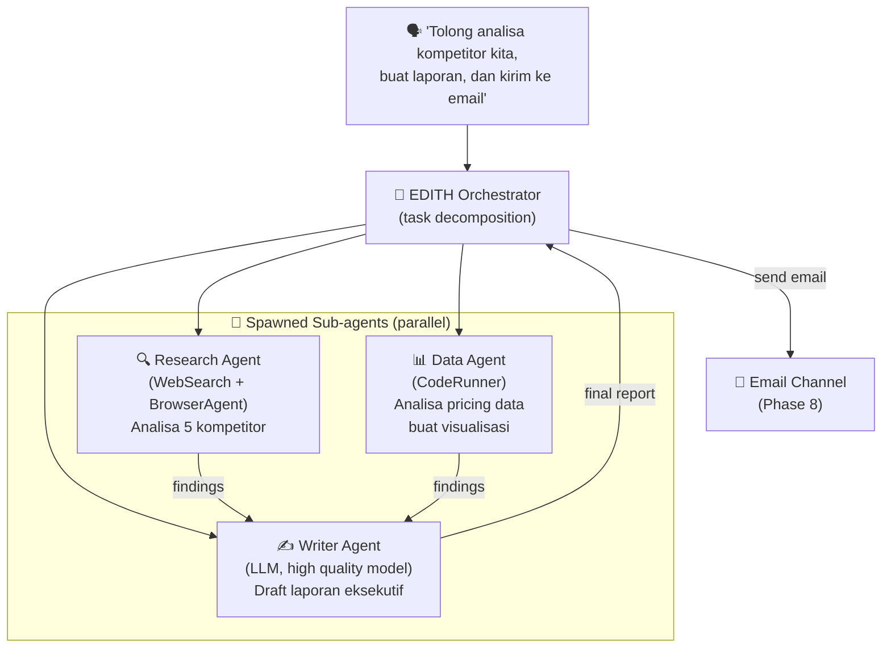
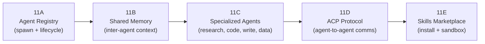
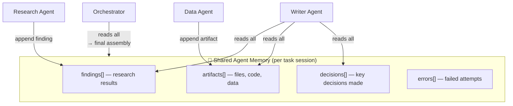
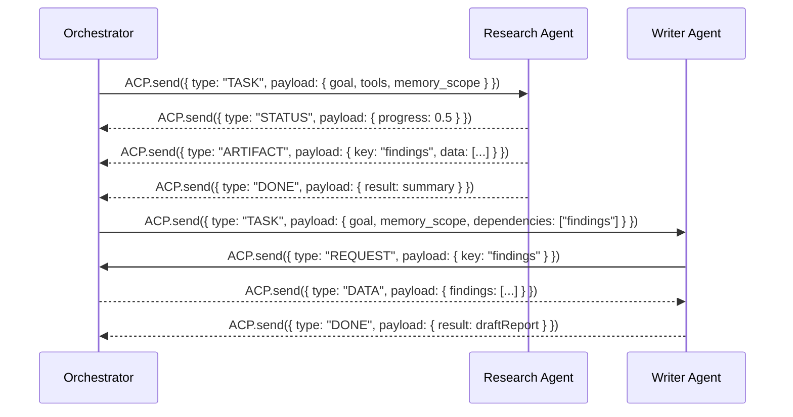
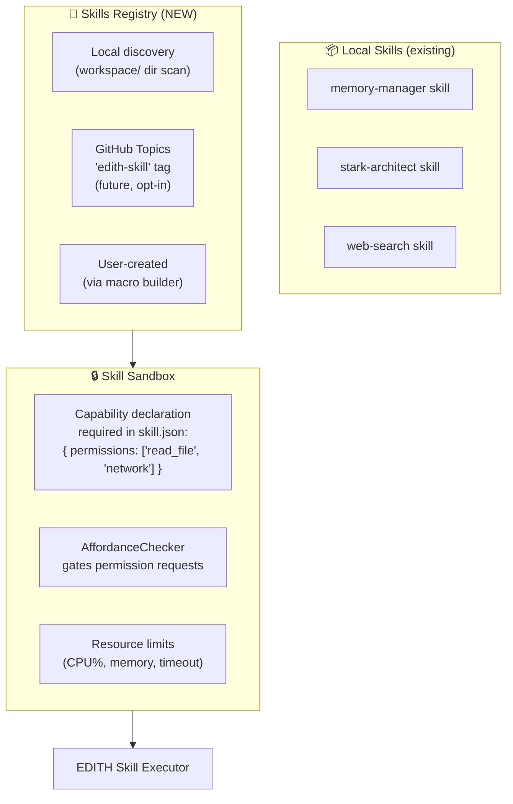

# Phase 11 — Multi-Agent Orchestration & Skills Marketplace

**Prioritas:** 🟢 MEDIUM — Scalability untuk complex tasks
**Depends on:** Phase 7 (computer use), Phase 9 (local LLM), Phase 6 (macro engine)
**Status Saat Ini:** LATS runner ✅ | ACP module ✅ (skeleton) | Task planner ✅ (basic) | Multi-agent coordination ❌ | Skills marketplace ❌ | Agent memory sharing ❌

---

## 1. Tujuan

Saat ini EDITH adalah **satu agent** yang melakukan semua hal. Phase ini membuatnya bisa **spawn specialized sub-agents** untuk parallel task execution — seperti JARVIS yang bisa deploy multiple "drones" untuk tackle berbagai problems sekaligus.



---

## 2. Sub-Phase Breakdown



---

### Phase 11A — Agent Registry (Spawn + Lifecycle)

```mermaid
stateDiagram-v2
    [*] --> SPAWNING : orchestrator.spawn(agentDef)
    SPAWNING --> RUNNING : initialized(tools, memory, prompt)
    RUNNING --> WAITING : awaiting sub-task result
    RUNNING --> DONE : task complete
    RUNNING --> FAILED : error / timeout
    WAITING --> RUNNING : dependency resolved
    DONE --> [*]
    FAILED --> [*] : orchestrator handles failure

    note right of RUNNING : Limited to maxAgents concurrent\n(configurable, default: 5)
```

```typescript
// EDITH-ts/src/acp/agent-registry.ts (extend existing acp/)
export class AgentRegistry {
  private agents: Map<string, AgentInstance> = new Map()
  private maxConcurrent = 5

  async spawn(def: AgentDefinition): Promise<string> {
    // Creates isolated agent with its own:
    // - working memory slice
    // - tool subset (based on def.capabilities)
    // - LLM model (can be lighter model for simple tasks)
    // - timeout (def.maxSeconds)
  }

  async collect(agentId: string): Promise<AgentResult>
  async broadcast(message: AgentMessage): Promise<void>
  async terminate(agentId: string): Promise<void>
}
```

---

### Phase 11B — Shared Memory (Inter-Agent Context)

**Goal:** Agents berbagi knowledge tanpa mengirim seluruh context ke setiap agent (token efficient).



**Implementation:** Thin wrapper around existing `WorkingMemory` in `memory/working-memory.ts` — scoped to a task session ID.

---

### Phase 11C — Specialized Agent Presets

Pre-defined agent personalities for common tasks:

| Agent | Model | Tools | Use Case |
|-------|-------|-------|---------|
| `research` | ollama/qwen2.5:7b | WebSearch, BrowserAgent | Find information |
| `coder` | ollama/phi4-mini:3.8b | CodeRunner, FileAgent | Write/debug code |
| `writer` | groq/llama-3.3-70b | (text only) | Draft documents |
| `analyst` | ollama/qwen2.5:7b | CodeRunner (pandas) | Analyze data |
| `executor` | qwen2.5:3b (fast) | GUIAgent, FileAgent | Run instructions |
| `reviewer` | groq/llama-3.3-70b | (text only) | Quality check output |

```typescript
// Usage from macro or user command
const report = await orchestrator.runMultiAgent({
  goal: "Analyze top 5 competitors and write executive summary",
  agents: ['research', 'analyst', 'writer'],
  parallel: true,
  maxMinutes: 10,
})
```

---

### Phase 11D — ACP Protocol (Agent Communication)

The existing `EDITH-ts/src/acp/` is a skeleton. Phase 11D implements the actual protocol:



**Transport:** In-process EventEmitter for same-machine agents. Future: IPC socket for separate process agents (allows GPU-heavy agents to run on different machine).

---

### Phase 11E — Skills Marketplace



**Skill manifest format (`skill.json`):**
```json
{
  "name": "stock-tracker",
  "version": "1.0.0",
  "description": "Track stock prices and alert on target price",
  "entrypoint": "index.ts",
  "permissions": ["network"],
  "triggers": ["price alert", "stock price", "portfolio"],
  "schedules": ["every 15 minutes"],
  "edithMinVersion": "1.0.0"
}
```

---

## 3. Research References

| Topic | Paper / Source | Key Finding |
|-------|----------------|-------------|
| Multi-agent framework | MetaGPT arXiv:2308.00352 | Roles + SOPs for agent teams |
| Agent communication | AutoGen (Microsoft) arXiv:2308.08155 | Multi-agent conversation patterns |
| Parallel task agents | CrewAI framework | Role-based crew with sequential/parallel modes |
| Agent memory | MemGPT arXiv:2310.08560 | Hierarchical memory for long-running agents |
| Skill composition | TaskMatrix.AI arXiv:2303.16434 | API + skill routing via LLM |

---

## 4. File Changes Summary

| File | Action | Est. Lines |
|------|--------|-----------|
| `EDITH-ts/src/acp/agent-registry.ts` | NEW (extend skeleton) | +200 |
| `EDITH-ts/src/acp/acp-protocol.ts` | NEW — message types + transport | +150 |
| `EDITH-ts/src/acp/shared-memory.ts` | NEW | +100 |
| `EDITH-ts/src/agents/specialized/` | NEW preset agent configs | +150 |
| `EDITH-ts/src/skills/marketplace.ts` | NEW | +150 |
| `EDITH-ts/src/skills/sandbox.ts` | NEW | +100 |
| `EDITH-ts/src/config/edith-config.ts` | Add multiAgent schema | +30 |
| `EDITH-ts/src/__tests__/multi-agent.test.ts` | NEW | +150 |
| **Total** | | **~1030 lines** |
