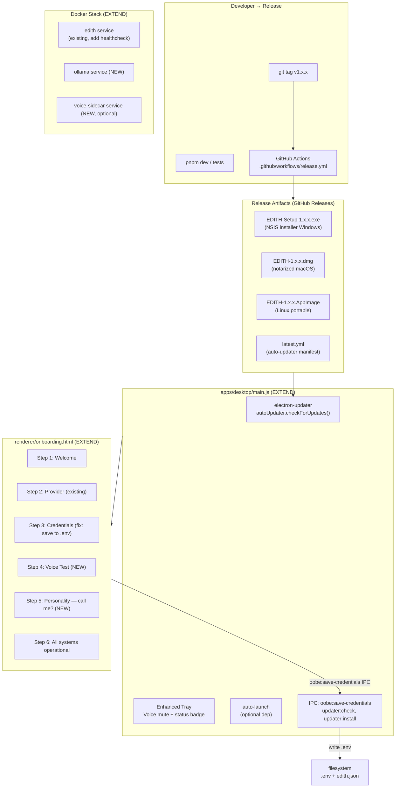

# Phase 12 — Distribution, Packaging & Auto-Update

**Prioritas:** 🟢 MEDIUM (jadi HIGH saat mau daily use atau share ke orang lain)  
**Depends on:** Phase 5 (security stable), Phase 9 (offline mode)  
**Status Saat Ini:** Electron shell ✅ | Tray dasar ✅ | OOBE 4-step ✅ | Docker + Compose dasar ✅ | CI/CD ✅ | electron-updater dep ✅ | Release pipeline ❌ | Auto-updater wired ❌ | OOBE credentials disimpan ❌ | `app`/`telemetry`/`update` config schema ❌

---

## 0. First Principles: Kenapa Ini Penting?

### 0.1 Masalah yang Dipecahkan

EDITH saat ini hanya bisa dijalankan lewat `pnpm dev` di terminal — artinya butuh developer setup. Tiga masalah nyata:

1. **Installation friction**: User biasa tidak bisa install. Perlu Node, pnpm, clone repo, copy `.env` — minimal 20 menit setup.
2. **Update manual**: Setiap ada perbaikan, user harus `git pull` + `pnpm install` lagi. Ini **tidak acceptable** untuk daily-use software.
3. **Persistence gap**: Electron app sudah ada tapi OOBE-nya belum menyimpan credentials ke `.env` — artinya setelah setup wizard, EDITH tetap tidak bisa connect ke LLM karena keys belum tersimpan.

### 0.2 Batasan Design (Non-Negotiable)

1. **EXTEND, JANGAN REPLACE**: `main.js`, `onboarding.html`, `Dockerfile`, `ci.yml` semua sudah ada. Kita tambah, bukan ganti dari scratch.
2. **Privacy default**: Telemetry OFF by default. Crash report LOCAL by default. User harus explicitly enable.
3. **Self-hosted first**: Update server bisa di-host sendiri (generic provider) — tidak harus GitHub. Docker stack harus bisa jalan tanpa internet setelah pull.
4. **Zero new npm deps** di core engine. `electron-updater` sudah ada di `apps/desktop/package.json`. `auto-launch` boleh ditambah di desktop app saja.
5. **Graceful degradation**: App tetap bisa jalan tanpa auto-updater (misal offline/self-hosted). Update check gagal = log + skip, tidak crash.

---

## 1. Audit: Apa yang Sudah Ada

> **BACA INI DULU** sebelum implement apapun.

### ✅ SUDAH ADA — EXTEND SAJA

| File | Yang Ada | Catatan |
|------|----------|---------|
| `apps/desktop/main.js` | Electron shell, Tray (Open/Status/Quit), WebSocket ke gateway, IPC handlers | Tray menu minimal — perlu Voice mute + status indicator |
| `apps/desktop/package.json` | `electron-updater ^6.1.7` sudah di dependencies | Tinggal wire ke main.js |
| `apps/desktop/preload.js` | contextBridge: sendMessage, getStatus, minimize, close, quit, onMessage, onConnected | Perlu tambah IPC untuk OOBE save + auto-updater events |
| `apps/desktop/renderer/onboarding.html` | 4-step wizard: Welcome → Provider → Credentials → Done | Credentials disimpan ke `console.log` saja (BUGS: tidak persistent). Tidak ada Voice Test. Tidak ada Personality step. Test connection di-mock (selalu true). |
| `Dockerfile` | Multi-stage build (builder + runtime), pnpm, prisma generate, expose 18789/8080 | Tidak ada Python sidecar, tidak ada healthcheck |
| `docker-compose.yml` | Satu service `edith`, volume data, env override | Tidak ada Ollama service, tidak ada healthcheck |
| `.github/workflows/ci.yml` | CI: typecheck, test, security audit, coverage — Ubuntu + Windows matrix | Tidak ada release workflow |
| `src/core/startup.ts` | Semua service init, headless-ready | Tidak ada headless-mode detection dari env |
| `src/config/edith-config.ts` | Zod schema: identity, agents, channels, skills, computerUse | Tidak ada `app` (autoLaunch, tray), `telemetry`, `update` sections |

### ❌ BELUM ADA (Target Phase 12)

| File | Keterangan |
|------|-----------|
| `.github/workflows/release.yml` | Release CI: build cross-platform + publish ke GitHub Releases |
| `apps/desktop/electron-builder.json` | Dedicated builder config (extraResources, signing, publish target) |
| IPC: `oobe:save-credentials` | Simpan keys ke `.env` dari OOBE |
| IPC: `updater:*` | Events dari auto-updater ke renderer |
| `app`/`telemetry`/`update` di `edith-config.ts` | Config schema untuk behavior app |

---

## 2. Arsitektur Target



---

## 3. Implementation Atoms

> Implement dalam urutan ini. 1 atom = 1 commit.

### Atom 0: Config Schema Extension di `src/config/edith-config.ts` (+50 lines)

**Tujuan:** Tambah `app`, `telemetry`, `update` sections ke `EDITHConfigSchema`.

```typescript
// Tambah ke EDITHConfigSchema:

const AppConfigSchema = z.object({
  /** Minimize ke tray saat close (bukan quit) */
  minimizeToTray: z.boolean().default(true),
  /** Autostart saat OS login */
  autoLaunch: z.boolean().default(false),
  /** Tampilkan tray notifications */
  showTrayNotifications: z.boolean().default(true),
  /** Start window minimized */
  startMinimized: z.boolean().default(false),
}).default({
  minimizeToTray: true,
  autoLaunch: false,
  showTrayNotifications: true,
  startMinimized: false,
})

const TelemetrySchema = z.object({
  /** Opt-in crash reporting — false by default */
  enabled: z.boolean().default(false),
  crashReporting: z.boolean().default(false),
  /** Endpoint Sentry/Glitchtip — user-configurable */
  endpoint: z.string().default(""),
}).default({ enabled: false, crashReporting: false, endpoint: "" })

const UpdateSchema = z.object({
  /** Cek update otomatis saat startup */
  autoCheck: z.boolean().default(true),
  /** Download update di background tanpa tanya */
  autoDownload: z.boolean().default(true),
  /**
   * Provider: 'github' (default) atau 'generic' (self-hosted).
   * Generic butuh url diisi.
   */
  provider: z.enum(["github", "generic"]).default("github"),
  /** URL update server jika provider = generic */
  url: z.string().default(""),
}).default({
  autoCheck: true,
  autoDownload: true,
  provider: "github",
  url: "",
})
```

**Tidak ada file baru** — extend `edith-config.ts` yang sudah ada.

---

### Atom 1: Auto-Updater di `apps/desktop/main.js` (+70 lines)

**Tujuan:** Wire `electron-updater` (sudah di dependencies) ke main process. Notify user via tray + speak via gateway WS.

```javascript
// Tambah ke apps/desktop/main.js setelah app.whenReady():

const { autoUpdater } = require("electron-updater")

function initAutoUpdater() {
  autoUpdater.autoDownload = true
  autoUpdater.autoInstallOnAppQuit = true

  autoUpdater.on("checking-for-update", () => {
    log("Checking for update...")
  })

  autoUpdater.on("update-available", (info) => {
    tray?.setToolTip(`EDITH — Update v${info.version} available`)
    mainWindow?.webContents.send("updater:available", info)
    // Speak via gateway jika connected
    sendToGateway({ type: "tts", text: `EDITH ${info.version} is available. Downloading.` })
  })

  autoUpdater.on("update-downloaded", (info) => {
    tray?.setToolTip(`EDITH — Restart to update to v${info.version}`)
    mainWindow?.webContents.send("updater:downloaded", info)
    sendToGateway({ type: "tts", text: "Update ready. Will apply on next restart." })
  })

  autoUpdater.on("error", (err) => {
    log("Update check error (non-fatal):", err.message)
    // Tidak crash — update check failure adalah non-critical
  })
}

// Di app.whenReady():
// Delay check 10s supaya gateway sudah ready
setTimeout(() => {
  try { initAutoUpdater(); autoUpdater.checkForUpdatesAndNotify() }
  catch (err) { log("Updater init failed (non-fatal):", err.message) }
}, 10_000)

// IPC dari renderer
ipcMain.handle("updater:check", () => autoUpdater.checkForUpdatesAndNotify())
ipcMain.handle("updater:install", () => autoUpdater.quitAndInstall())
```

**Catatan:** Jika `provider = generic` dari `edith.json`, set `autoUpdater.setFeedURL(url)` sebelum check.

---

### Atom 2: Fix OOBE — Credentials Persistence di `onboarding.html` (+80 lines)

**Tujuan:** OOBE sekarang hanya `console.log` credentials. Fix agar credentials disimpan ke `.env` via IPC.

**Di `apps/desktop/main.js`**, tambah IPC handler baru:
```javascript
const fs = require("fs")
const os = require("os")

ipcMain.handle("oobe:save-credentials", async (_, credentials) => {
  try {
    // 1. Tulis .env di root project
    const envPath = path.join(__dirname, "../../.env")
    let envContent = ""
    
    if (credentials.GROQ_API_KEY) {
      envContent += `GROQ_API_KEY=${credentials.GROQ_API_KEY}\n`
    }
    if (credentials.ANTHROPIC_API_KEY) {
      envContent += `ANTHROPIC_API_KEY=${credentials.ANTHROPIC_API_KEY}\n`
    }
    if (credentials.OPENAI_API_KEY) {
      envContent += `OPENAI_API_KEY=${credentials.OPENAI_API_KEY}\n`
    }
    
    // Append ke .env yang sudah ada (jangan overwrite semua)
    const existing = fs.existsSync(envPath) ? fs.readFileSync(envPath, "utf-8") : ""
    const merged = mergeEnvContent(existing, envContent)
    fs.writeFileSync(envPath, merged, "utf-8")
    
    // 2. Update edith.json (titleWord dari personality step)
    if (credentials.titleWord) {
      const configPath = path.join(__dirname, "../../edith.json")
      const existing = fs.existsSync(configPath)
        ? JSON.parse(fs.readFileSync(configPath, "utf-8"))
        : {}
      existing.personality = { ...existing.personality, titleWord: credentials.titleWord }
      existing._setupComplete = true
      existing._setupVersion = app.getVersion()
      fs.writeFileSync(configPath, JSON.stringify(existing, null, 2))
    }
    
    return { ok: true }
  } catch (err) {
    log("oobe:save-credentials error:", err)
    return { ok: false, error: String(err) }
  }
})
```

**Di `apps/desktop/preload.js`**, expose handler baru:
```javascript
saveCredentials: (credentials) =>
  ipcRenderer.invoke("oobe:save-credentials", credentials),
onUpdaterEvent: (callback) => {
  ipcRenderer.on("updater:available", (_, info) => callback("available", info))
  ipcRenderer.on("updater:downloaded", (_, info) => callback("downloaded", info))
},
```

**Di `onboarding.html`**, ubah fungsi `saveCredentials()`:
```javascript
async function saveCredentials() {
  const result = await window.edith.saveCredentials(credentials)
  if (!result.ok) {
    console.error("Failed to save credentials:", result.error)
  }
}
```

---

### Atom 3: OOBE — Tambah Step Voice Test + Personality (+100 lines di `onboarding.html`)

**Tujuan:** Lengkapi OOBE dari 4 step → 6 step. Extend HTML yang sudah ada.

**Step 4 (NEW): Voice Test**
```html
<div class="step" id="step-4">
  <div class="step-title">Voice Setup</div>
  <div class="step-desc">
    EDITH can speak and listen. Test your microphone and speakers.
  </div>
  <div class="btn-group" style="flex-direction: column; gap: 12px;">
    <button class="btn btn-secondary" id="test-tts">
      🔊 Test: "All systems operational"
    </button>
    <button class="btn btn-secondary" id="test-mic">
      🎤 Test Microphone
    </button>
    <button class="btn btn-secondary" id="skip-voice">
      Skip voice setup
    </button>
  </div>
  <div class="test-status" id="voice-status" style="display: none;"></div>
  <div class="btn-group" style="margin-top: 24px;">
    <button class="btn btn-secondary" id="step4-back">Back</button>
    <button class="btn btn-primary" id="step4-next">Continue</button>
  </div>
</div>
```

**Step 5 (NEW): Personality**
```html
<div class="step" id="step-5">
  <div class="step-title">How should I address you?</div>
  <div class="step-desc">
    EDITH adapts to your preference. This can be changed anytime.
  </div>
  <div class="provider-options">
    <label class="provider-option" data-title="Sir">
      <div class="provider-name">Sir</div>
      <div class="provider-desc">Classic, professional</div>
    </label>
    <label class="provider-option" data-title="Boss">
      <div class="provider-name">Boss</div>
      <div class="provider-desc">Casual authority</div>
    </label>
    <label class="provider-option" data-title="">
      <div class="provider-name">My name</div>
      <div class="provider-desc">Personal touch</div>
    </label>
  </div>
  <div id="custom-name-input" style="display: none;">
    <input type="text" class="input-field" id="custom-name" placeholder="Enter your name..." />
  </div>
  <div class="btn-group" style="margin-top: 24px;">
    <button class="btn btn-secondary" id="step5-back">Back</button>
    <button class="btn btn-primary" id="step5-next">Continue</button>
  </div>
</div>
```

**Step 6 (renamed dari 4):** "All systems are operational, [titleWord]."

Progress dots ikut diupdate ke 6 dots.

---

### Atom 4: Enhanced Tray di `apps/desktop/main.js` (+40 lines)

**Tujuan:** Tray menu lebih rich — status indicator, voice mute toggle.

```javascript
// Ganti createTray() yang ada:
function updateTrayMenu() {
  const isConnected = ws && ws.readyState === WebSocket.OPEN
  const statusIcon = isConnected ? "🟢" : "🔴"

  tray.setContextMenu(Menu.buildFromTemplate([
    { label: `${statusIcon} EDITH`, enabled: false },
    { type: "separator" },
    { label: "Open", click: () => mainWindow?.show() },
    { label: `Voice: ${micMuted ? "Muted 🔇" : "Active 🎤"}`, click: () => {
      micMuted = !micMuted
      sendToGateway({ type: "voice:mute", muted: micMuted })
      updateTrayMenu()
    }},
    { type: "separator" },
    { label: "Check for Updates", click: () => autoUpdater.checkForUpdatesAndNotify() },
    { label: "Settings", click: () => { mainWindow?.show(); mainWindow?.webContents.send("nav:settings") }},
    { type: "separator" },
    { label: "Quit", click: () => { app.isQuitting = true; app.quit() }}
  ]))
}
```

**autoLaunch** (optional): Jika `edith.json.app.autoLaunch === true`, gunakan `auto-launch` package:
```javascript
// Kondisional — hanya load jika package tersedia
try {
  const AutoLaunch = require("auto-launch")
  const edithLauncher = new AutoLaunch({ name: "EDITH" })
  const config = loadConfig() // baca edith.json
  if (config.app?.autoLaunch) {
    edithLauncher.enable()
  }
} catch (e) { /* auto-launch optional */ }
```

---

### Atom 5: `apps/desktop/electron-builder.json` (NEW, ~50 lines)

**Tujuan:** Pisahkan builder config dari `package.json` — lebih maintainable dan bisa include `extraResources`.

```json
{
  "appId": "ai.edith.desktop",
  "productName": "EDITH",
  "copyright": "Copyright © 2025 EDITH",
  "directories": {
    "output": "dist",
    "buildResources": "assets"
  },
  "publish": [
    {
      "provider": "github",
      "owner": "${GITHUB_OWNER}",
      "repo": "${GITHUB_REPO}",
      "releaseType": "release"
    }
  ],
  "extraResources": [
    { "from": "../../dist/", "to": "engine/", "filter": ["**/*"] },
    { "from": "../../python/", "to": "python/", "filter": ["**/*.py", "requirements*.txt"] },
    { "from": "../../workspace/", "to": "workspace/", "filter": ["SOUL.md", "AGENTS.md", "USER.md", "MEMORY.md"] },
    { "from": "../../prisma/", "to": "prisma/", "filter": ["schema.prisma"] }
  ],
  "files": ["main.js", "preload.js", "renderer/**/*", "node_modules/**/*"],
  "win": {
    "target": [
      { "target": "nsis", "arch": ["x64"] },
      { "target": "portable", "arch": ["x64"] }
    ],
    "icon": "assets/icon.ico"
  },
  "nsis": {
    "oneClick": true,
    "perMachine": false,
    "createDesktopShortcut": true,
    "createStartMenuShortcut": true
  },
  "mac": {
    "target": [{ "target": "dmg", "arch": ["x64", "arm64"] }],
    "icon": "assets/icon.icns",
    "category": "public.app-category.productivity",
    "hardenedRuntime": true,
    "gatekeeperAssess": false,
    "entitlements": "assets/entitlements.mac.plist",
    "entitlementsInherit": "assets/entitlements.mac.plist"
  },
  "linux": {
    "target": [
      { "target": "AppImage", "arch": ["x64"] },
      { "target": "deb", "arch": ["x64"] }
    ],
    "icon": "assets/icon.png",
    "category": "Utility"
  }
}
```

**Hapus `build` key dari `apps/desktop/package.json`** setelah file ini dibuat.

---

### Atom 6: `.github/workflows/release.yml` (NEW, ~100 lines)

**Tujuan:** Auto-build dan publish ke GitHub Releases saat ada tag `v*`.

```yaml
name: Release

on:
  push:
    tags:
      - 'v*'

permissions:
  contents: write  # untuk publish GitHub Release

jobs:
  # Build engine TypeScript dulu
  build-engine:
    runs-on: ubuntu-latest
    steps:
      - uses: actions/checkout@v4
      - uses: pnpm/action-setup@v4
        with: { version: 10 }
      - uses: actions/setup-node@v4
        with: { node-version: 22, cache: pnpm }
      - run: pnpm install --frozen-lockfile
      - run: pnpm build
      - uses: actions/upload-artifact@v4
        with:
          name: engine-dist
          path: dist/

  build-desktop:
    needs: build-engine
    strategy:
      fail-fast: false
      matrix:
        include:
          - os: windows-latest
            platform: win
            artifact: EDITH-Setup-*.exe
          - os: macos-latest
            platform: mac
            artifact: EDITH-*.dmg
          - os: ubuntu-latest
            platform: linux
            artifact: EDITH-*.AppImage

    runs-on: ${{ matrix.os }}
    steps:
      - uses: actions/checkout@v4
      - uses: actions/download-artifact@v4
        with: { name: engine-dist, path: dist/ }

      - uses: pnpm/action-setup@v4
        with: { version: 10 }
      - uses: actions/setup-node@v4
        with: { node-version: 22, cache: pnpm }

      - name: Install root deps
        run: pnpm install --frozen-lockfile

      - name: Install desktop deps
        working-directory: apps/desktop
        run: pnpm install --frozen-lockfile

      # macOS: notarization (requires Apple Developer secrets)
      - name: Build & Publish (${{ matrix.platform }})
        working-directory: apps/desktop
        env:
          GH_TOKEN: ${{ secrets.GITHUB_TOKEN }}
          GITHUB_OWNER: ${{ github.repository_owner }}
          GITHUB_REPO: ${{ github.event.repository.name }}
          # macOS signing (optional — skip jika secrets tidak ada)
          APPLE_ID: ${{ secrets.APPLE_ID }}
          APPLE_APP_SPECIFIC_PASSWORD: ${{ secrets.APPLE_APP_SPECIFIC_PASSWORD }}
          APPLE_TEAM_ID: ${{ secrets.APPLE_TEAM_ID }}
          CSC_LINK: ${{ secrets.CSC_LINK }}
          CSC_KEY_PASSWORD: ${{ secrets.CSC_KEY_PASSWORD }}
        run: pnpm build:${{ matrix.platform }} -- --publish always

  publish-docker:
    needs: build-engine
    runs-on: ubuntu-latest
    steps:
      - uses: actions/checkout@v4
      - uses: actions/download-artifact@v4
        with: { name: engine-dist, path: dist/ }
      - uses: docker/setup-buildx-action@v3
      - uses: docker/login-action@v3
        with:
          registry: ghcr.io
          username: ${{ github.actor }}
          password: ${{ secrets.GITHUB_TOKEN }}
      - uses: docker/build-push-action@v5
        with:
          context: .
          push: true
          tags: |
            ghcr.io/${{ github.repository }}:latest
            ghcr.io/${{ github.repository }}:${{ github.ref_name }}
```

---

### Atom 7: Docker Stack Extension (`Dockerfile` + `docker-compose.yml`, +60 lines)

**Tujuan:** Tambah healthcheck ke Dockerfile, Ollama service + Python sidecar (optional) ke compose.

**`Dockerfile`** — tambah healthcheck setelah CMD:
```dockerfile
# Setelah EXPOSE dan sebelum CMD:
HEALTHCHECK --interval=30s --timeout=5s --start-period=30s --retries=3 \
  CMD wget -qO- http://localhost:18789/health || exit 1
```

**`docker-compose.yml`** — extend dengan Ollama + healthcheck:
```yaml
version: "3.9"
services:
  edith:
    build: .
    image: ghcr.io/${GITHUB_REPOSITORY:-edith-local}:latest
    ports:
      - "18789:18789"
      - "8080:8080"
    volumes:
      - edith_data:/data
      - ./.env:/app/.env:ro
      - ./workspace:/app/workspace:ro
    restart: unless-stopped
    environment:
      - NODE_ENV=production
      - DATABASE_URL=file:/data/edith.db
      # Arahkan ke Ollama container
      - OLLAMA_BASE_URL=http://ollama:11434
    depends_on:
      ollama:
        condition: service_healthy
    healthcheck:
      test: ["CMD", "wget", "-qO-", "http://localhost:18789/health"]
      interval: 30s
      timeout: 5s
      retries: 3
      start_period: 30s

  ollama:
    image: ollama/ollama:latest
    volumes:
      - ollama_data:/root/.ollama
    ports:
      - "11434:11434"
    restart: unless-stopped
    healthcheck:
      test: ["CMD", "curl", "-f", "http://localhost:11434/api/tags"]
      interval: 30s
      timeout: 10s
      retries: 3
      start_period: 60s

  # Optional: Python voice sidecar (uncomment jika dipakai)
  # voice-sidecar:
  #   build:
  #     context: .
  #     dockerfile: python/Dockerfile
  #   ports:
  #     - "8765:8765"
  #   restart: unless-stopped

volumes:
  edith_data:
  ollama_data:
```

---

### Atom 8: Crash Handler (LOCAL only, ~60 lines di `apps/desktop/main.js`)

**Tujuan:** Tangkap unhandled exception, tulis crash dump ke `~/.edith/crashes/`. Tidak kirim ke mana-mana by default.

```javascript
const crashDir = path.join(os.homedir(), ".edith", "crashes")

process.on("uncaughtException", (err) => {
  const timestamp = new Date().toISOString().replace(/[:.]/g, "-")
  const dumpFile = path.join(crashDir, `crash-${timestamp}.json`)
  
  const dump = {
    timestamp,
    version: app.getVersion(),
    platform: process.platform,
    error: { name: err.name, message: err.message, stack: err.stack },
    // TIDAK menyimpan: conversation content, API keys, user data
  }
  
  try {
    fs.mkdirSync(crashDir, { recursive: true })
    fs.writeFileSync(dumpFile, JSON.stringify(dump, null, 2))
    log("Crash dump written:", dumpFile)
  } catch (writeErr) {
    log("Failed to write crash dump:", writeErr)
  }
  
  // Hanya kirim jika telemetry explicitly enabled
  // (cek edith.json.telemetry.crashReporting)
})
```

---

## 4. File Changes Summary

| File | Action | Est. Lines | Atom |
|------|--------|-----------|------|
| `src/config/edith-config.ts` | EXTEND +AppConfig, +Telemetry, +Update schemas | +50 | 0 |
| `apps/desktop/main.js` | EXTEND +auto-updater, +crash handler, +enhanced tray, +IPC oobe:save | +150 | 1, 2, 4, 8 |
| `apps/desktop/preload.js` | EXTEND +saveCredentials, +onUpdaterEvent | +15 | 2 |
| `apps/desktop/renderer/onboarding.html` | EXTEND +step 4 voice, +step 5 personality, fix credentials save | +100 | 3 |
| `apps/desktop/electron-builder.json` | NEW — dedicated build config | +50 | 5 |
| `.github/workflows/release.yml` | NEW — release CI pipeline | +100 | 6 |
| `Dockerfile` | EXTEND +healthcheck | +5 | 7 |
| `docker-compose.yml` | EXTEND +Ollama service, +healthchecks | +35 | 7 |
| **Total** | | **~505 lines** | |

**Files yang TIDAK perlu diubah:**
- `apps/desktop/package.json` — hanya hapus `build` key setelah electron-builder.json dibuat (Atom 5)
- `.github/workflows/ci.yml` — sudah bagus, tidak perlu diubah
- `src/core/startup.ts` — sudah headless-ready, tidak perlu diubah
- `Dockerfile` builder/runtime stages — sudah optimal

---

## 5. Acceptance Gates

| Gate | Kriteria | Pass |
|------|----------|------|
| G1 | `pnpm typecheck` green setelah Atom 0 | Mandatory |
| G2 | OOBE step 3: API key tersimpan ke `.env` setelah selesai wizard | Core fix |
| G3 | OOBE step 5: `titleWord` tersimpan ke `edith.json` | Core fix |
| G4 | Auto-updater: `autoUpdater.checkForUpdates()` dipanggil 10s setelah startup, error tidak crash app | Required |
| G5 | Release workflow: push tag `v0.1.0-test` → artifacts terbuild di GitHub Releases | Deployment gate |
| G6 | Docker: `docker-compose up` menghasilkan EDITH + Ollama running, healthcheck pass | Docker gate |
| G7 | Crash handler: uncaughtException → dump file di `~/.edith/crashes/`, tidak ada API key di dump | Privacy gate |
| G8 | Telemetry default: `edith.json` baru dibuat tidak ada `telemetry: true` di dalamnya | Privacy gate |

---

## 6. Secrets yang Dibutuhkan di GitHub Repository

Untuk release CI yang lengkap. Yang bold wajib, sisanya opsional:

| Secret | Keterangan | Wajib? |
|--------|-----------|--------|
| **`GITHUB_TOKEN`** | Auto-provided GitHub Actions | ✅ Auto |
| `APPLE_ID` | Apple Developer account email | macOS notarize |
| `APPLE_APP_SPECIFIC_PASSWORD` | App-specific password dari appleid.apple.com | macOS notarize |
| `APPLE_TEAM_ID` | Team ID dari Apple Developer Portal | macOS notarize |
| `CSC_LINK` | Code Signing Certificate (.p12 as base64) | Windows/macOS signing |
| `CSC_KEY_PASSWORD` | Password untuk CSC_LINK | Windows/macOS signing |

**Tanpa signing secrets**: build tetap jalan tapi installer tidak ter-sign — Windows akan tampilkan SmartScreen warning, macOS butuh user klik "Open Anyway". Ini **acceptable untuk personal use / development**.

---

## 7. Self-Hosted Update Server (Opsional)

Jika tidak mau bergantung ke GitHub untuk distribusi update:

1. Build artifacts manual: `cd apps/desktop && pnpm build`
2. Copy `dist/*.exe`, `dist/*.dmg`, `dist/*.AppImage`, `dist/latest*.yml` ke NAS/VPS
3. Serve via nginx/caddy sebagai static files
4. Update `edith.json`:
   ```json
   {
     "update": {
       "provider": "generic",
       "url": "http://your-server/edith-updates/"
     }
   }
   ```

EDITH akan check `http://your-server/edith-updates/latest.yml` untuk deteksi versi terbaru.
