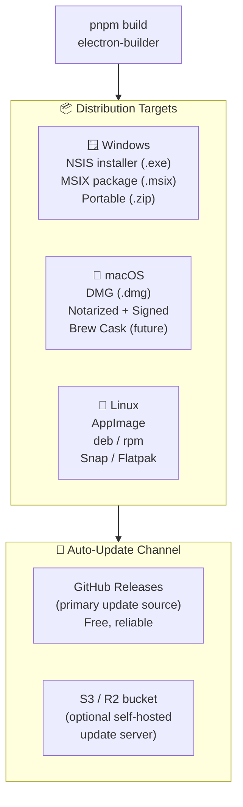
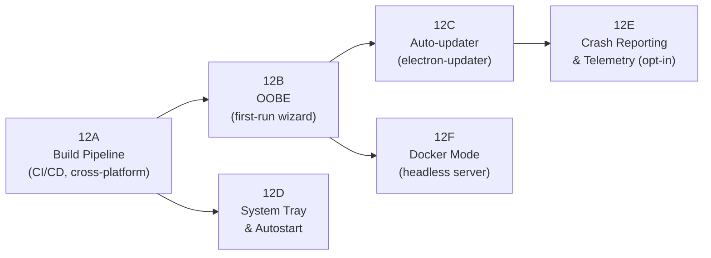
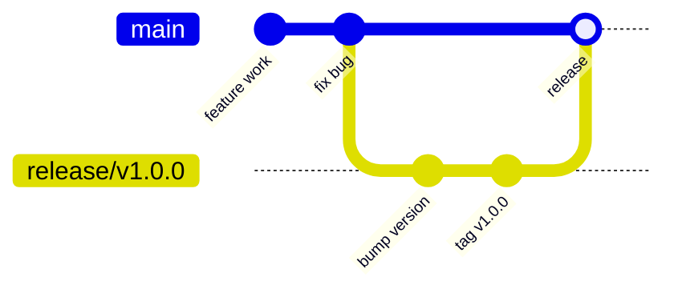
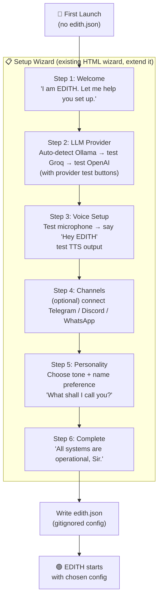
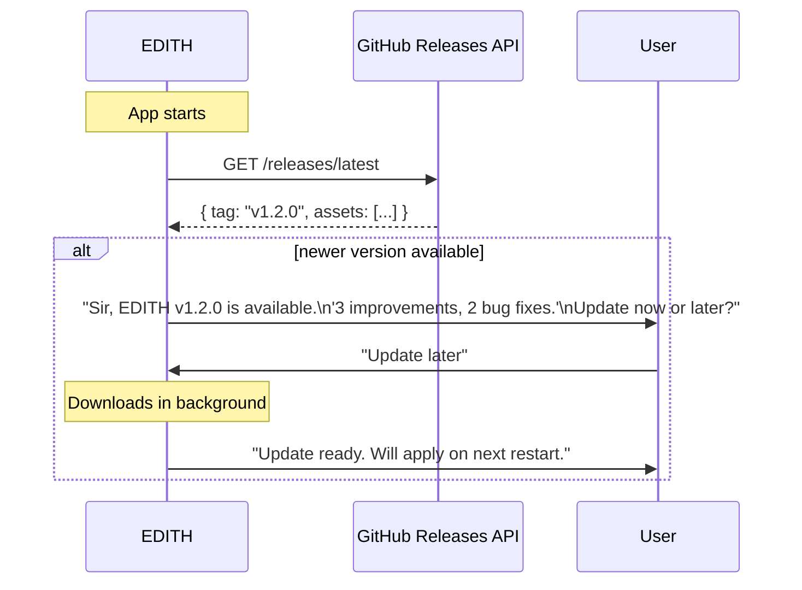
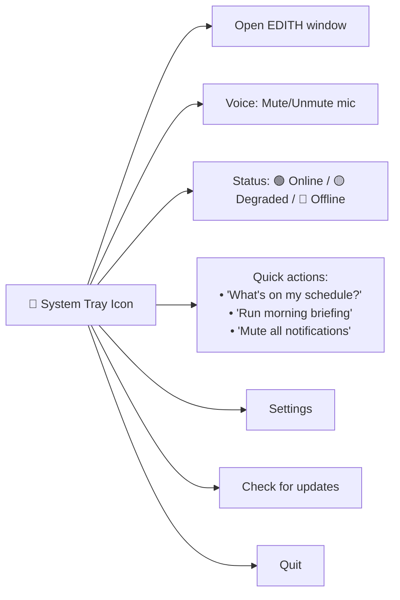
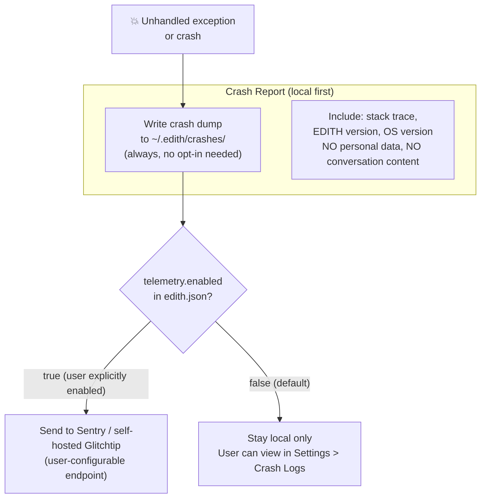
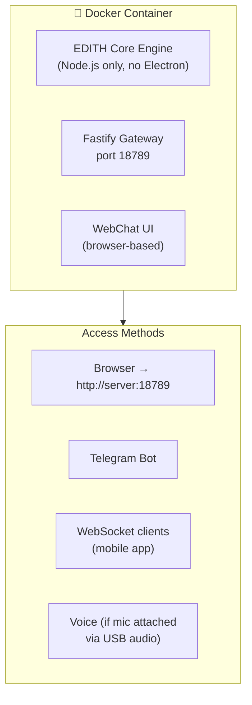
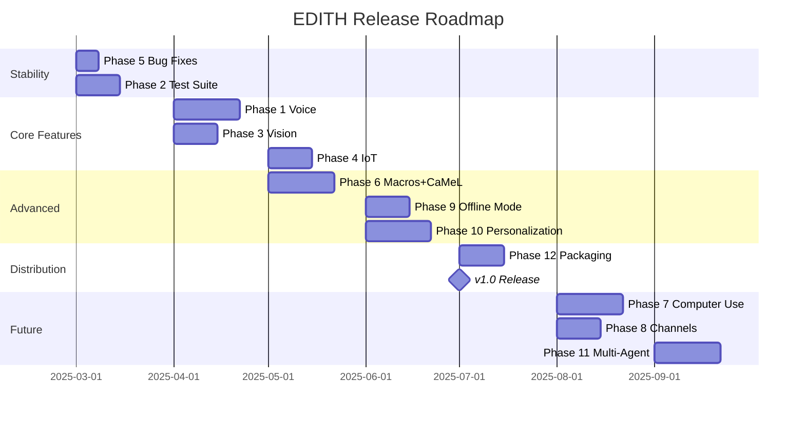

# Phase 12 — Distribution, Packaging & Auto-Update

**Prioritas:** 🟢 MEDIUM (becomes HIGH when ready to share/use daily)
**Depends on:** Phase 5 (bug fixes), Phase 9 (offline mode) — should be stable before packaging
**Status Saat Ini:** Electron shell ✅ | electron-builder setup ✅ | Manual install ❌ | Auto-updater ❌ | Onboarding wizard (partial) ✅ | OOBE complete ❌

---

## 1. Tujuan

Jadikan EDITH dapat di-install dengan **satu klik** di Windows, macOS, dan Linux — dan bisa **auto-update** tanpa user harus manual download. Plus first-run experience (OOBE) yang smooth untuk setup awal.



---

## 2. Sub-Phase Breakdown



---

### Phase 12A — Build Pipeline

**Goal:** One-command cross-platform build + GitHub Actions CI that auto-publishes on tag push.



**GitHub Actions workflow (`.github/workflows/release.yml`):**
```yaml
on:
  push:
    tags: ['v*']

jobs:
  build-windows:
    runs-on: windows-latest
    steps:
      - pnpm install
      - pnpm run build:ts
      - electron-builder --win --publish always

  build-mac:
    runs-on: macos-latest
    steps:
      - pnpm install
      - pnpm run build:ts
      - electron-builder --mac --publish always
      # notarize via APPLE_ID + APPLE_TEAM_ID secrets

  build-linux:
    runs-on: ubuntu-latest
    steps:
      - pnpm install
      - pnpm run build:ts
      - electron-builder --linux --publish always
```

**`electron-builder.json` config (in `apps/desktop/`):**
```json
{
  "appId": "ai.edith.desktop",
  "productName": "EDITH",
  "publish": {
    "provider": "github",
    "owner": "your-github-username",
    "repo": "EDITH"
  },
  "win": {
    "target": ["nsis", "portable"],
    "icon": "assets/icon.ico"
  },
  "mac": {
    "target": ["dmg"],
    "icon": "assets/icon.icns",
    "notarize": true
  },
  "linux": {
    "target": ["AppImage", "deb"],
    "icon": "assets/icon.png"
  },
  "extraResources": [
    { "from": "../../EDITH-ts/dist/", "to": "engine/" },
    { "from": "../../EDITH-ts/python/", "to": "python/" },
    { "from": "../../EDITH-ts/models/", "to": "models/" }
  ]
}
```

---

### Phase 12B — OOBE (Out-of-Box Experience)

**Goal:** First-run wizard yang membimbing user setup EDITH dari nol ke fully functional.



**Voice-guided OOBE:**
- Every step narrated by EDITH via TTS (using Edge TTS as default before user TTS prefs are set)
- User can respond by voice OR mouse/keyboard
- Wizard detects if Ollama is running locally and auto-suggests it as primary LLM

**edith.json written by OOBE:**
```json
{
  "_setupComplete": true,
  "_setupVersion": "1.0.0",
  "personality": { "titleWord": "Sir" },
  "llm": { "provider": "groq", "model": "groq/llama-3.3-70b-versatile" },
  "voice": { "enabled": true, "tts": { "engine": "edge" } },
  "env": { "GROQ_API_KEY": "user entered key" }
}
```

---

### Phase 12C — Auto-Updater

**Goal:** EDITH checks for updates silently in background, notifies user, updates on next restart (or immediately if user agrees).



**Implementation:** `electron-updater` (already a dependency pattern in electron-builder ecosystem)

```typescript
// apps/desktop/main.js — add to existing
import { autoUpdater } from 'electron-updater'

autoUpdater.autoDownload = true
autoUpdater.checkForUpdatesAndNotify()

autoUpdater.on('update-available', (info) => {
  edithCore.speak(`EDITH version ${info.version} is available.`)
})
autoUpdater.on('update-downloaded', () => {
  edithCore.speak('Update ready. Restart to apply.')
})
```

**Self-hosted update server alternative:**
```json
{
  "publish": {
    "provider": "generic",
    "url": "http://your-nas-or-server/edith-updates/"
  }
}
```
User dapat host update server sendiri di NAS/VPS — fully self-hosted update pipeline.

---

### Phase 12D — System Tray & Autostart

**Goal:** EDITH jalan di background, icon di system tray, autostart saat login.



**Autostart config in `edith.json`:**
```json
{
  "app": {
    "startMinimized": true,
    "autoLaunch": true,
    "minimizeToTray": true,
    "showTrayNotifications": true
  }
}
```

---

### Phase 12E — Crash Reporting & Telemetry (Opt-In Only)

**Always opt-in, never opt-out-required. No data sent by default.**



**Telemetry config (off by default):**
```json
{
  "telemetry": {
    "enabled": false,
    "crashReporting": false,
    "endpoint": ""
  }
}
```

---

### Phase 12F — Docker Mode (Headless Server)

**Goal:** EDITH bisa jalan sebagai headless server (tanpa Electron GUI) untuk deployment di VPS, home server, atau NAS.



**`Dockerfile`:**
```dockerfile
FROM node:22-alpine
WORKDIR /app

# Copy compiled engine
COPY EDITH-ts/dist/ ./dist/
COPY EDITH-ts/python/ ./python/
COPY EDITH-ts/models/ ./models/
COPY EDITH-ts/prisma/ ./prisma/

RUN npm install -g pnpm
RUN pnpm install --prod

# Python for voice sidecar
RUN apk add python3 py3-pip
RUN pip3 install faster-whisper kokoro soundfile

EXPOSE 18789
CMD ["node", "dist/core/startup.js"]
```

**`docker-compose.yml`:**
```yaml
version: '3.9'
services:
  edith:
    image: edith:latest
    ports:
      - "18789:18789"
    volumes:
      - ./edith.json:/app/edith.json:ro
      - edith-data:/app/data
    environment:
      - NODE_ENV=production
    restart: unless-stopped

  ollama:
    image: ollama/ollama
    volumes:
      - ollama-data:/root/.ollama
    ports:
      - "11434:11434"

volumes:
  edith-data:
  ollama-data:
```

---

## 3. Summary — Road to v1.0 Release



---

## 4. File Changes Summary

| File | Action | Est. Lines |
|------|--------|-----------|
| `.github/workflows/release.yml` | NEW — CI/CD build pipeline | +80 |
| `apps/desktop/electron-builder.json` | Update + extraResources | +30 |
| `apps/desktop/main.js` | Add auto-updater, tray menu | +100 |
| `apps/desktop/renderer/wizard.html` | Extend OOBE steps (voice, personality) | +150 |
| `Dockerfile` | NEW | +40 |
| `docker-compose.yml` | NEW | +30 |
| `EDITH-ts/src/config/edith-config.ts` | Add app/telemetry schema | +30 |
| `EDITH-ts/src/core/startup.ts` | Headless mode support | +40 |
| **Total** | | **~500 lines** |

**New deps:**
```bash
# In apps/desktop:
pnpm add electron-updater

# CI only:
# macOS code signing via Apple Developer account
# Windows code signing via EV cert (optional)
```
