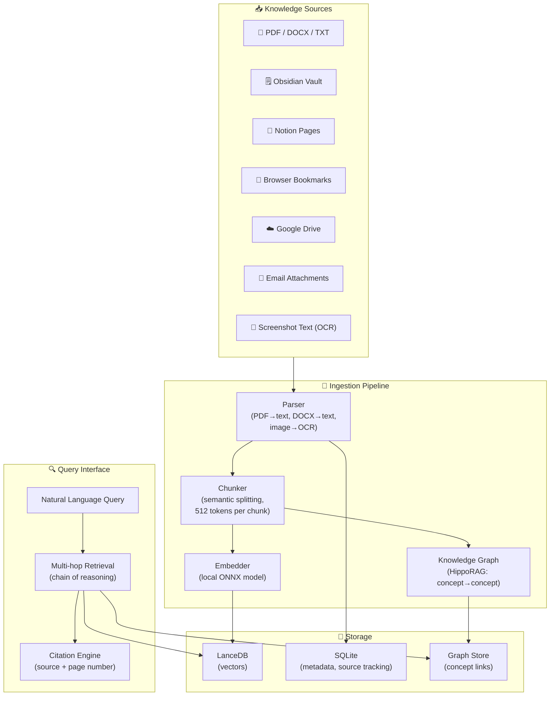
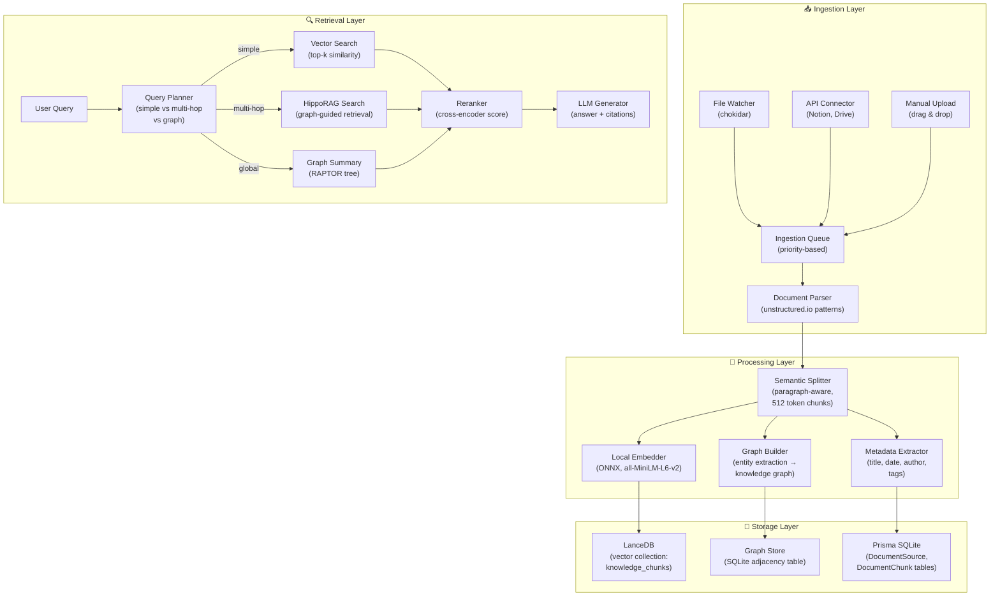
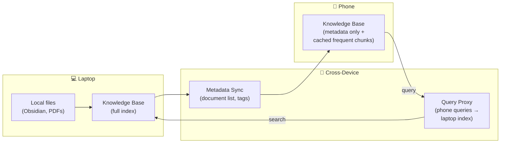
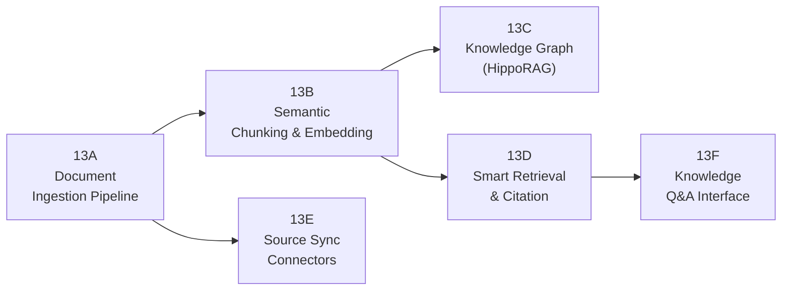
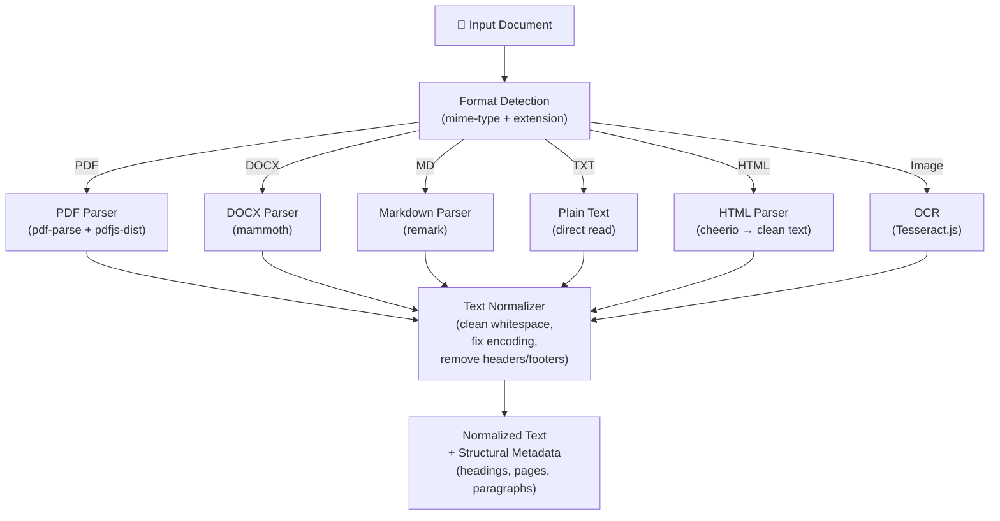
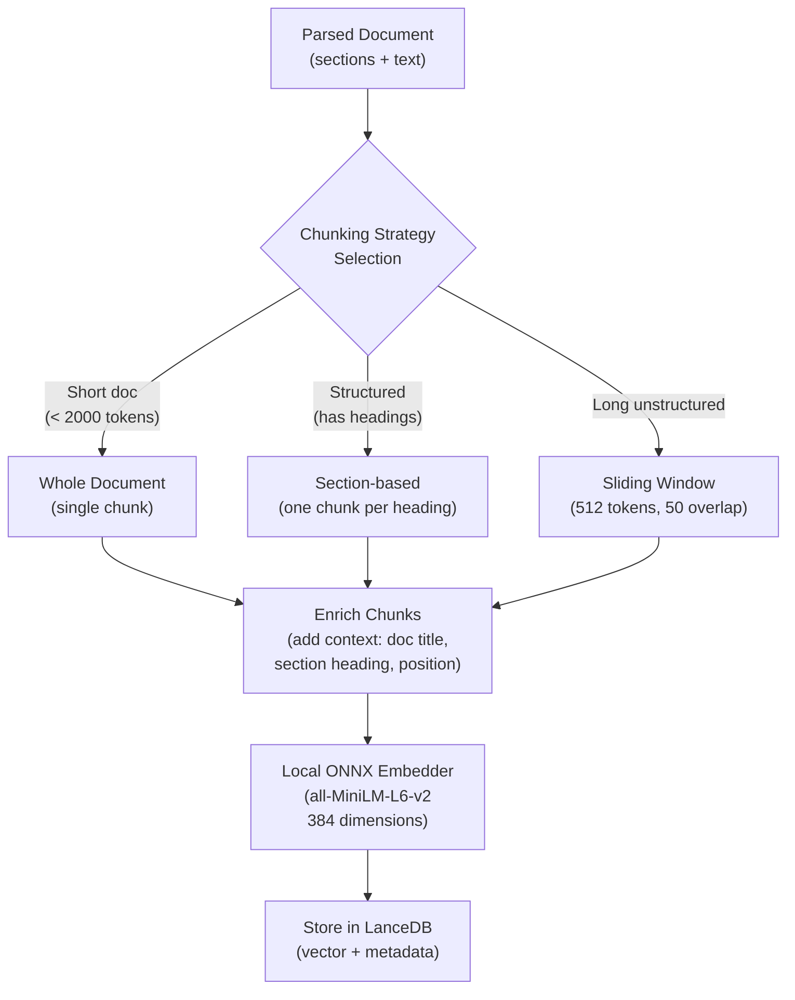
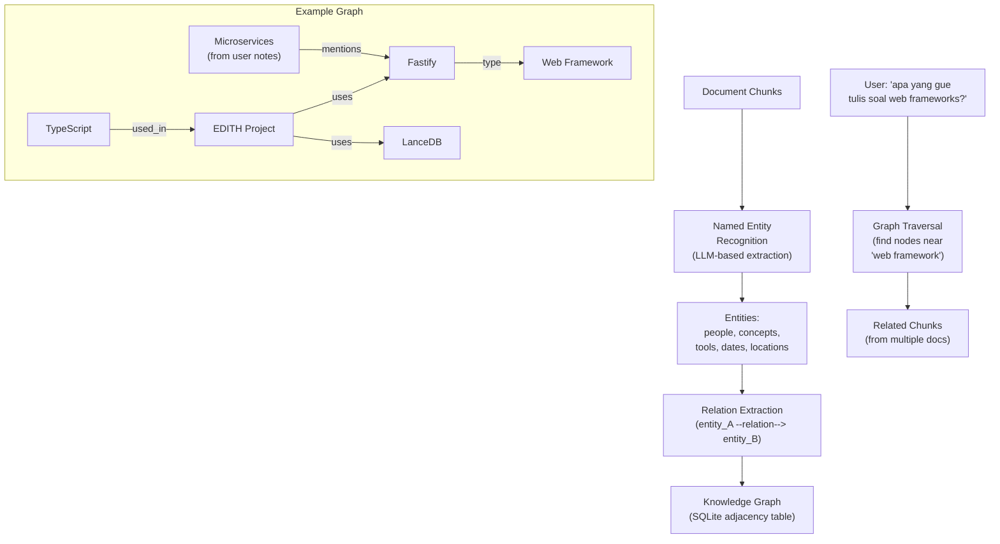
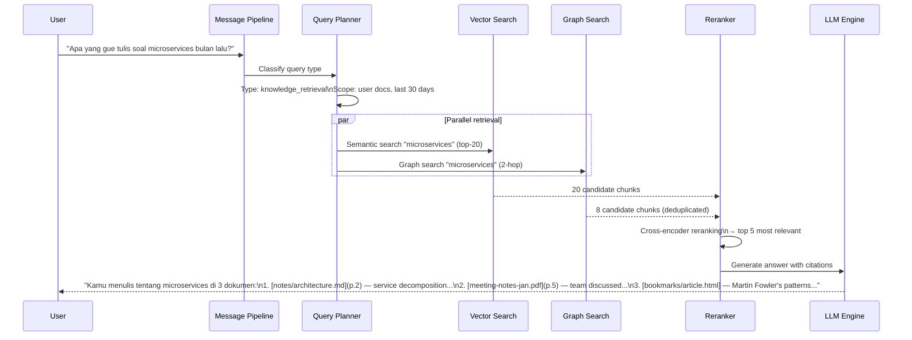
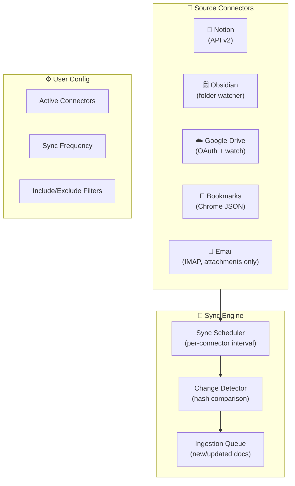
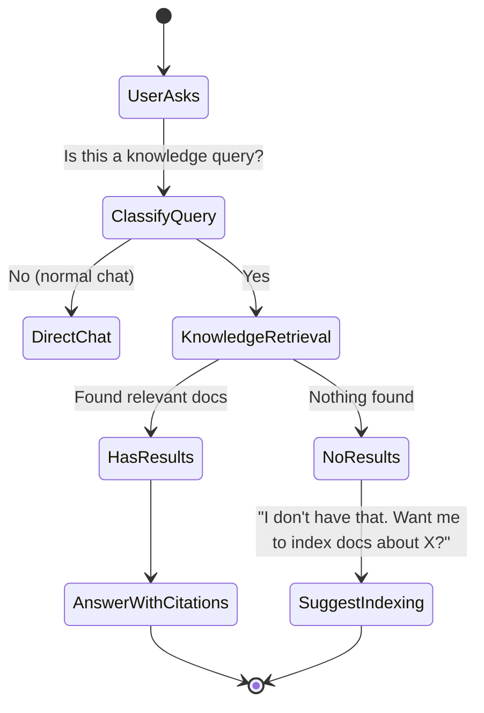

# Phase 13 — Personal Knowledge Base (Second Brain)

> "JARVIS punya akses ke semua database Stark Industries. EDITH harus punya akses ke semua yang pernah user tulis."

**Prioritas:** 🔴 HIGH — Killer feature. Biggest daily value.
**Depends on:** Phase 9 (LanceDB vectors), Phase 6 (proactive retrieval)
**Status:** ❌ Not started

---

## 1. Tujuan

User punya dokumen di mana-mana: PDF di laptop, notes di Obsidian, bookmark di browser,
meeting notes di Notion. EDITH harus **membaca, index, dan bisa jawab pertanyaan** dari
semua dokumen ini. Bukan sekedar search — ini **semantic understanding** atas personal knowledge.



---

## 2. Research References

| # | Paper / Project | ID | Kontribusi ke EDITH |
|---|-----------------|-----|---------------------|
| 1 | RAG Survey: Retrieval-Augmented Generation | arXiv:2312.10997 | Comprehensive RAG pipeline patterns — chunking, retrieval, generation |
| 2 | LongRAG: Enhancing RAG for Long Contexts | arXiv:2406.15319 | Handle dokumen panjang (100+ halaman) — long-context retrieval strategies |
| 3 | HippoRAG: Neurobiologically Inspired RAG | arXiv:2405.14831 | Knowledge graph + vector search — hippocampus-style memory indexing |
| 4 | ColPali: Visual Document Retrieval | arXiv:2407.01449 | PDF visual understanding — tabel, diagram, chart tanpa parse ke teks |
| 5 | Unstructured.io (open source) | github.com/Unstructured-IO | Document parsing: PDF, DOCX, HTML, images → structured elements |
| 6 | LlamaIndex (open source) | github.com/run-llama/llama_index | RAG framework — ingestion, indexing, retrieval patterns |
| 7 | GraphRAG (Microsoft) | arXiv:2404.16130 | Community-based graph retrieval — global questions over large corpora |
| 8 | RAPTOR: Recursive Tree Retrieval | arXiv:2401.18059 | Hierarchical summarization tree — multi-level abstraction for retrieval |

---

## 3. Arsitektur

### 3.1 Kontrak Arsitektur

```
Rule 1: Knowledge Base = extension of EDITH memory, NOT a separate system.
        Uses existing LanceDB from Phase 9 with new collections.
        Query interface through message-pipeline.ts like everything else.

Rule 2: Ingestion is async and non-blocking.
        User drops file → queued → background processing.
        Never block chat for document indexing.

Rule 3: Source tracking is mandatory.
        Every chunk knows its source file, page, paragraph.
        Citations are ALWAYS provided with answers.

Rule 4: Local-first embedding.
        Use ONNX models (e.g., all-MiniLM-L6-v2) locally.
        No document content sent to cloud for embedding.

Rule 5: User controls what gets indexed.
        Explicit opt-in per folder/source.
        Never auto-index without consent.
```

### 3.2 System Architecture



### 3.3 Cross-Device Sync (Phase 27 Integration)



---

## 4. Sub-Phase Breakdown



---

### Phase 13A — Document Ingestion Pipeline

**Goal:** Parse any document format into clean text chunks.



```typescript
/**
 * @module knowledge/document-parser
 * Document parser that handles multiple formats and outputs normalized text.
 */

interface ParsedDocument {
  sourceId: string;
  title: string;
  content: string;
  format: 'pdf' | 'docx' | 'md' | 'txt' | 'html' | 'image';
  metadata: {
    author?: string;
    createdAt?: Date;
    pageCount?: number;
    wordCount: number;
    language?: string;
  };
  structure: DocumentSection[];
}

interface DocumentSection {
  heading?: string;
  content: string;
  page?: number;
  level: number; // heading level (1-6), 0 = body text
}

// DECISION: Use pdf-parse + Tesseract.js (local) instead of cloud OCR
// WHY: Privacy — user documents never leave machine
// ALTERNATIVES: AWS Textract (better accuracy, cloud), Google Vision (cloud)
// REVISIT: If OCR quality insufficient → add optional cloud fallback

class DocumentParser {
  async parse(filePath: string): Promise<ParsedDocument> {
    const format = this.detectFormat(filePath);
    const rawText = await this.extractText(filePath, format);
    const sections = this.extractStructure(rawText, format);
    
    return {
      sourceId: this.generateSourceId(filePath),
      title: this.extractTitle(sections, filePath),
      content: rawText,
      format,
      metadata: this.extractMetadata(rawText, filePath),
      structure: sections,
    };
  }
  
  private detectFormat(path: string): ParsedDocument['format'] {
    const ext = path.split('.').pop()?.toLowerCase();
    const formatMap: Record<string, ParsedDocument['format']> = {
      pdf: 'pdf', docx: 'docx', md: 'md', txt: 'txt',
      html: 'html', htm: 'html', png: 'image', jpg: 'image', jpeg: 'image',
    };
    return formatMap[ext ?? ''] ?? 'txt';
  }
}
```

```json
{
  "knowledgeBase": {
    "ingestion": {
      "watchPaths": ["~/Documents/notes", "~/Obsidian"],
      "supportedFormats": ["pdf", "docx", "md", "txt", "html", "png", "jpg"],
      "maxFileSizeMB": 50,
      "excludePatterns": ["**/node_modules/**", "**/.git/**"],
      "ocrEnabled": true,
      "ocrLanguage": "eng+ind"
    }
  }
}
```

**Files:**
| File | Action | Lines |
|------|--------|-------|
| `EDITH-ts/src/memory/knowledge/document-parser.ts` | CREATE | ~180 |
| `EDITH-ts/src/memory/knowledge/format-handlers.ts` | CREATE | ~200 |
| `EDITH-ts/src/memory/knowledge/ingestion-queue.ts` | CREATE | ~100 |
| `EDITH-ts/src/memory/knowledge/__tests__/document-parser.test.ts` | CREATE | ~120 |

---

### Phase 13B — Semantic Chunking & Embedding

**Goal:** Split documents into meaningful chunks and embed them locally.



```typescript
/**
 * @module knowledge/semantic-chunker
 * Splits documents into semantically meaningful chunks with context enrichment.
 */

interface DocumentChunk {
  chunkId: string;
  sourceId: string;
  content: string;               // chunk text
  contextPrefix: string;         // "From: {doc_title} > {section_heading}"
  embedding?: Float32Array;      // 384d vector
  metadata: {
    page?: number;
    position: number;            // 0-indexed chunk position in document
    totalChunks: number;
    tokens: number;
  };
}

class SemanticChunker {
  private readonly maxChunkTokens = 512;
  private readonly overlapTokens = 50;
  
  chunk(doc: ParsedDocument): DocumentChunk[] {
    const totalTokens = this.countTokens(doc.content);
    
    if (totalTokens < 2000) {
      return [this.createWholeDocChunk(doc)];
    }
    
    if (doc.structure.length > 1) {
      return this.chunkBySection(doc);
    }
    
    return this.slidingWindowChunk(doc);
  }
  
  private chunkBySection(doc: ParsedDocument): DocumentChunk[] {
    return doc.structure.map((section, i) => ({
      chunkId: `${doc.sourceId}-chunk-${i}`,
      sourceId: doc.sourceId,
      content: section.content,
      contextPrefix: `From: ${doc.title} > ${section.heading ?? 'Body'}`,
      metadata: {
        page: section.page,
        position: i,
        totalChunks: doc.structure.length,
        tokens: this.countTokens(section.content),
      },
    }));
  }
}
```

**Files:**
| File | Action | Lines |
|------|--------|-------|
| `EDITH-ts/src/memory/knowledge/semantic-chunker.ts` | CREATE | ~150 |
| `EDITH-ts/src/memory/knowledge/local-embedder.ts` | CREATE | ~100 |
| `EDITH-ts/src/memory/knowledge/__tests__/semantic-chunker.test.ts` | CREATE | ~120 |

---

### Phase 13C — Knowledge Graph (HippoRAG)

**Goal:** Build concept-level connections between documents for multi-hop retrieval.



```typescript
/**
 * @module knowledge/knowledge-graph
 * HippoRAG-inspired knowledge graph for concept linking across documents.
 */

interface KnowledgeEntity {
  id: string;
  name: string;
  type: 'person' | 'concept' | 'tool' | 'place' | 'date' | 'organization';
  sourceChunks: string[];    // which chunks mention this entity
  embedding?: Float32Array;  // entity name embedding for fuzzy matching
}

interface KnowledgeEdge {
  from: string;  // entity id
  to: string;    // entity id
  relation: string;  // "uses", "mentions", "created_by", "part_of"
  weight: number;    // strength (frequency, recency)
  sourceChunk: string;
}

class KnowledgeGraph {
  /**
   * Extract entities and relations from a chunk using LLM.
   * @param chunk - The document chunk to process
   * @returns Extracted entities and edges
   */
  async extractFromChunk(chunk: DocumentChunk): Promise<{
    entities: KnowledgeEntity[];
    edges: KnowledgeEdge[];
  }> {
    const prompt = `Extract entities and relationships from this text.
Return JSON: {"entities": [{"name": "...", "type": "..."}], "relations": [{"from": "...", "to": "...", "relation": "..."}]}

Text: ${chunk.content}`;
    
    // Use EDITH's engine interface — provider-agnostic
    const result = await this.engine.generate(prompt, { json: true });
    return this.parseExtractionResult(result, chunk);
  }
  
  /**
   * Multi-hop retrieval: follow graph edges to find related chunks.
   * @param query - User's natural language question
   * @param hops - Number of graph hops (default 2)
   */
  async graphRetrieval(query: string, hops: number = 2): Promise<DocumentChunk[]> {
    const queryEntities = await this.extractQueryEntities(query);
    const reachableNodes = await this.traverseGraph(queryEntities, hops);
    return this.getChunksForEntities(reachableNodes);
  }
}
```

**Files:**
| File | Action | Lines |
|------|--------|-------|
| `EDITH-ts/src/memory/knowledge/knowledge-graph.ts` | CREATE | ~200 |
| `EDITH-ts/src/memory/knowledge/entity-extractor.ts` | CREATE | ~120 |
| `EDITH-ts/src/memory/knowledge/__tests__/knowledge-graph.test.ts` | CREATE | ~100 |

---

### Phase 13D — Smart Retrieval & Citation

**Goal:** Answer questions with citations (source + page).



```typescript
/**
 * @module knowledge/retrieval-engine
 * Smart retrieval with parallel search, reranking, and citations.
 */

interface RetrievalResult {
  answer: string;
  citations: Citation[];
  confidence: number;
  chunksUsed: number;
}

interface Citation {
  sourceFile: string;
  sourceName: string;
  page?: number;
  section?: string;
  relevantExcerpt: string;
  similarity: number;
}

class KnowledgeRetriever {
  async retrieve(query: string, options?: {
    dateRange?: { from: Date; to: Date };
    sourceFilter?: string[];     // only search in specific sources
    maxResults?: number;
  }): Promise<RetrievalResult> {
    // 1. Parallel vector + graph search
    const [vectorResults, graphResults] = await Promise.all([
      this.vectorSearch(query, 20, options),
      this.graphSearch(query, 2, options),
    ]);
    
    // 2. Deduplicate + merge
    const candidates = this.deduplicateChunks([...vectorResults, ...graphResults]);
    
    // 3. Rerank with cross-encoder
    const reranked = await this.rerank(query, candidates, options?.maxResults ?? 5);
    
    // 4. Generate answer with citations
    return this.generateWithCitations(query, reranked);
  }
  
  private async generateWithCitations(
    query: string,
    chunks: ScoredChunk[]
  ): Promise<RetrievalResult> {
    const context = chunks.map((c, i) =>
      `[Source ${i + 1}: ${c.sourceName}, p.${c.page ?? '?'}]\n${c.content}`
    ).join('\n\n');
    
    const prompt = `Answer based ONLY on the provided sources. Cite using [Source N].
If the information is not in the sources, say "I don't have that in your documents."

Sources:\n${context}\n\nQuestion: ${query}`;
    
    const answer = await this.engine.generate(prompt);
    const citations = this.extractCitationsFromAnswer(answer, chunks);
    
    return { answer, citations, confidence: chunks[0]?.score ?? 0, chunksUsed: chunks.length };
  }
}
```

**Files:**
| File | Action | Lines |
|------|--------|-------|
| `EDITH-ts/src/memory/knowledge/retrieval-engine.ts` | CREATE | ~200 |
| `EDITH-ts/src/memory/knowledge/reranker.ts` | CREATE | ~80 |
| `EDITH-ts/src/memory/knowledge/citation-builder.ts` | CREATE | ~80 |
| `EDITH-ts/src/memory/knowledge/__tests__/retrieval-engine.test.ts` | CREATE | ~120 |

---

### Phase 13E — Source Sync Connectors

**Goal:** Auto-sync from Notion, Obsidian, Google Drive, bookmarks.



```json
{
  "knowledgeBase": {
    "connectors": {
      "obsidian": {
        "enabled": true,
        "vaultPath": "~/Obsidian/MyVault",
        "syncIntervalMinutes": 5,
        "watchMode": true
      },
      "notion": {
        "enabled": true,
        "apiKey": "$vault:NOTION_API_KEY",
        "databases": ["task-db-id", "notes-db-id"],
        "syncIntervalMinutes": 30
      },
      "googleDrive": {
        "enabled": false,
        "folderId": "...",
        "syncIntervalMinutes": 60
      },
      "bookmarks": {
        "enabled": true,
        "browserProfile": "Default",
        "syncIntervalMinutes": 60
      }
    }
  }
}
```

**Files:**
| File | Action | Lines |
|------|--------|-------|
| `EDITH-ts/src/memory/knowledge/connectors/obsidian.ts` | CREATE | ~100 |
| `EDITH-ts/src/memory/knowledge/connectors/notion.ts` | CREATE | ~120 |
| `EDITH-ts/src/memory/knowledge/connectors/google-drive.ts` | CREATE | ~120 |
| `EDITH-ts/src/memory/knowledge/connectors/bookmarks.ts` | CREATE | ~80 |
| `EDITH-ts/src/memory/knowledge/sync-scheduler.ts` | CREATE | ~80 |

---

### Phase 13F — Knowledge Q&A Interface

**Goal:** Natural language interface for querying personal knowledge.



**Example Interactions:**
```
User: "cari semua yang gue tulis soal arsitektur microservice"
EDITH: "Gue nemuin 3 dokumen tentang microservices:
        1. 📄 architecture-notes.md (Obsidian) — lu menulis tentang service decomposition
           dengan event-driven pattern. [hal 2-3]
        2. 📄 meeting-2024-01-15.pdf — tim diskusi migration dari monolith. [hal 5]
        3. 🔖 Bookmark: Martin Fowler - Microservices
        
        Mau gue rangkum semuanya jadi satu summary?"

User: "buat ringkasan dari 10 artikel yang gue simpan soal AI"
EDITH: "Dari 10 artikel AI di knowledge base lu:
        [structured summary with citations for each article]"

User: "dari semua meeting notes, siapa yang paling sering sebut deadline?"
EDITH: "Dari 12 meeting notes yang gue index:
        1. Budi — 8 kali
        2. Sarah — 5 kali
        3. Reza — 3 kali
        Konteks: Budi biasa sebut deadline saat sprint planning."
```

**Files:**
| File | Action | Lines |
|------|--------|-------|
| `EDITH-ts/src/memory/knowledge/query-classifier.ts` | CREATE | ~80 |
| `EDITH-ts/src/memory/knowledge/qa-interface.ts` | CREATE | ~120 |
| `EDITH-ts/src/skills/knowledge-skill.ts` | CREATE | ~80 |

---

## 5. Acceptance Gates

```
□ PDF parsing: extract text + metadata from multi-page PDF
□ DOCX parsing: handle tables, lists, formatting
□ Markdown parsing: preserve heading structure
□ OCR: extract text from screenshot/image
□ Semantic chunking: 512-token chunks with section context
□ Local embedding: all-MiniLM-L6-v2 ONNX, 384d vectors
□ LanceDB storage: insert + search knowledge chunks
□ Knowledge graph: entity extraction from chunks
□ Multi-hop retrieval: follow graph edges → find related docs
□ Citation in answers: source file + page number
□ Reranking: cross-encoder improves retrieval quality
□ Obsidian watcher: detect file change → auto re-index
□ Notion connector: sync pages from configured databases
□ Google Drive connector: sync files from configured folders
□ Knowledge Q&A: "cari semua yang gue tulis soal X" → cited answer
□ Index status dashboard: show indexed docs, last sync, errors
□ Cross-device: knowledge query from phone → laptop index (Phase 27)
```

---

## 6. Koneksi ke Phase Lain

| Phase | Integration | Protocol |
|-------|------------|----------|
| Phase 6 (Proactive) | Proactive: "lu punya notes soal ini, mau gue ingetin?" | context_inject |
| Phase 9 (Offline) | Local LanceDB + ONNX embedding = fully offline capable | existing_store |
| Phase 14 (Calendar) | "Cari meeting notes dari meeting minggu lalu" | calendar_link |
| Phase 18 (Social) | People graph + knowledge graph merge | graph_merge |
| Phase 19 (Dev Mode) | Code documentation → knowledge base | doc_ingest |
| Phase 21 (Emotion) | Mood-aware retrieval: stressed → shorter summaries | style_adapt |
| Phase 24 (Self-Improve) | Gap detection: "user banyak tanya soal X tapi ga ada docs" | gap_signal |
| Phase 27 (Cross-Device) | Query from phone → search laptop index | gateway_proxy |

---

## 7. File Changes Summary

| File | Action | Lines |
|------|--------|-------|
| `EDITH-ts/src/memory/knowledge/document-parser.ts` | CREATE | ~180 |
| `EDITH-ts/src/memory/knowledge/format-handlers.ts` | CREATE | ~200 |
| `EDITH-ts/src/memory/knowledge/ingestion-queue.ts` | CREATE | ~100 |
| `EDITH-ts/src/memory/knowledge/semantic-chunker.ts` | CREATE | ~150 |
| `EDITH-ts/src/memory/knowledge/local-embedder.ts` | CREATE | ~100 |
| `EDITH-ts/src/memory/knowledge/knowledge-graph.ts` | CREATE | ~200 |
| `EDITH-ts/src/memory/knowledge/entity-extractor.ts` | CREATE | ~120 |
| `EDITH-ts/src/memory/knowledge/retrieval-engine.ts` | CREATE | ~200 |
| `EDITH-ts/src/memory/knowledge/reranker.ts` | CREATE | ~80 |
| `EDITH-ts/src/memory/knowledge/citation-builder.ts` | CREATE | ~80 |
| `EDITH-ts/src/memory/knowledge/connectors/obsidian.ts` | CREATE | ~100 |
| `EDITH-ts/src/memory/knowledge/connectors/notion.ts` | CREATE | ~120 |
| `EDITH-ts/src/memory/knowledge/connectors/google-drive.ts` | CREATE | ~120 |
| `EDITH-ts/src/memory/knowledge/connectors/bookmarks.ts` | CREATE | ~80 |
| `EDITH-ts/src/memory/knowledge/sync-scheduler.ts` | CREATE | ~80 |
| `EDITH-ts/src/memory/knowledge/query-classifier.ts` | CREATE | ~80 |
| `EDITH-ts/src/memory/knowledge/qa-interface.ts` | CREATE | ~120 |
| `EDITH-ts/src/skills/knowledge-skill.ts` | CREATE | ~80 |
| `EDITH-ts/src/memory/knowledge/__tests__/document-parser.test.ts` | CREATE | ~120 |
| `EDITH-ts/src/memory/knowledge/__tests__/semantic-chunker.test.ts` | CREATE | ~120 |
| `EDITH-ts/src/memory/knowledge/__tests__/knowledge-graph.test.ts` | CREATE | ~100 |
| `EDITH-ts/src/memory/knowledge/__tests__/retrieval-engine.test.ts` | CREATE | ~120 |
| **Total** | | **~2750** |

**New dependencies:** `pdf-parse`, `mammoth`, `tesseract.js`, `@notionhq/client`, `googleapis`
