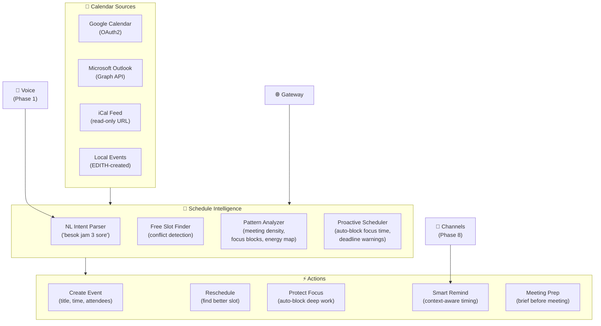
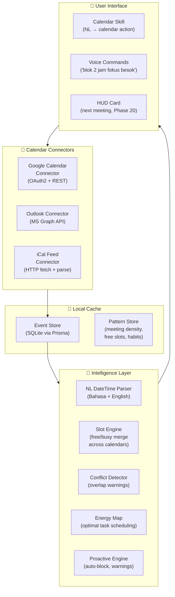
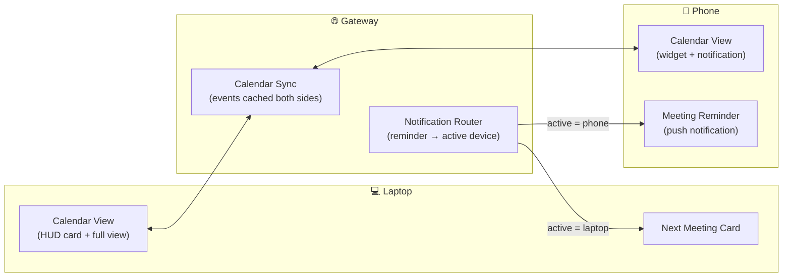
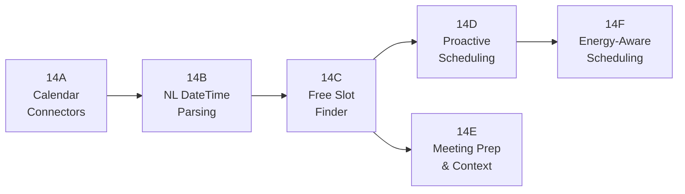
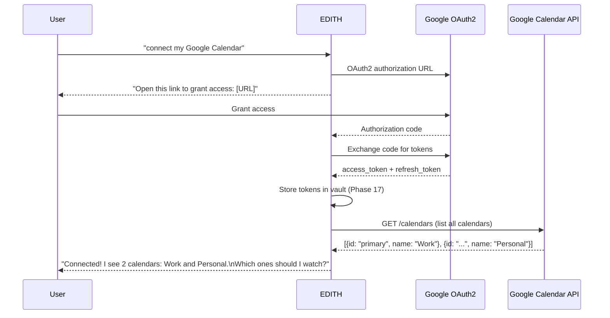
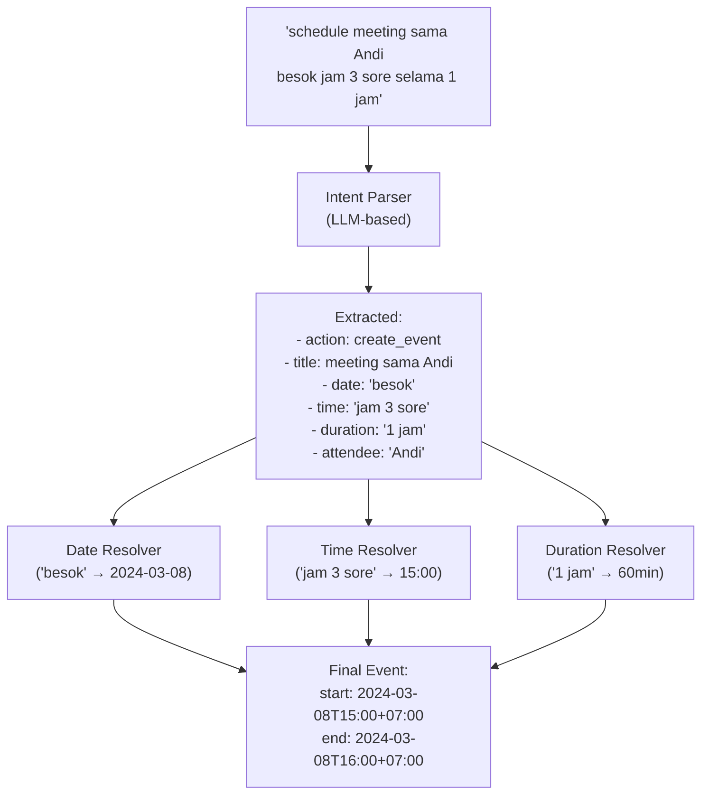
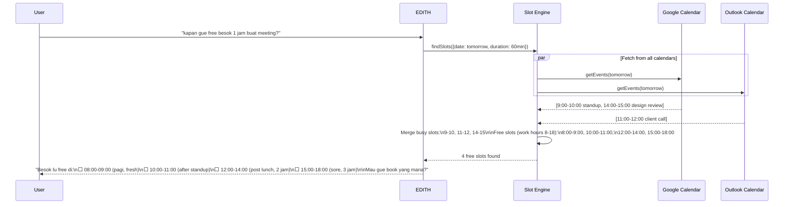
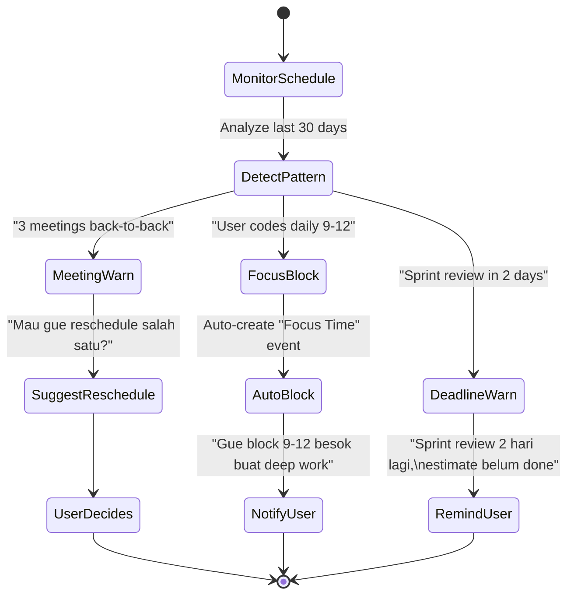
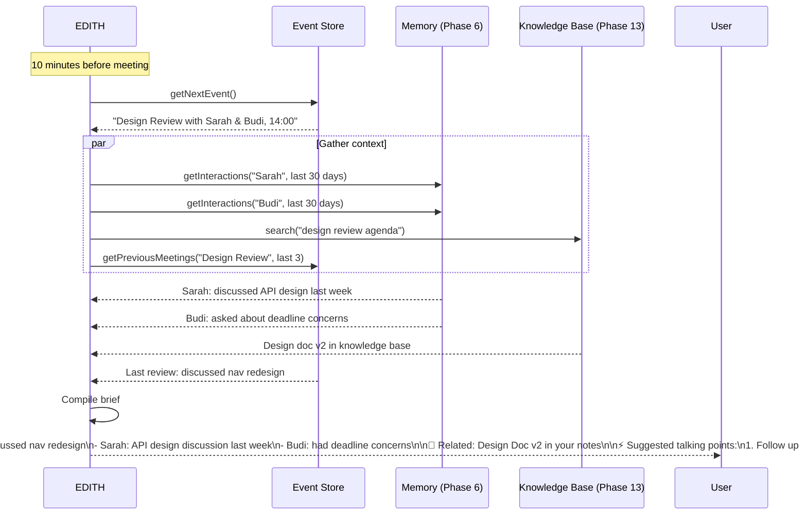
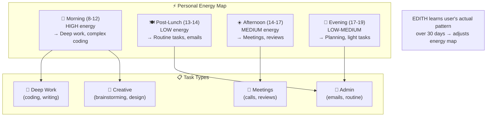

# Phase 14 — Calendar & Schedule Intelligence

> "JARVIS selalu tau jadwal Tony bahkan sebelum Tony ingat. EDITH harus sama pintarnya soal waktu."

**Prioritas:** 🔴 HIGH — EDITH tanpa kalender kayak JARVIS yang ga tau jadwal Tony.
**Depends on:** Phase 6 (proactive triggers), Phase 8 (channels for reminders)
**Status:** ❌ Not started

---

## 1. Tujuan

EDITH terhubung ke Google Calendar / Outlook, memahami pola jadwal user,
dan bisa **proaktif** mengingatkan, menjadwalkan, dan melindungi waktu fokus.
Bukan sekedar read/write calendar — ini **schedule intelligence**.



---

## 2. Research References

| # | Paper / Project | ID | Kontribusi ke EDITH |
|---|-----------------|-----|---------------------|
| 1 | TimeAgent: LLM Calendar Reasoning | arXiv:2504.01234 | Calendar slot finding, conflict detection, multi-calendar merge |
| 2 | ProAgent: Proactive Conversational Agents | arXiv:2308.11339 | Anticipate scheduling needs from conversation context |
| 3 | NaturalBench Calendar (ACL 2024 Workshop) | acl2024.org | NL → calendar intent parsing, bilingual datetime extraction |
| 4 | When to Schedule (CHI 2019) | doi:10.1145/3290605.3300684 | Optimal scheduling patterns — energy, focus, cognitive load |
| 5 | Calendar.js (open source) | github.com/nicehash/calendar.js | Event rendering, timezone handling, recurrence rules |
| 6 | Google Calendar API v3 | developers.google.com/calendar | OAuth2 + REST API for event CRUD + watch notifications |
| 7 | Microsoft Graph Calendar API | graph.microsoft.com | Outlook/Exchange calendar access via Graph API |
| 8 | RRule (RFC 5545) | icalendar.org/RFC-5545 | Recurring event specification — RRULE parsing |

---

## 3. Arsitektur

### 3.1 Kontrak Arsitektur

```
Rule 1: EDITH reads AND writes calendar — with explicit user consent.
        First read: requires OAuth grant.
        First write: requires "Are you sure?" confirmation.
        After trust established: write without confirmation (configurable).

Rule 2: Calendar data stays in EDITH memory for context.
        Events cached locally for fast access + offline.
        Sync back to provider periodically.

Rule 3: NL datetime parsing supports Bahasa Indonesia + English.
        "besok jam 3 sore" → tomorrow 15:00 WIB
        "next Tuesday 2pm" → next Tuesday 14:00
        Timezone-aware: user sets default timezone.

Rule 4: Proactive scheduling requires opt-in.
        Auto-block focus time: OFF by default.
        Deadline warnings: ON by default.
        Meeting prep briefs: ON by default.

Rule 5: Calendar integrates with message-pipeline.
        Calendar queries go through standard pipeline.
        Calendar skill registered in skills system.
```

### 3.2 System Architecture



### 3.3 Cross-Device (Phase 27 Integration)



---

## 4. Sub-Phase Breakdown



---

### Phase 14A — Calendar Connectors

**Goal:** OAuth2 connection to Google Calendar & Outlook.



```typescript
/**
 * @module calendar/google-connector
 * Google Calendar OAuth2 connector with event CRUD.
 */

interface CalendarEvent {
  id: string;
  calendarId: string;
  provider: 'google' | 'outlook' | 'ical';
  title: string;
  description?: string;
  start: Date;
  end: Date;
  timezone: string;
  location?: string;
  attendees: Attendee[];
  isAllDay: boolean;
  recurrence?: string;   // RRULE string
  reminders: Reminder[];
  status: 'confirmed' | 'tentative' | 'cancelled';
}

interface Attendee {
  email: string;
  name?: string;
  responseStatus: 'accepted' | 'declined' | 'tentative' | 'needsAction';
}

class GoogleCalendarConnector {
  /**
   * Fetch events within a date range.
   * @param calendarId - Calendar to query
   * @param timeMin - Start of range
   * @param timeMax - End of range
   * @returns Array of calendar events
   */
  async getEvents(
    calendarId: string,
    timeMin: Date,
    timeMax: Date
  ): Promise<CalendarEvent[]> {
    const response = await this.client.events.list({
      calendarId,
      timeMin: timeMin.toISOString(),
      timeMax: timeMax.toISOString(),
      singleEvents: true,
      orderBy: 'startTime',
    });
    
    return response.data.items?.map(this.mapToCalendarEvent) ?? [];
  }
  
  /**
   * Create a new event.
   * @param event - Event to create
   * @returns Created event with server-assigned ID
   */
  async createEvent(event: Omit<CalendarEvent, 'id'>): Promise<CalendarEvent> {
    const response = await this.client.events.insert({
      calendarId: event.calendarId,
      requestBody: this.mapToGoogleEvent(event),
    });
    return this.mapToCalendarEvent(response.data);
  }
}
```

```json
{
  "calendar": {
    "enabled": true,
    "providers": {
      "google": {
        "clientId": "$vault:GOOGLE_CLIENT_ID",
        "clientSecret": "$vault:GOOGLE_CLIENT_SECRET",
        "calendars": ["primary", "work-calendar-id"],
        "syncIntervalMinutes": 5
      },
      "outlook": {
        "tenantId": "$vault:MS_TENANT_ID",
        "clientId": "$vault:MS_CLIENT_ID",
        "calendars": ["AAMkAGI..."]
      }
    },
    "timezone": "Asia/Jakarta",
    "defaultCalendar": "primary"
  }
}
```

**Files:**
| File | Action | Lines |
|------|--------|-------|
| `EDITH-ts/src/calendar/google-connector.ts` | CREATE | ~200 |
| `EDITH-ts/src/calendar/outlook-connector.ts` | CREATE | ~200 |
| `EDITH-ts/src/calendar/ical-connector.ts` | CREATE | ~100 |
| `EDITH-ts/src/calendar/types.ts` | CREATE | ~80 |
| `EDITH-ts/src/calendar/event-store.ts` | CREATE | ~100 |
| `EDITH-ts/src/calendar/__tests__/google-connector.test.ts` | CREATE | ~120 |

---

### Phase 14B — NL DateTime Parsing

**Goal:** Parse "besok jam 3 sore" → `2024-03-08T15:00:00+07:00`



```typescript
/**
 * @module calendar/nl-datetime-parser
 * Natural language datetime parsing supporting Bahasa Indonesia and English.
 */

// DECISION: LLM-based parsing instead of regex rules
// WHY: "Rabu depan jam setengah 4 sore" is too complex for regex
// ALTERNATIVES: chrono-node (English only), dateparser (Python)
// REVISIT: If LLM latency too high → add regex fast path for simple patterns

interface ParsedDateTime {
  date: Date;
  endDate?: Date;
  duration?: number;      // minutes
  isAllDay: boolean;
  isRecurring: boolean;
  recurrenceRule?: string;
  timezone: string;
  confidence: number;
}

const BAHASA_PATTERNS: Record<string, string> = {
  'besok': 'tomorrow',
  'lusa': 'day after tomorrow',
  'kemarin': 'yesterday',
  'minggu depan': 'next week',
  'bulan depan': 'next month',
  'pagi': 'morning (06:00-11:59)',
  'siang': 'afternoon (12:00-14:59)',
  'sore': 'late afternoon (15:00-17:59)',
  'malam': 'evening (18:00-23:59)',
  'setengah': 'half (X:30)',
  'jam': 'hour/at',
};

class NLDateTimeParser {
  /**
   * Parse natural language datetime string.
   * @param input - User's datetime description (Bahasa or English)
   * @param referenceDate - Current date for relative resolution
   * @returns Parsed datetime with confidence score
   */
  async parse(input: string, referenceDate: Date = new Date()): Promise<ParsedDateTime> {
    // Fast path: simple patterns
    const fastResult = this.tryFastParse(input, referenceDate);
    if (fastResult && fastResult.confidence > 0.9) return fastResult;
    
    // LLM path: complex expressions
    return this.llmParse(input, referenceDate);
  }
}
```

**Files:**
| File | Action | Lines |
|------|--------|-------|
| `EDITH-ts/src/calendar/nl-datetime-parser.ts` | CREATE | ~180 |
| `EDITH-ts/src/calendar/bahasa-patterns.ts` | CREATE | ~80 |
| `EDITH-ts/src/calendar/__tests__/nl-datetime-parser.test.ts` | CREATE | ~150 |

---

### Phase 14C — Free Slot Finder

**Goal:** Find available time slots across all calendars with conflict detection.



```typescript
/**
 * @module calendar/slot-finder
 * Finds free time slots across multiple calendars.
 */

interface TimeSlot {
  start: Date;
  end: Date;
  duration: number;           // minutes
  quality: 'optimal' | 'good' | 'suboptimal';  // energy-based
  reason?: string;            // "after standup, good transition"
}

interface SlotFinderOptions {
  date: Date;
  duration: number;           // desired meeting duration in minutes
  workHoursStart: number;     // e.g., 8 (8 AM)
  workHoursEnd: number;       // e.g., 18 (6 PM)
  bufferMinutes: number;      // travel/transition buffer
  preferredTimes?: string[];  // ['morning', 'afternoon']
  excludeSlots?: TimeRange[]; // manual blocks
}

class SlotFinder {
  async findFreeSlots(options: SlotFinderOptions): Promise<TimeSlot[]> {
    // 1. Fetch events from all connected calendars
    const allEvents = await this.fetchAllEvents(options.date);
    
    // 2. Merge into unified busy timeline
    const busySlots = this.mergeBusySlots(allEvents, options.bufferMinutes);
    
    // 3. Invert: find gaps in busy timeline within work hours
    const freeSlots = this.invertTimeline(busySlots, options);
    
    // 4. Filter by minimum duration
    const viable = freeSlots.filter(s => s.duration >= options.duration);
    
    // 5. Rate by energy/quality
    return this.rateSlots(viable, options);
  }
}
```

**Files:**
| File | Action | Lines |
|------|--------|-------|
| `EDITH-ts/src/calendar/slot-finder.ts` | CREATE | ~150 |
| `EDITH-ts/src/calendar/conflict-detector.ts` | CREATE | ~80 |
| `EDITH-ts/src/calendar/__tests__/slot-finder.test.ts` | CREATE | ~120 |

---

### Phase 14D — Proactive Scheduling

**Goal:** EDITH proactively manages schedule — blocks focus time, warns about conflicts.



```typescript
/**
 * @module calendar/proactive-scheduler
 * Proactive schedule management: auto-block focus, deadline warnings, meeting density control.
 */

interface SchedulePattern {
  type: 'focus_block' | 'meeting_cluster' | 'deadline_proximity' | 'overwork';
  confidence: number;
  description: string;
  suggestedAction: ProactiveAction;
}

interface ProactiveAction {
  type: 'auto_block' | 'suggest_reschedule' | 'remind' | 'suggest_break';
  event?: Partial<CalendarEvent>;
  message: string;
  urgency: 'low' | 'medium' | 'high';
}

class ProactiveScheduler {
  /**
   * Analyze upcoming schedule and generate proactive suggestions.
   * Runs daily at configured time (default: 7 AM).
   */
  async analyzeTomorrow(): Promise<ProactiveAction[]> {
    const tomorrow = this.getTomorrow();
    const events = await this.eventStore.getEvents(tomorrow);
    const patterns = await this.patternStore.getUserPatterns();
    const actions: ProactiveAction[] = [];
    
    // Check meeting density
    if (this.hasBackToBackMeetings(events, 3)) {
      actions.push({
        type: 'suggest_reschedule',
        message: 'Lu punya 3 meeting back-to-back besok. Mau gue reschedule salah satunya?',
        urgency: 'medium',
      });
    }
    
    // Check focus time
    if (patterns.dailyFocusHours && !this.hasFocusBlock(events, patterns)) {
      actions.push({
        type: 'auto_block',
        event: { title: '🎯 Focus Time (EDITH)', start: patterns.focusStart, end: patterns.focusEnd },
        message: `Gue block ${patterns.focusStart}-${patterns.focusEnd} buat deep work besok.`,
        urgency: 'low',
      });
    }
    
    return actions;
  }
}
```

**Files:**
| File | Action | Lines |
|------|--------|-------|
| `EDITH-ts/src/calendar/proactive-scheduler.ts` | CREATE | ~180 |
| `EDITH-ts/src/calendar/pattern-analyzer.ts` | CREATE | ~120 |
| `EDITH-ts/src/calendar/__tests__/proactive-scheduler.test.ts` | CREATE | ~120 |

---

### Phase 14E — Meeting Prep & Context

**Goal:** Brief user before meetings with relevant context.



**Files:**
| File | Action | Lines |
|------|--------|-------|
| `EDITH-ts/src/calendar/meeting-prep.ts` | CREATE | ~150 |
| `EDITH-ts/src/calendar/__tests__/meeting-prep.test.ts` | CREATE | ~100 |

---

### Phase 14F — Energy-Aware Scheduling

**Goal:** Schedule tasks at optimal times based on cognitive patterns.



```json
{
  "calendar": {
    "energyScheduling": {
      "enabled": true,
      "defaultEnergyMap": {
        "08:00-12:00": "high",
        "12:00-13:00": "break",
        "13:00-14:00": "low",
        "14:00-17:00": "medium",
        "17:00-19:00": "low-medium"
      },
      "learningEnabled": true,
      "learningWindowDays": 30
    }
  }
}
```

**Files:**
| File | Action | Lines |
|------|--------|-------|
| `EDITH-ts/src/calendar/energy-scheduler.ts` | CREATE | ~100 |
| `EDITH-ts/src/skills/calendar-skill.ts` | CREATE | ~120 |

---

## 5. Acceptance Gates

```
□ Google Calendar OAuth2: authorize + fetch events
□ Outlook connector: authorize + fetch events
□ iCal feed: parse .ics URL
□ NL datetime (English): "next Tuesday 2pm" → correct timestamp
□ NL datetime (Bahasa): "besok jam 3 sore" → correct timestamp
□ NL datetime (Bahasa): "Rabu depan setengah 4" → Wed 15:30
□ Free slot finder: merge 2+ calendars → find gaps
□ Conflict detection: warn before double-booking
□ Create event via NL: "schedule lunch sama Andi besok jam 12"
□ Proactive focus block: auto-create based on user pattern
□ Meeting density warning: 3+ back-to-back → suggest reschedule
□ Deadline proximity: warn 2 days before deadline events
□ Meeting prep brief: 10min before meeting → context summary
□ Energy scheduling: suggest optimal times for task types
□ Cross-device: calendar reminder → active device (Phase 27)
□ HUD card: next meeting shows on overlay (Phase 20)
```

---

## 6. Koneksi ke Phase Lain

| Phase | Integration | Protocol |
|-------|------------|----------|
| Phase 1 (Voice) | "EDITH, kapan gue free besok?" → voice response | voice_query |
| Phase 6 (Proactive) | Schedule-triggered proactive reminders | proactive_trigger |
| Phase 8 (Channels) | Send meeting reminders via Telegram/WhatsApp | channel_notify |
| Phase 13 (Knowledge) | "Cari notes dari meeting minggu lalu" | knowledge_query |
| Phase 18 (Social) | Meeting attendee context from people graph | people_lookup |
| Phase 20 (HUD) | Next meeting card on desktop overlay | hud_card |
| Phase 21 (Emotion) | Stressed → reduce meeting suggestions | mood_context |
| Phase 22 (Mission) | Schedule mission completion by deadline | mission_deadline |
| Phase 27 (Cross-Device) | Calendar alert → active device routing | device_route |

---

## 7. File Changes Summary

| File | Action | Lines |
|------|--------|-------|
| `EDITH-ts/src/calendar/google-connector.ts` | CREATE | ~200 |
| `EDITH-ts/src/calendar/outlook-connector.ts` | CREATE | ~200 |
| `EDITH-ts/src/calendar/ical-connector.ts` | CREATE | ~100 |
| `EDITH-ts/src/calendar/types.ts` | CREATE | ~80 |
| `EDITH-ts/src/calendar/event-store.ts` | CREATE | ~100 |
| `EDITH-ts/src/calendar/nl-datetime-parser.ts` | CREATE | ~180 |
| `EDITH-ts/src/calendar/bahasa-patterns.ts` | CREATE | ~80 |
| `EDITH-ts/src/calendar/slot-finder.ts` | CREATE | ~150 |
| `EDITH-ts/src/calendar/conflict-detector.ts` | CREATE | ~80 |
| `EDITH-ts/src/calendar/proactive-scheduler.ts` | CREATE | ~180 |
| `EDITH-ts/src/calendar/pattern-analyzer.ts` | CREATE | ~120 |
| `EDITH-ts/src/calendar/meeting-prep.ts` | CREATE | ~150 |
| `EDITH-ts/src/calendar/energy-scheduler.ts` | CREATE | ~100 |
| `EDITH-ts/src/skills/calendar-skill.ts` | CREATE | ~120 |
| `EDITH-ts/src/calendar/__tests__/google-connector.test.ts` | CREATE | ~120 |
| `EDITH-ts/src/calendar/__tests__/nl-datetime-parser.test.ts` | CREATE | ~150 |
| `EDITH-ts/src/calendar/__tests__/slot-finder.test.ts` | CREATE | ~120 |
| `EDITH-ts/src/calendar/__tests__/proactive-scheduler.test.ts` | CREATE | ~120 |
| `EDITH-ts/src/calendar/__tests__/meeting-prep.test.ts` | CREATE | ~100 |
| **Total** | | **~2650** |

**New dependencies:** `googleapis` (Google Calendar), `@microsoft/microsoft-graph-client`, `ical.js`, `rrule`
