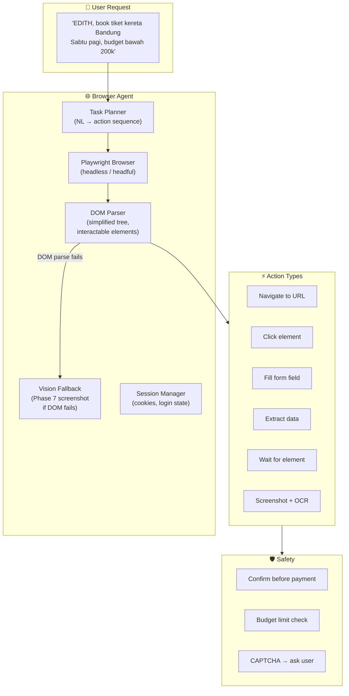
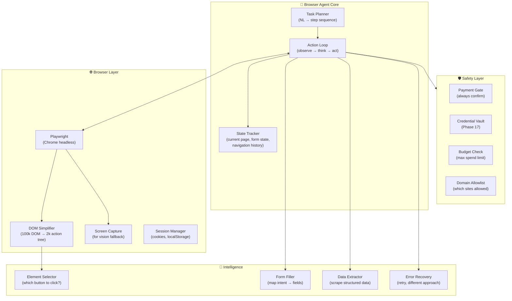
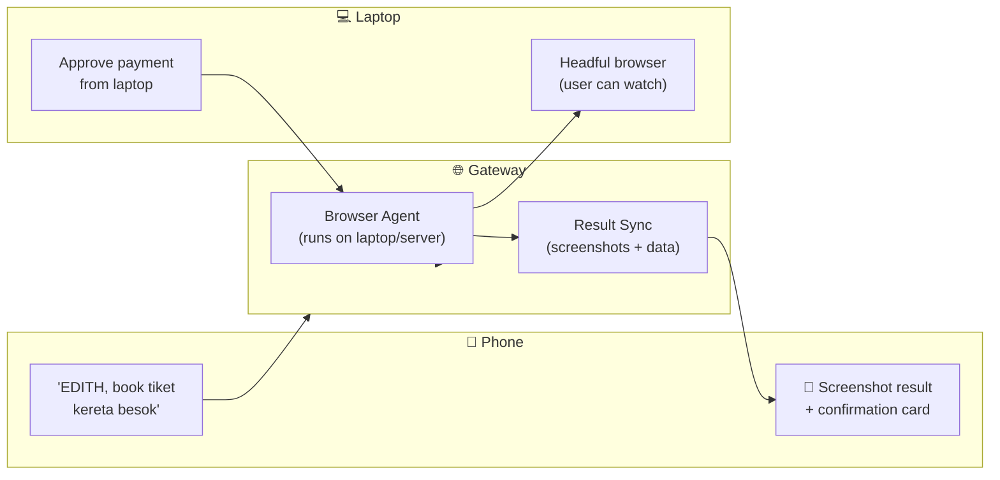
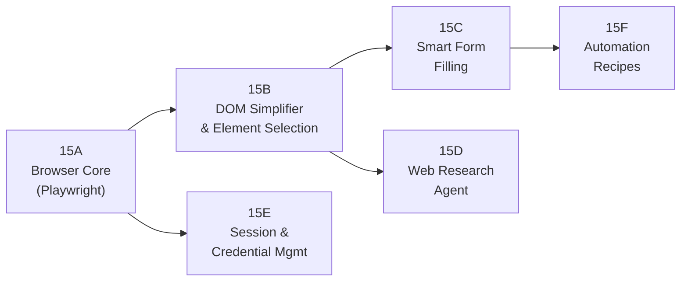
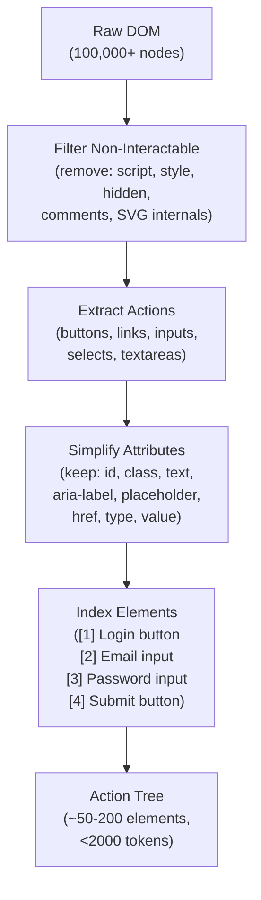
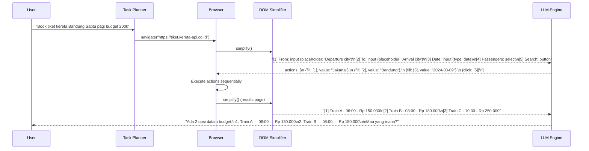
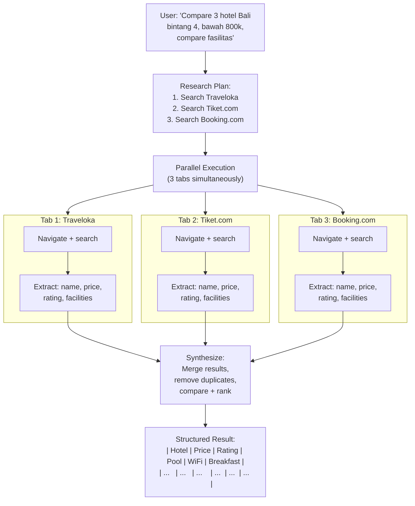
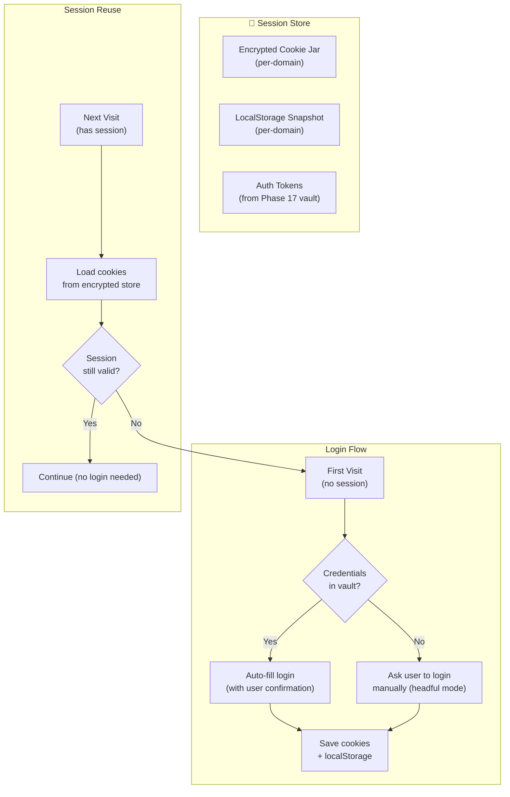
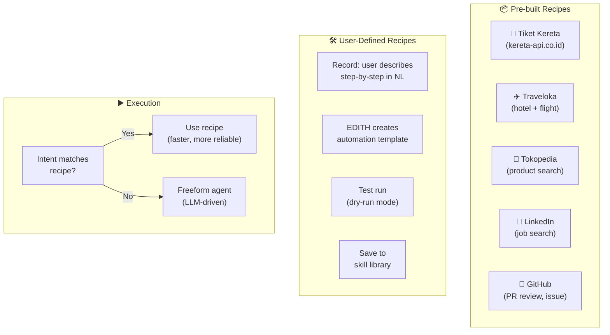

# Phase 15 — Browser Agent (Deep Web Automation)

> "JARVIS bisa hack Departemen Pertahanan. EDITH minimal harus bisa book tiket kereta."

**Prioritas:** 🟡 MEDIUM-HIGH — Beda dari Phase 7 (Computer Use).
**Depends on:** Phase 7 (computer use / vision fallback), Phase 17 (credential vault)
**Status:** ❌ Not started

---

## 1. Tujuan

Phase 7 (Computer Use) = screenshot → klik pixel. Ini = **purpose-built browser automation**
dengan DOM awareness, form filling cerdas, session management, dan web scraping terstruktur.
EDITH bisa browse web, fill forms, extract data, dan complete tasks — di browser nyata.



---

## 2. Research References

| # | Paper / Project | ID | Kontribusi ke EDITH |
|---|-----------------|-----|---------------------|
| 1 | WebAgent: LLM-driven Browser Agent | arXiv:2307.12856 | HTML understanding → action generation, multi-step web tasks |
| 2 | Mind2Web: Cross-Website Generalization | arXiv:2306.06070 | Generalize web automation across unseen websites |
| 3 | WebArena: Realistic Web Task Benchmark | arXiv:2307.13854 | Benchmark for evaluating autonomous web agents |
| 4 | Browser Use (open source, 2024) | github.com/browser-use | Playwright + LLM integration pattern, production-ready |
| 5 | SeeAct: GPT-4V Web Agent | arXiv:2401.01614 | Vision-based web agent — click based on screenshot |
| 6 | Playwright (Microsoft) | playwright.dev | Browser automation: Chrome, Firefox, WebKit |
| 7 | AgentQL: Web Element Query Language | agentql.com | Natural language → DOM element selection |
| 8 | Skyvern (open source) | github.com/Skyvern-AI | Visual web automation without pre-mapped selectors |

---

## 3. Arsitektur

### 3.1 Kontrak Arsitektur

```
Rule 1: DOM-first, Vision-fallback.
        Try structured DOM parsing first (faster, more accurate).
        If DOM is obfuscated/complex → fallback to Phase 7 screenshot vision.

Rule 2: Never auto-submit payments or sensitive actions.
        Payment forms → ALWAYS confirm with user.
        Login with stored credentials → confirm first time, remember preference.

Rule 3: Session persistence across requests.
        Login once → cookies stored in encrypted session store.
        Next request to same site → already logged in.

Rule 4: Rate limiting and politeness.
        Respect robots.txt (configurable override).
        Max 1 request per second per domain (default).
        Concurrent tabs: max 5 (configurable).

Rule 5: DOM simplification before LLM.
        Raw DOM is too large for context windows.
        Simplify: keep only interactable elements with attributes.
        Result: slim action tree that LLM can reason about.
```

### 3.2 System Architecture



### 3.3 Cross-Device (Phase 27 Integration)



---

## 4. Sub-Phase Breakdown



---

### Phase 15A — Browser Core (Playwright)

**Goal:** Playwright-powered browser with observe-think-act loop.

```mermaid
stateDiagram-v2
    [*] --> Navigate
    Navigate --> Observe : Page loaded
    
    Observe --> Think : DOM simplified + screenshot
    Think --> Act : LLM decides action
    
    Act --> Click : "Click 'Book Now' button"
    Act --> Fill : "Type 'Bandung' in destination"
    Act --> Navigate : "Go to checkout page"
    Act --> Extract : "Get all prices from table"
    Act --> Wait : "Wait for loading spinner"
    Act --> Done : "Task complete"
    
    Click --> Observe : Page may have changed
    Fill --> Observe
    Navigate --> Observe
    Wait --> Observe
    
    Done --> [*]
    
    Observe --> Error : Unexpected page state
    Error --> Recovery : Try different approach
    Recovery --> Observe
```

```typescript
/**
 * @module browser/browser-core
 * Playwright browser automation with observe-think-act loop.
 */

import { chromium, type Browser, type Page } from 'playwright';

interface BrowserAction {
  type: 'click' | 'fill' | 'navigate' | 'extract' | 'wait' | 'screenshot' | 'scroll';
  selector?: string;
  value?: string;
  url?: string;
  description: string;
}

interface PageState {
  url: string;
  title: string;
  actionTree: ActionElement[];    // simplified DOM
  screenshot?: Buffer;
  formState: Record<string, string>;
}

class BrowserCore {
  private browser: Browser | null = null;
  private page: Page | null = null;
  
  async launch(headless: boolean = true): Promise<void> {
    this.browser = await chromium.launch({
      headless,
      args: ['--disable-web-security', '--no-sandbox'],
    });
    const context = await this.browser.newContext({
      userAgent: 'EDITH-Browser-Agent/1.0',
      viewport: { width: 1280, height: 720 },
    });
    this.page = await context.newPage();
  }
  
  /**
   * Observe current page state: simplified DOM + optional screenshot.
   */
  async observe(): Promise<PageState> {
    if (!this.page) throw new Error('Browser not launched');
    
    const [actionTree, screenshot] = await Promise.all([
      this.simplifyDOM(),
      this.page.screenshot({ type: 'png' }),
    ]);
    
    return {
      url: this.page.url(),
      title: await this.page.title(),
      actionTree,
      screenshot,
      formState: await this.getFormState(),
    };
  }
  
  /**
   * Execute a browser action.
   */
  async act(action: BrowserAction): Promise<void> {
    if (!this.page) throw new Error('Browser not launched');
    
    switch (action.type) {
      case 'navigate':
        await this.page.goto(action.url!, { waitUntil: 'domcontentloaded' });
        break;
      case 'click':
        await this.page.click(action.selector!, { timeout: 10000 });
        break;
      case 'fill':
        await this.page.fill(action.selector!, action.value!);
        break;
      case 'wait':
        await this.page.waitForSelector(action.selector!, { timeout: 15000 });
        break;
      case 'scroll':
        await this.page.mouse.wheel(0, 500);
        break;
    }
  }
}
```

**Files:**
| File | Action | Lines |
|------|--------|-------|
| `EDITH-ts/src/browser/browser-core.ts` | CREATE | ~200 |
| `EDITH-ts/src/browser/types.ts` | CREATE | ~100 |
| `EDITH-ts/src/browser/__tests__/browser-core.test.ts` | CREATE | ~120 |

---

### Phase 15B — DOM Simplifier & Element Selection

**Goal:** 100k DOM → 2k actionable element tree.



```typescript
/**
 * @module browser/dom-simplifier
 * Simplifies full DOM into actionable element tree for LLM consumption.
 */

interface ActionElement {
  index: number;              // [1], [2], ...
  tag: string;                // 'button', 'input', 'a', 'select'
  text: string;               // visible text or label
  attributes: {
    id?: string;
    type?: string;
    placeholder?: string;
    href?: string;
    ariaLabel?: string;
    value?: string;
  };
  isVisible: boolean;
  boundingBox: { x: number; y: number; width: number; height: number };
}

class DOMSimplifier {
  /**
   * Reduce full DOM to actionable elements only.
   * @param page - Playwright page
   * @returns Simplified action tree with indexed elements
   */
  async simplify(page: Page): Promise<ActionElement[]> {
    return page.evaluate(() => {
      const interactableTags = new Set([
        'a', 'button', 'input', 'select', 'textarea', 'summary', 'details'
      ]);
      const interactableRoles = new Set([
        'button', 'link', 'textbox', 'checkbox', 'radio', 'tab',
        'menuitem', 'option', 'switch', 'combobox'
      ]);
      
      const elements: ActionElement[] = [];
      let index = 0;
      
      const allElements = document.querySelectorAll('*');
      for (const el of allElements) {
        const tag = el.tagName.toLowerCase();
        const role = el.getAttribute('role');
        
        if (!interactableTags.has(tag) && !interactableRoles.has(role ?? '')) continue;
        
        const rect = el.getBoundingClientRect();
        if (rect.width === 0 || rect.height === 0) continue;
        
        elements.push({
          index: ++index,
          tag,
          text: (el.textContent ?? '').trim().slice(0, 100),
          attributes: {
            id: el.id || undefined,
            type: (el as HTMLInputElement).type || undefined,
            placeholder: (el as HTMLInputElement).placeholder || undefined,
            href: (el as HTMLAnchorElement).href || undefined,
            ariaLabel: el.getAttribute('aria-label') || undefined,
          },
          isVisible: true,
          boundingBox: { x: rect.x, y: rect.y, width: rect.width, height: rect.height },
        });
      }
      
      return elements;
    });
  }
}
```

**Files:**
| File | Action | Lines |
|------|--------|-------|
| `EDITH-ts/src/browser/dom-simplifier.ts` | CREATE | ~150 |
| `EDITH-ts/src/browser/element-selector.ts` | CREATE | ~100 |

---

### Phase 15C — Smart Form Filling

**Goal:** Map user intent to form fields without hardcoded selectors.



```typescript
/**
 * @module browser/form-filler
 * Maps user intent to form fields using LLM reasoning.
 */

interface FormField {
  index: number;
  label: string;
  type: string;          // text, email, password, date, select
  placeholder?: string;
  currentValue?: string;
  options?: string[];    // for select elements
  required: boolean;
}

interface FillPlan {
  fields: Array<{
    fieldIndex: number;
    value: string;
    confidence: number;
  }>;
  missingInfo: string[];  // info we need from user
}

class SmartFormFiller {
  /**
   * Generate fill plan from user intent + detected form fields.
   */
  async planFill(
    intent: string,
    fields: FormField[],
    userContext: Record<string, string>
  ): Promise<FillPlan> {
    const prompt = `Given the user's request and the form fields below, determine what to fill in each field.
If information is missing, list what's needed.

User request: "${intent}"
User context: ${JSON.stringify(userContext)}

Form fields:
${fields.map(f => `[${f.index}] ${f.label} (${f.type}${f.placeholder ? `, hint: "${f.placeholder}"` : ''}${f.required ? ', required' : ''})`).join('\n')}

Respond in JSON: {"fields": [{"fieldIndex": N, "value": "..."}], "missingInfo": ["..."]}`;

    return this.engine.generateJSON<FillPlan>(prompt);
  }
}
```

**Files:**
| File | Action | Lines |
|------|--------|-------|
| `EDITH-ts/src/browser/form-filler.ts` | CREATE | ~150 |
| `EDITH-ts/src/browser/__tests__/form-filler.test.ts` | CREATE | ~100 |

---

### Phase 15D — Web Research Agent

**Goal:** Multi-tab parallel research with structured data extraction.



```typescript
/**
 * @module browser/research-agent
 * Multi-source web research with parallel extraction and synthesis.
 */

interface ResearchResult {
  query: string;
  sources: SourceResult[];
  synthesis: string;            // LLM-generated comparison
  structuredData?: Record<string, unknown>[];  // extracted table data
  citations: { url: string; title: string; extractedAt: Date }[];
}

interface SourceResult {
  url: string;
  title: string;
  extractedData: Record<string, unknown>[];
  rawText: string;
  screenshot?: Buffer;
}

class WebResearchAgent {
  /**
   * Conduct parallel research across multiple sources.
   * @param query - Research query
   * @param sources - URLs or search engines to use
   * @param maxTabs - Maximum concurrent tabs (default: 3)
   */
  async research(
    query: string,
    sources: string[],
    maxTabs: number = 3
  ): Promise<ResearchResult> {
    // 1. Plan: what sites to visit, what data to extract
    const plan = await this.planResearch(query, sources);
    
    // 2. Execute in parallel (batched by maxTabs)
    const results = await this.executeParallel(plan, maxTabs);
    
    // 3. Deduplicate + merge
    const merged = this.mergeResults(results);
    
    // 4. Synthesize with LLM
    const synthesis = await this.synthesize(query, merged);
    
    return {
      query,
      sources: results,
      synthesis,
      structuredData: merged,
      citations: results.map(r => ({
        url: r.url, title: r.title, extractedAt: new Date()
      })),
    };
  }
}
```

**Files:**
| File | Action | Lines |
|------|--------|-------|
| `EDITH-ts/src/browser/research-agent.ts` | CREATE | ~200 |
| `EDITH-ts/src/browser/data-extractor.ts` | CREATE | ~120 |

---

### Phase 15E — Session & Credential Management

**Goal:** Persistent login sessions + secure credential storage.



**Files:**
| File | Action | Lines |
|------|--------|-------|
| `EDITH-ts/src/browser/session-manager.ts` | CREATE | ~120 |
| `EDITH-ts/src/browser/credential-bridge.ts` | CREATE | ~80 |

---

### Phase 15F — Automation Recipes

**Goal:** Pre-built + user-defined automation templates.



```json
{
  "browserAgent": {
    "enabled": true,
    "headless": true,
    "maxConcurrentTabs": 5,
    "requestsPerSecondPerDomain": 1,
    "respectRobotsTxt": true,
    "domainAllowlist": ["*"],
    "domainBlocklist": ["*.gov", "*.mil"],
    "autoLoginConfirmation": true,
    "maxBudgetPerSession": 0,
    "screenshotOnEveryStep": false,
    "timeout": 30000
  }
}
```

**Files:**
| File | Action | Lines |
|------|--------|-------|
| `EDITH-ts/src/browser/recipe-engine.ts` | CREATE | ~120 |
| `EDITH-ts/src/browser/recipes/tiket-kereta.ts` | CREATE | ~80 |
| `EDITH-ts/src/skills/browser-skill.ts` | CREATE | ~100 |

---

## 5. Acceptance Gates

```
□ Playwright launches headless Chrome successfully
□ DOM simplifier: 100k DOM → <200 actionable elements
□ Navigate + click + fill form on real website
□ Smart form filling: map "book tiket Bandung" → form fields
□ Web research: parallel 3-tab extraction + synthesis
□ Structured data extraction: prices, dates, names from results page
□ Session persistence: login once → cookies saved → auto-restore
□ CAPTCHA detection → ask user (no auto-solve)
□ Payment gate: ALWAYS confirm before purchase
□ Budget check: reject if over user's limit
□ Domain allowlist/blocklist enforcement
□ Error recovery: page load failure → retry with different approach
□ Vision fallback: when DOM parsing fails → use screenshot (Phase 7)
□ Cross-device: start browser task from phone → executes on laptop (Phase 27)
□ Rate limiting: respect 1 req/sec default
```

---

## 6. Koneksi ke Phase Lain

| Phase | Integration | Protocol |
|-------|------------|----------|
| Phase 7 (Computer Use) | Vision fallback when DOM parsing fails | screenshot_analyze |
| Phase 13 (Knowledge) | Save extracted web data to knowledge base | ingest_content |
| Phase 14 (Calendar) | "Book meeting room" on web portal | browser_task |
| Phase 17 (Privacy) | Credential vault for auto-login | vault_read |
| Phase 22 (Mission) | Browser tasks as mission sub-tasks | task_execute |
| Phase 25 (Simulation) | Preview browser actions before execution | preview_mode |
| Phase 27 (Cross-Device) | Trigger browser task from phone | remote_execute |

---

## 7. File Changes Summary

| File | Action | Lines |
|------|--------|-------|
| `EDITH-ts/src/browser/browser-core.ts` | CREATE | ~200 |
| `EDITH-ts/src/browser/types.ts` | CREATE | ~100 |
| `EDITH-ts/src/browser/dom-simplifier.ts` | CREATE | ~150 |
| `EDITH-ts/src/browser/element-selector.ts` | CREATE | ~100 |
| `EDITH-ts/src/browser/form-filler.ts` | CREATE | ~150 |
| `EDITH-ts/src/browser/research-agent.ts` | CREATE | ~200 |
| `EDITH-ts/src/browser/data-extractor.ts` | CREATE | ~120 |
| `EDITH-ts/src/browser/session-manager.ts` | CREATE | ~120 |
| `EDITH-ts/src/browser/credential-bridge.ts` | CREATE | ~80 |
| `EDITH-ts/src/browser/recipe-engine.ts` | CREATE | ~120 |
| `EDITH-ts/src/browser/recipes/tiket-kereta.ts` | CREATE | ~80 |
| `EDITH-ts/src/skills/browser-skill.ts` | CREATE | ~100 |
| `EDITH-ts/src/browser/__tests__/browser-core.test.ts` | CREATE | ~120 |
| `EDITH-ts/src/browser/__tests__/form-filler.test.ts` | CREATE | ~100 |
| **Total** | | **~1840** |

**New dependencies:** `playwright` (browser automation)
