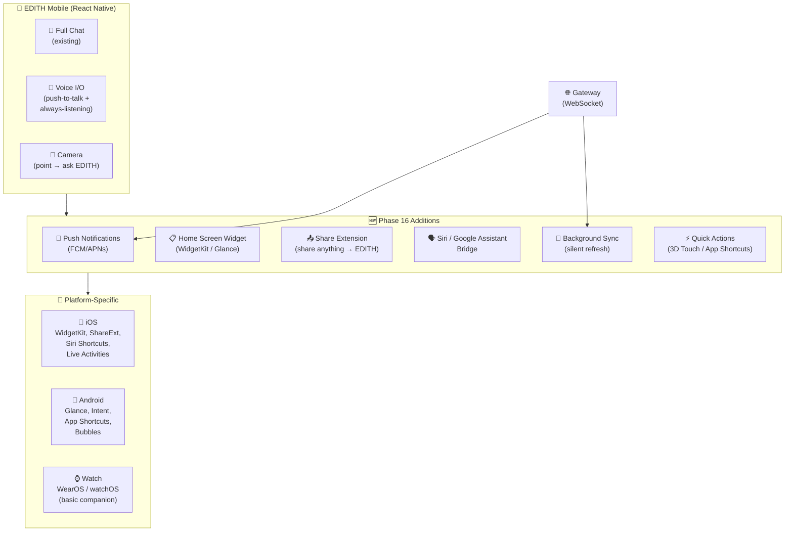
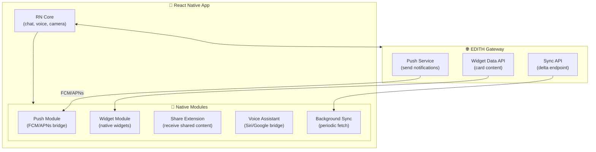
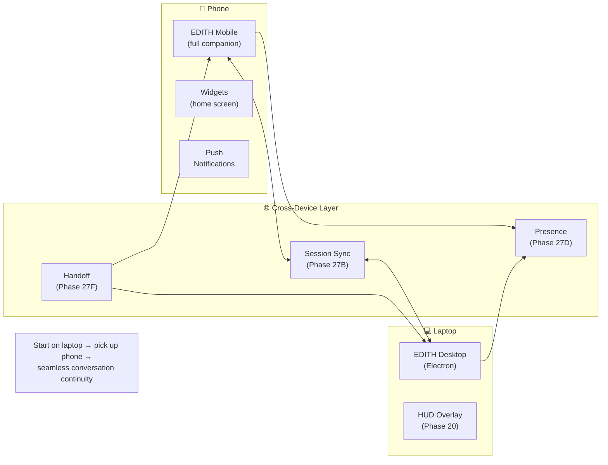
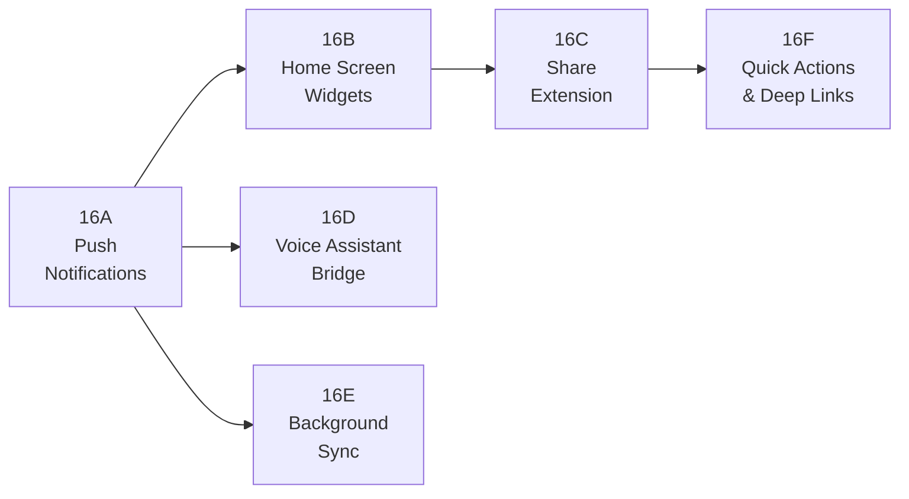
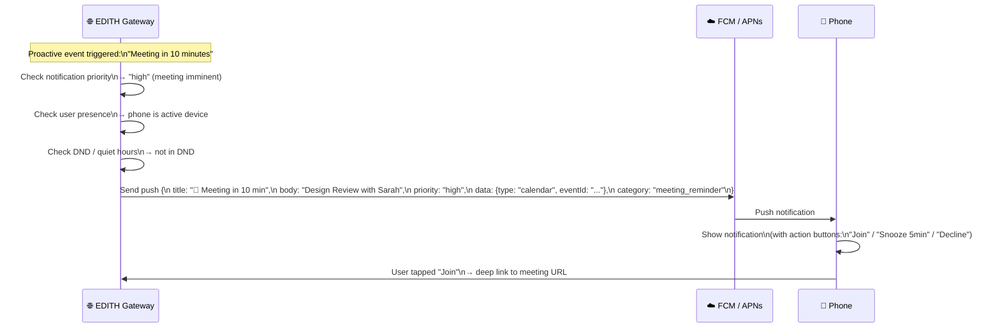
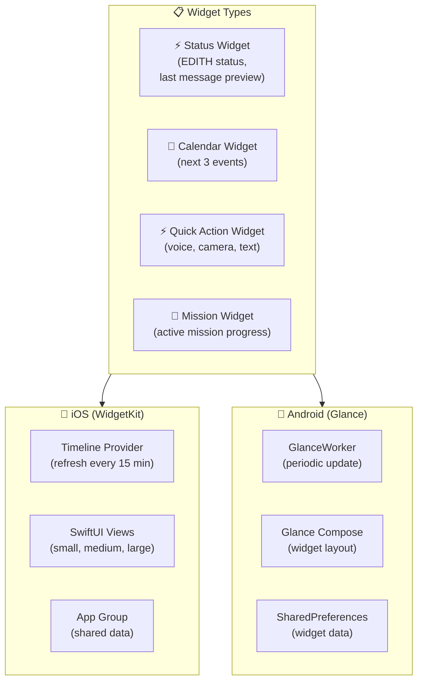
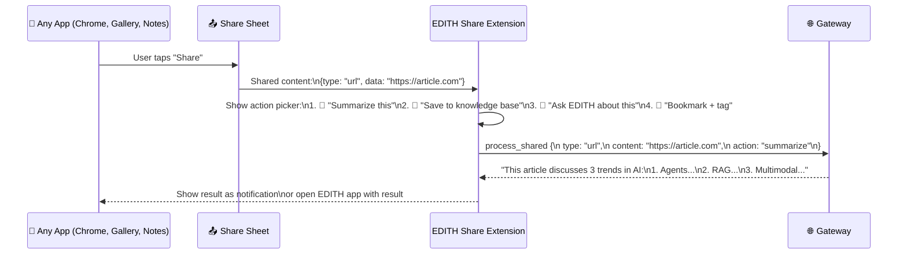
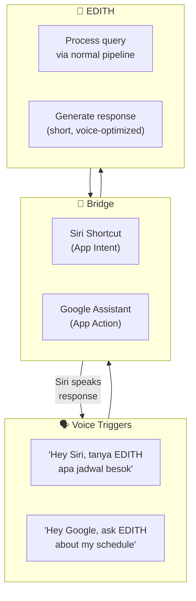
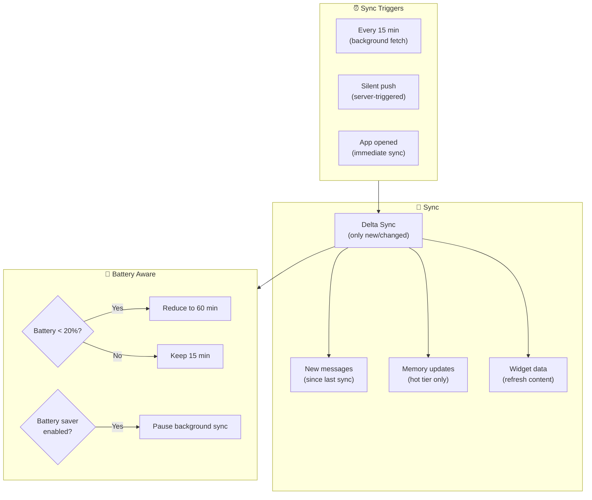

# Phase 16 — Mobile Deep Integration

> "Iron Man suit ada versi portable. EDITH di HP bukan versi lite — harus full companion."

**Prioritas:** 🟡 MEDIUM-HIGH — Mobile app udah ada (React Native) tapi masih basic chat only.
**Depends on:** Phase 8 (channels), Phase 12 (distribution), Phase 1 (voice)
**Status:** ❌ Not started

---

## 1. Tujuan

React Native app sekarang cuma bisa chat. Phase ini expand ke: push notifications,
background sync, home screen widget, share extension, Siri/Google Assistant integration,
dan companion features. Ini bikin EDITH **always with you**, bukan cuma app yang dibuka sesekali.



---

## 2. Research References

| # | Paper / Project | ID | Kontribusi ke EDITH |
|---|-----------------|-----|---------------------|
| 1 | Firebase Cloud Messaging | firebase.google.com/docs/cloud-messaging | Push notification infrastructure: FCM (Android) + APNs bridge (iOS) |
| 2 | Apple WidgetKit | developer.apple.com/widgetkit | iOS home screen widgets: timeline-based, SwiftUI |
| 3 | Android Glance (Jetpack) | developer.android.com/glance | Android home screen widgets: Compose-based |
| 4 | Expo Notifications | docs.expo.dev/push-notifications | Cross-platform push via Expo push service |
| 5 | iOS Share Extension | developer.apple.com/share | Share sheet: receive content from other apps |
| 6 | Siri Shortcuts / App Intents | developer.apple.com/sirikit | Voice commands via Siri → app actions |
| 7 | Android App Shortcuts | developer.android.com/shortcuts | Long-press quick actions + Google Assistant integration |
| 8 | React Native Background Fetch | github.com/transistorsoft | Background execution: periodic data sync |

---

## 3. Arsitektur

### 3.1 Kontrak Arsitektur

```
Rule 1: Mobile app is a FULL companion, not a lite version.
        Same conversation history, same memory, same capabilities.
        Anything you do on laptop, you can trigger from phone.

Rule 2: Push notifications are smart, not spammy.
        Priority-based: urgent → immediate, info → batched hourly.
        Respect DND and user-set quiet hours.
        Max 10 non-urgent notifications per day (configurable).

Rule 3: Background sync is battery-conscious.
        Periodic sync: every 15 min (configurable).
        Only sync delta (new messages, updated memory).
        Respect battery saver mode.

Rule 4: Platform features use native APIs, not web fallbacks.
        iOS widgets → WidgetKit (native Swift).
        Android widgets → Glance (native Compose).
        Not WebView-based widgets.

Rule 5: Offline mode available.
        Cache last 100 messages + active context.
        Queue outgoing messages for sync when online.
```

### 3.2 System Architecture



### 3.3 Cross-Device (Phase 27 Integration)



---

## 4. Sub-Phase Breakdown



---

### Phase 16A — Push Notifications

**Goal:** Smart push notifications from EDITH gateway to phone.



```typescript
/**
 * @module mobile/push-service
 * Server-side push notification dispatch with priority routing.
 */

interface PushNotification {
  userId: string;
  title: string;
  body: string;
  priority: 'critical' | 'high' | 'normal' | 'low';
  category: NotificationCategory;
  data: Record<string, string>;
  actions?: NotificationAction[];
  collapseKey?: string;       // group similar notifications
  ttl?: number;               // time-to-live seconds
}

type NotificationCategory =
  | 'chat_message'
  | 'meeting_reminder'
  | 'proactive_suggestion'
  | 'mission_update'
  | 'mission_approval'
  | 'security_alert'
  | 'daily_brief';

interface NotificationAction {
  id: string;
  title: string;
  destructive?: boolean;
}

class PushService {
  private readonly MAX_DAILY_LOW_PRIORITY = 10;
  
  async send(notification: PushNotification): Promise<void> {
    // 1. Check quiet hours
    if (this.isQuietHours(notification.userId) && notification.priority !== 'critical') {
      await this.queueForLater(notification);
      return;
    }
    
    // 2. Rate limit low-priority
    if (notification.priority === 'low') {
      const todayCount = await this.getTodayCount(notification.userId, 'low');
      if (todayCount >= this.MAX_DAILY_LOW_PRIORITY) return; // silently drop
    }
    
    // 3. Get device tokens
    const tokens = await this.getDeviceTokens(notification.userId);
    
    // 4. Send via FCM/APNs
    await this.dispatch(notification, tokens);
  }
}
```

```json
{
  "mobile": {
    "push": {
      "enabled": true,
      "quietHours": { "start": "23:00", "end": "07:00" },
      "maxDailyLowPriority": 10,
      "categories": {
        "chat_message": { "sound": "default", "badge": true },
        "meeting_reminder": { "sound": "reminder.wav", "badge": true },
        "proactive_suggestion": { "sound": "none", "badge": false },
        "mission_update": { "sound": "default", "badge": true }
      }
    }
  }
}
```

**Files:**
| File | Action | Lines |
|------|--------|-------|
| `EDITH-ts/src/gateway/push-service.ts` | CREATE | ~150 |
| `EDITH-ts/src/gateway/push-tokens.ts` | CREATE | ~60 |
| `apps/mobile/services/PushHandler.ts` | CREATE | ~100 |
| `apps/mobile/services/NotificationRouter.ts` | CREATE | ~80 |
| `EDITH-ts/src/gateway/__tests__/push-service.test.ts` | CREATE | ~100 |

---

### Phase 16B — Home Screen Widgets

**Goal:** Glanceable EDITH info on home screen.



```typescript
/**
 * @module mobile/widget-data-provider
 * Provides data for home screen widgets via API.
 */

interface WidgetData {
  status: {
    state: 'ready' | 'thinking' | 'listening';
    lastMessage: string;
    lastMessageTime: number;
  };
  calendar: {
    events: Array<{
      title: string;
      time: string;
      location?: string;
      isNext: boolean;
    }>;
  };
  mission?: {
    name: string;
    progress: number;          // 0-100
    currentStep: string;
    eta?: string;
  };
  quickActions: string[];       // ['voice', 'camera', 'text', 'screenshot']
}
```

**Files:**
| File | Action | Lines |
|------|--------|-------|
| `EDITH-ts/src/gateway/widget-api.ts` | CREATE | ~100 |
| `apps/mobile/widgets/StatusWidget.tsx` | CREATE | ~80 |
| `apps/mobile/widgets/CalendarWidget.tsx` | CREATE | ~80 |
| `apps/mobile/widgets/QuickActionWidget.tsx` | CREATE | ~60 |

---

### Phase 16C — Share Extension

**Goal:** Share anything from any app → EDITH processes it.



**Files:**
| File | Action | Lines |
|------|--------|-------|
| `apps/mobile/services/ShareExtension.ts` | CREATE | ~100 |
| `apps/mobile/screens/ShareActionScreen.tsx` | CREATE | ~80 |

---

### Phase 16D — Voice Assistant Bridge

**Goal:** "Hey Siri, tanya EDITH..." or Google Assistant integration.



**Files:**
| File | Action | Lines |
|------|--------|-------|
| `apps/mobile/services/SiriBridge.ts` | CREATE | ~80 |
| `apps/mobile/services/GoogleAssistantBridge.ts` | CREATE | ~80 |

---

### Phase 16E — Background Sync

**Goal:** Keep phone app data fresh without draining battery.



**Files:**
| File | Action | Lines |
|------|--------|-------|
| `apps/mobile/services/BackgroundSync.ts` | CREATE | ~120 |
| `apps/mobile/services/SyncManager.ts` | CREATE | ~80 |

---

### Phase 16F — Quick Actions & Deep Links

**Goal:** 3D Touch / long-press shortcuts + universal deep links.

```typescript
/**
 * Quick actions available from home screen long-press.
 */
const QUICK_ACTIONS = [
  { id: 'voice', title: '🎤 Talk to EDITH', icon: 'mic', deepLink: 'edith://voice' },
  { id: 'camera', title: '📸 Show EDITH', icon: 'camera', deepLink: 'edith://camera' },
  { id: 'text', title: '💬 Quick Message', icon: 'chat', deepLink: 'edith://chat' },
  { id: 'mission', title: '🚀 Active Mission', icon: 'rocket', deepLink: 'edith://mission' },
];
```

**Files:**
| File | Action | Lines |
|------|--------|-------|
| `apps/mobile/services/QuickActions.ts` | CREATE | ~60 |
| `apps/mobile/services/DeepLinkRouter.ts` | CREATE | ~80 |

---

## 5. Acceptance Gates

```
□ Push notification: proactive event → phone shows notification
□ Push priority: critical bypasses quiet hours, low is rate-limited
□ Push actions: tap "Join" → opens meeting URL
□ Home screen widget: shows next 3 calendar events
□ Widget refresh: updates every 15 minutes
□ Share extension: share URL from Chrome → EDITH summarizes
□ Share extension: share photo → EDITH describes
□ Siri bridge: "Hey Siri, tanya EDITH" → works
□ Background sync: new messages synced every 15 min
□ Battery aware: reduce sync when battery < 20%
□ Quick actions: long-press app icon → 4 shortcuts
□ Deep links: edith://chat opens chat, edith://voice opens voice
□ Offline mode: cached messages viewable without connection
□ Cross-device handoff (Phase 27): laptop→phone seamless
```

---

## 6. Koneksi ke Phase Lain

| Phase | Integration | Protocol |
|-------|------------|----------|
| Phase 1 (Voice) | Voice I/O on phone (push-to-talk + always-on) | voice_stream |
| Phase 8 (Channels) | Channel messages delivered via push | push_notify |
| Phase 13 (Knowledge) | Share content → save to knowledge base | share_ingest |
| Phase 14 (Calendar) | Calendar widget on home screen | widget_data |
| Phase 20 (HUD) | Mobile HUD mini-widget | hud_state |
| Phase 22 (Mission) | Mission progress widget + approval push | mission_status |
| Phase 27 (Cross-Device) | Full cross-device sync + handoff | session_sync |

---

## 7. File Changes Summary

| File | Action | Lines |
|------|--------|-------|
| `EDITH-ts/src/gateway/push-service.ts` | CREATE | ~150 |
| `EDITH-ts/src/gateway/push-tokens.ts` | CREATE | ~60 |
| `EDITH-ts/src/gateway/widget-api.ts` | CREATE | ~100 |
| `EDITH-ts/src/gateway/__tests__/push-service.test.ts` | CREATE | ~100 |
| `apps/mobile/services/PushHandler.ts` | CREATE | ~100 |
| `apps/mobile/services/NotificationRouter.ts` | CREATE | ~80 |
| `apps/mobile/services/ShareExtension.ts` | CREATE | ~100 |
| `apps/mobile/services/SiriBridge.ts` | CREATE | ~80 |
| `apps/mobile/services/GoogleAssistantBridge.ts` | CREATE | ~80 |
| `apps/mobile/services/BackgroundSync.ts` | CREATE | ~120 |
| `apps/mobile/services/SyncManager.ts` | CREATE | ~80 |
| `apps/mobile/services/QuickActions.ts` | CREATE | ~60 |
| `apps/mobile/services/DeepLinkRouter.ts` | CREATE | ~80 |
| `apps/mobile/widgets/StatusWidget.tsx` | CREATE | ~80 |
| `apps/mobile/widgets/CalendarWidget.tsx` | CREATE | ~80 |
| `apps/mobile/widgets/QuickActionWidget.tsx` | CREATE | ~60 |
| `apps/mobile/screens/ShareActionScreen.tsx` | CREATE | ~80 |
| **Total** | | **~1590** |

**New dependencies:** `expo-notifications`, `expo-sharing`, `expo-background-fetch`, `react-native-quick-actions`
