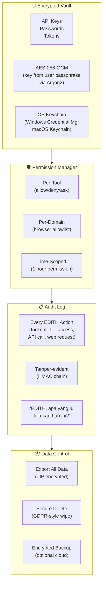
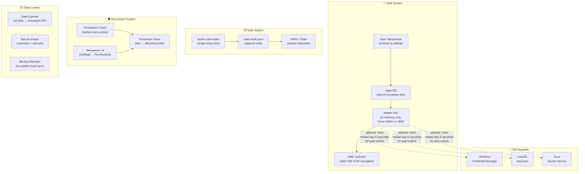
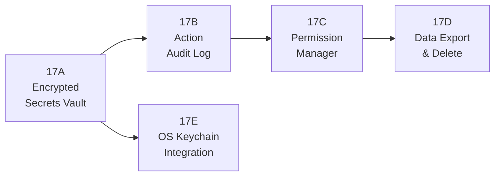
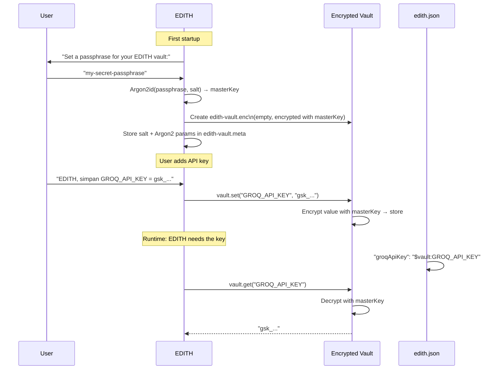
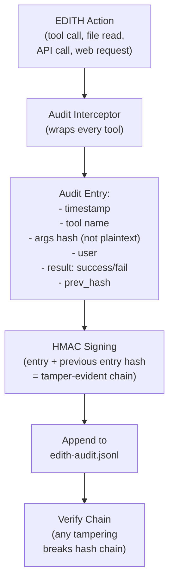
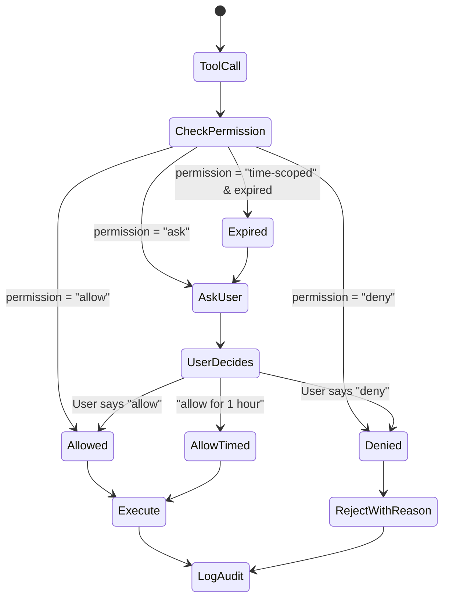
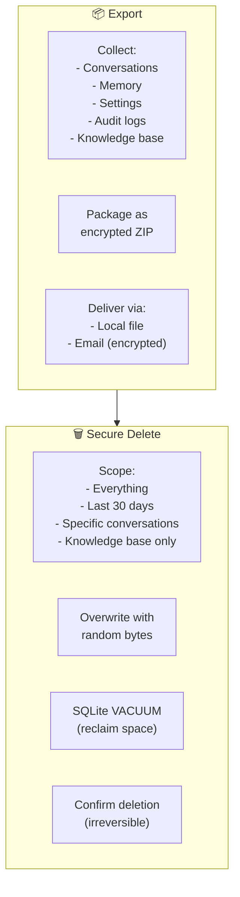

# Phase 17 — Privacy Vault & Security Layer

> "Tony ga pernah nyerahin kunci suit ke siapapun. Data user = kunci mereka."

**Prioritas:** 🟡 MEDIUM — Makin penting karena EDITH menyimpan data sensitif.
**Depends on:** Phase 6 (CaMeL taint tracking), Phase 5 (security baseline)
**Status:** ❌ Not started

---

## 1. Tujuan

Saat ini API keys disimpan plaintext di `edith.json`. Memory mengandung data sensitif.
EDITH bisa baca file dan browse web. Tanpa security layer yang proper, ini berbahaya.

Phase ini membangun: encrypted vault, action audit log, granular permissions,
dan data export/delete — supaya user bisa **trust** EDITH sepenuhnya.



---

## 2. Research References

| # | Paper / Project | ID | Kontribusi ke EDITH |
|---|-----------------|-----|---------------------|
| 1 | CaMeL: Taint Tracking for LLM Security | arXiv:2503.18813 | Taint tracking for sensitive data flow — extend to vault |
| 2 | OWASP ASVS v4.0 | owasp.org/asvs | Application security verification: secrets, auth, crypto standards |
| 3 | Argon2 (Winner of PHC) | github.com/P-H-C/phc-winner-argon2 | Password hashing: memory-hard, GPU-resistant key derivation |
| 4 | Secretless Broker (CyberArk) | github.com/cyberark/secretless-broker | Runtime secrets injection: no plaintext at rest |
| 5 | Age Encryption (FiloSottile) | github.com/FiloSottile/age | Modern encryption: simple, audited, X25519 + ChaCha20-Poly1305 |
| 6 | NIST SP 800-132 | nist.gov | PBKDF guidelines: iterations, salt, key derivation best practices |
| 7 | GDPR Technical Guidelines | gdpr.eu/technical-measures | Data export, erasure, portability requirements |
| 8 | SQLCipher (Zetetic) | zetetic.net/sqlcipher | Encrypted SQLite — full database encryption at rest |

---

## 3. Arsitektur

### 3.1 Kontrak Arsitektur

```
Rule 1: NO secrets in plaintext at rest. Ever.
        edith.json may reference vault: "$vault:GROQ_API_KEY"
        Vault file is AES-256-GCM encrypted.
        Key derived from user passphrase via Argon2id.

Rule 2: Audit log is append-only and tamper-evident.
        HMAC chain: each entry includes hash of previous entry.
        Tampering with any entry breaks the chain.
        Audit log stored separately from main database.

Rule 3: Permissions are checked BEFORE action, never after.
        tool_call → check permission → execute (or deny).
        Default: deny. User must explicitly grant.

Rule 4: Data export includes ALL user data.
        Conversations, memory, settings, audit logs, knowledge base.
        Export format: encrypted ZIP with manifest.

Rule 5: Secure delete is REAL delete.
        Not just mark-as-deleted. Overwrite bits.
        SQLite: vacuum after delete.
        Files: overwrite with random data before unlink.
```

### 3.2 System Architecture



### 3.3 Cross-Device (Phase 27 Integration)

```mermaid
flowchart LR
    subgraph Laptop["💻 Laptop"]
        LaptopVault["Vault\n(master key from passphrase)"]
        LaptopAudit["Audit Log\n(local actions)"]
    end

    subgraph Phone["📱 Phone"]
        PhoneVault["Vault\n(synced from laptop,\nbiometric unlock)"]
        PhoneAudit["Audit Log\n(phone actions)"]
    end

    subgraph Sync["🔄 Cross-Device"]
        VaultSync["Vault Sync\n(encrypted blob transfer,\nNEVER plaintext)"]
        AuditMerge["Audit Merge\n(combined timeline)"]
    end

    LaptopVault <-->|"encrypted"| VaultSync <-->|"encrypted"| PhoneVault
    LaptopAudit --> AuditMerge <-- PhoneAudit
```

---

## 4. Sub-Phase Breakdown



---

### Phase 17A — Encrypted Secrets Vault

**Goal:** Zero plaintext secrets at rest.



```typescript
/**
 * @module security/vault
 * Encrypted secrets vault with Argon2id key derivation.
 */

import { createCipheriv, createDecipheriv, randomBytes, scrypt } from 'node:crypto';

interface VaultEntry {
  key: string;
  value: string;           // plaintext (only in memory)
  createdAt: number;
  updatedAt: number;
  tags: string[];          // categorization: 'api_key', 'password', 'token'
}

// DECISION: Argon2id via native crypto (scrypt fallback for portability)
// WHY: Argon2id is gold standard but requires native addon
// ALTERNATIVES: PBKDF2 (weaker), bcrypt (not for key derivation)
// REVISIT: When Argon2 lands in Node.js crypto natively

class SecureVault {
  private masterKey: Buffer | null = null;
  
  /**
   * Unlock vault with user passphrase.
   * @param passphrase - User's master passphrase
   */
  async unlock(passphrase: string): Promise<void> {
    const meta = await this.loadMeta();
    this.masterKey = await this.deriveKey(passphrase, meta.salt, meta.params);
    
    // Verify by attempting to decrypt test entry
    try {
      await this.decryptVault();
    } catch {
      this.masterKey = null;
      throw new Error('Invalid passphrase');
    }
  }
  
  /**
   * Get a secret from the vault.
   * @param key - Secret key name
   * @returns Decrypted secret value
   */
  async get(key: string): Promise<string> {
    if (!this.masterKey) throw new Error('Vault is locked');
    const entries = await this.decryptVault();
    const entry = entries.find(e => e.key === key);
    if (!entry) throw new Error(`Secret "${key}" not found in vault`);
    return entry.value;
  }
  
  /**
   * Store a secret in the vault.
   * @param key - Secret key name
   * @param value - Secret value (will be encrypted)
   */
  async set(key: string, value: string): Promise<void> {
    if (!this.masterKey) throw new Error('Vault is locked');
    const entries = await this.decryptVault();
    const existing = entries.findIndex(e => e.key === key);
    const entry: VaultEntry = {
      key,
      value,
      createdAt: existing >= 0 ? entries[existing].createdAt : Date.now(),
      updatedAt: Date.now(),
      tags: this.inferTags(key),
    };
    if (existing >= 0) entries[existing] = entry;
    else entries.push(entry);
    await this.encryptAndSave(entries);
  }
  
  /**
   * Auto-lock after idle timeout.
   */
  lock(): void {
    if (this.masterKey) {
      this.masterKey.fill(0); // secure wipe from memory
      this.masterKey = null;
    }
  }
  
  private async deriveKey(passphrase: string, salt: Buffer, params: { N: number; r: number; p: number }): Promise<Buffer> {
    return new Promise((resolve, reject) => {
      scrypt(passphrase, salt, 32, params, (err, key) => {
        if (err) reject(err);
        else resolve(key);
      });
    });
  }
}
```

**Files:**
| File | Action | Lines |
|------|--------|-------|
| `EDITH-ts/src/security/vault.ts` | CREATE | ~250 |
| `EDITH-ts/src/security/vault-crypto.ts` | CREATE | ~100 |
| `EDITH-ts/src/security/vault-resolver.ts` | CREATE | ~80 |
| `EDITH-ts/src/security/__tests__/vault.test.ts` | CREATE | ~150 |

---

### Phase 17B — Action Audit Log

**Goal:** Every EDITH action logged with tamper-evident chain.



```typescript
/**
 * @module security/audit-log
 * Tamper-evident action audit log with HMAC chain.
 */

interface AuditEntry {
  id: string;
  timestamp: number;
  tool: string;
  argsHash: string;          // SHA-256 of args (not plaintext sensitive data)
  userId: string;
  deviceId: string;
  result: 'success' | 'failure' | 'denied';
  duration: number;          // ms
  prevHash: string;          // HMAC of previous entry (chain)
  hash: string;              // HMAC of this entry
}

class AuditLog {
  private lastHash: string = '';
  
  /**
   * Log an action with tamper-evident chaining.
   * @param tool - Tool name (e.g., 'file-write', 'web-search')
   * @param args - Tool arguments (will be hashed, not stored plaintext)
   * @param result - Action result
   */
  async log(tool: string, args: Record<string, unknown>, result: AuditEntry['result'], duration: number): Promise<void> {
    const entry: AuditEntry = {
      id: randomUUID(),
      timestamp: Date.now(),
      tool,
      argsHash: this.hashArgs(args),
      userId: this.getCurrentUserId(),
      deviceId: this.getDeviceId(),
      result,
      duration,
      prevHash: this.lastHash,
      hash: '',
    };
    
    entry.hash = this.hmac(JSON.stringify(entry));
    this.lastHash = entry.hash;
    
    await this.append(entry);
  }
  
  /**
   * Verify audit chain integrity.
   * @returns true if chain is intact, false if tampered
   */
  async verifyChain(): Promise<{ intact: boolean; brokenAt?: number }> {
    const entries = await this.readAll();
    for (let i = 1; i < entries.length; i++) {
      if (entries[i].prevHash !== entries[i - 1].hash) {
        return { intact: false, brokenAt: i };
      }
    }
    return { intact: true };
  }
}
```

**Files:**
| File | Action | Lines |
|------|--------|-------|
| `EDITH-ts/src/security/audit-log.ts` | CREATE | ~180 |
| `EDITH-ts/src/security/audit-interceptor.ts` | CREATE | ~80 |
| `EDITH-ts/src/security/__tests__/audit-log.test.ts` | CREATE | ~120 |

---

### Phase 17C — Permission Manager

**Goal:** Granular per-tool permissions with time-scoped grants.



```typescript
/**
 * @module security/permission-manager
 * Granular permission system for EDITH tool access.
 */

interface Permission {
  tool: string;
  action: 'allow' | 'deny' | 'ask';
  scope?: {
    domains?: string[];         // for browser: which domains
    paths?: string[];           // for file access: which directories
    timeLimit?: number;         // ms: permission expires after this
    grantedAt?: number;         // when permission was granted
  };
}

class PermissionManager {
  /**
   * Check if a tool action is permitted.
   * @param tool - Tool name
   * @param context - Action context (domain, path, etc.)
   * @returns Permission result
   */
  async check(tool: string, context?: Record<string, string>): Promise<'allowed' | 'denied' | 'ask'> {
    const perm = await this.getPermission(tool);
    
    if (!perm) return 'ask'; // default: ask
    
    if (perm.action === 'deny') return 'denied';
    
    if (perm.action === 'allow') {
      // Check time scope
      if (perm.scope?.timeLimit && perm.scope.grantedAt) {
        if (Date.now() > perm.scope.grantedAt + perm.scope.timeLimit) return 'ask';
      }
      // Check domain scope
      if (perm.scope?.domains && context?.domain) {
        if (!this.matchesDomain(context.domain, perm.scope.domains)) return 'ask';
      }
      return 'allowed';
    }
    
    return 'ask';
  }
}
```

**Files:**
| File | Action | Lines |
|------|--------|-------|
| `EDITH-ts/src/security/permission-manager.ts` | CREATE | ~150 |
| `EDITH-ts/src/security/permission-store.ts` | CREATE | ~80 |
| `EDITH-ts/src/security/__tests__/permission-manager.test.ts` | CREATE | ~120 |

---

### Phase 17D — Data Export & Delete

**Goal:** GDPR-style data portability + secure erasure.



**Files:**
| File | Action | Lines |
|------|--------|-------|
| `EDITH-ts/src/security/data-exporter.ts` | CREATE | ~150 |
| `EDITH-ts/src/security/secure-eraser.ts` | CREATE | ~100 |

---

### Phase 17E — OS Keychain Integration

**Goal:** Store vault master key in OS keychain for seamless unlock.

```typescript
/**
 * @module security/keychain
 * OS keychain integration for secure master key storage.
 */

// DECISION: Use node-keytar for cross-platform keychain access
// WHY: Single API covers Windows, macOS, Linux keystores
// ALTERNATIVES: Manual Win32 API (Windows only), custom encrypted file
// REVISIT: If keytar maintenance drops → switch to native N-API

class KeychainBridge {
  private readonly SERVICE_NAME = 'edith-vault';
  
  async storeMasterKeyHash(userId: string, keyHash: string): Promise<void> {
    const keytar = await import('keytar');
    await keytar.setPassword(this.SERVICE_NAME, userId, keyHash);
  }
  
  async getMasterKeyHash(userId: string): Promise<string | null> {
    const keytar = await import('keytar');
    return keytar.getPassword(this.SERVICE_NAME, userId);
  }
  
  async deleteMasterKeyHash(userId: string): Promise<void> {
    const keytar = await import('keytar');
    await keytar.deletePassword(this.SERVICE_NAME, userId);
  }
}
```

**Files:**
| File | Action | Lines |
|------|--------|-------|
| `EDITH-ts/src/security/keychain.ts` | CREATE | ~80 |

---

## 5. Acceptance Gates

```
□ Vault: create with passphrase → encrypted file on disk
□ Vault: store secret → encrypted at rest (verify with hex dump)
□ Vault: retrieve secret → correct decrypted value
□ Vault: wrong passphrase → rejected (no data leak)
□ Vault: auto-lock after 30 min idle
□ Config: "$vault:KEY_NAME" resolves to vault value at runtime
□ Audit: every tool call logged with timestamp + tool + result
□ Audit: args are HASHED, not stored plaintext
□ Audit: HMAC chain intact → verifyChain() returns true
□ Audit: tamper with one entry → verifyChain() detects
□ Permission: denied tool → action rejected with reason
□ Permission: "ask" tool → user prompted → choice respected
□ Permission: time-scoped "allow 1 hour" → expires correctly
□ Export: all data → encrypted ZIP file
□ Delete: secure erase → data unrecoverable
□ Keychain: master key stored in OS keychain for auto-unlock
□ Cross-device: vault sync encrypted between devices (Phase 27)
```

---

## 6. Koneksi ke Phase Lain

| Phase | Integration | Protocol |
|-------|------------|----------|
| Phase 5 (Bugfix) | Extends existing security hardening | security_layer |
| Phase 6 (Proactive) | CaMeL taint tracking + vault secrets | taint_check |
| Phase 15 (Browser) | Credential vault for browser auto-login | vault_read |
| Phase 22 (Mission) | Mission actions audited in log | audit_log |
| Phase 25 (Simulation) | Preview actions before execute (safety) | preview_gate |
| Phase 26 (Legion) | Instance-to-instance auth tokens in vault | instance_auth |
| Phase 27 (Cross-Device) | Vault sync encrypted between devices | vault_sync |

---

## 7. File Changes Summary

| File | Action | Lines |
|------|--------|-------|
| `EDITH-ts/src/security/vault.ts` | CREATE | ~250 |
| `EDITH-ts/src/security/vault-crypto.ts` | CREATE | ~100 |
| `EDITH-ts/src/security/vault-resolver.ts` | CREATE | ~80 |
| `EDITH-ts/src/security/audit-log.ts` | CREATE | ~180 |
| `EDITH-ts/src/security/audit-interceptor.ts` | CREATE | ~80 |
| `EDITH-ts/src/security/permission-manager.ts` | CREATE | ~150 |
| `EDITH-ts/src/security/permission-store.ts` | CREATE | ~80 |
| `EDITH-ts/src/security/data-exporter.ts` | CREATE | ~150 |
| `EDITH-ts/src/security/secure-eraser.ts` | CREATE | ~100 |
| `EDITH-ts/src/security/keychain.ts` | CREATE | ~80 |
| `EDITH-ts/src/security/__tests__/vault.test.ts` | CREATE | ~150 |
| `EDITH-ts/src/security/__tests__/audit-log.test.ts` | CREATE | ~120 |
| `EDITH-ts/src/security/__tests__/permission-manager.test.ts` | CREATE | ~120 |
| **Total** | | **~1640** |

**New dependencies:** `keytar` (OS keychain), `argon2` (optional, scrypt fallback available)
