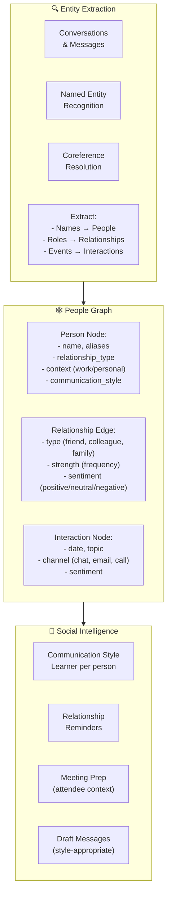
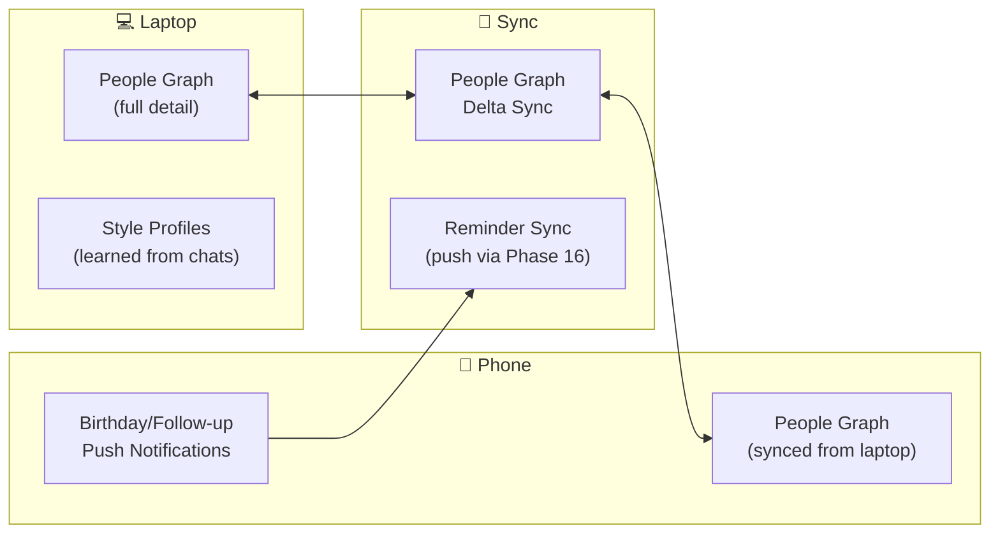
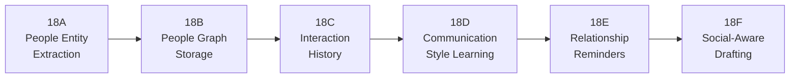
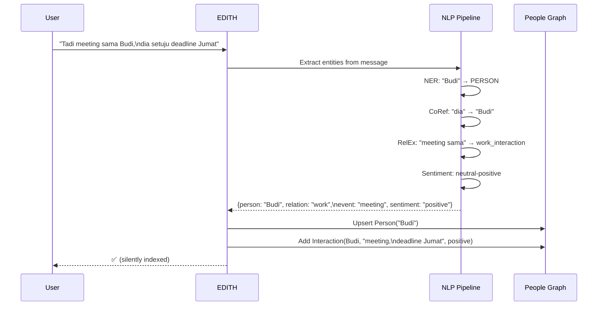
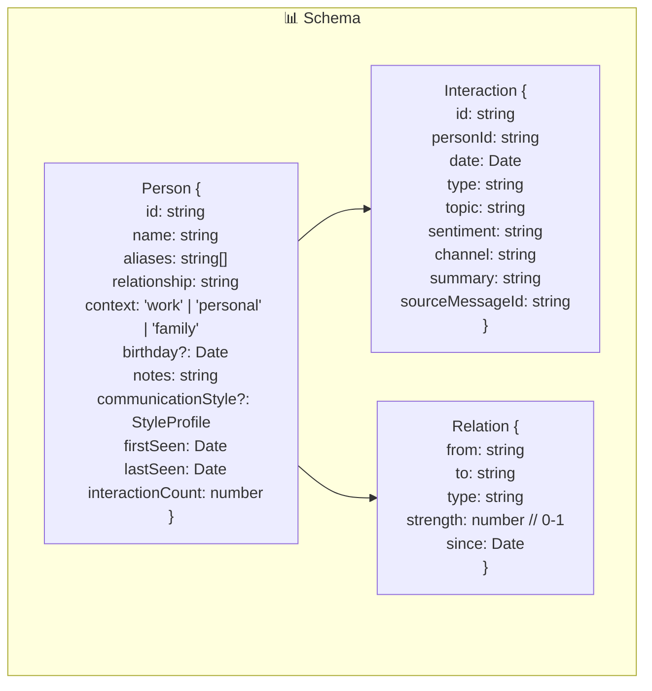
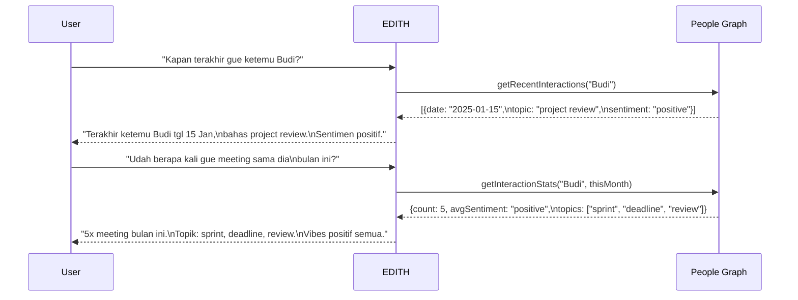
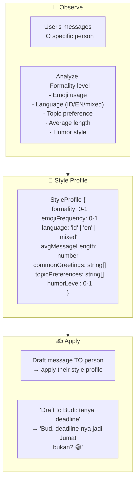
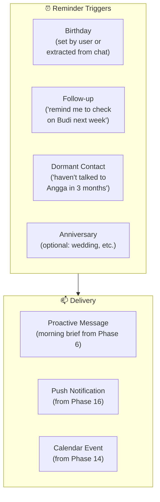
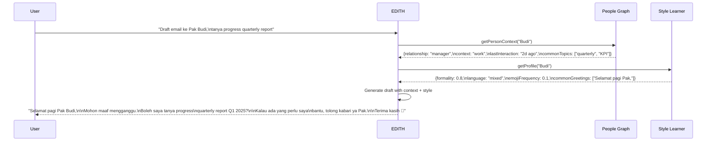

# Phase 18 — Social & Relationship Memory

> "JARVIS kenal semua orang di hidup Tony — nama, kebiasaan, bahkan mood mereka."

**Prioritas:** 🟡 MEDIUM — Membuat EDITH paham konteks sosial user.
**Depends on:** Phase 6 (Memory Architecture), Phase 10 (Personalization), Phase 13 (Knowledge Base)
**Status:** ❌ Not started

---

## 1. Tujuan

EDITH tahu banyak tentang user, tapi belum ngerti tentang **orang lain** di hidup user.
Siapa bos? Siapa pacar? Siapa teman kuliah? Kapan ulang tahun mereka?
Gaya komunikasi gimana ke setiap orang?

Phase ini membangun: people graph dari percakapan, interaction history tracking,
communication style learning per orang, dan relationship reminders.



---

## 2. Research References

| # | Paper / Project | ID | Kontribusi ke EDITH |
|---|-----------------|-----|---------------------|
| 1 | PersonalLLM: Personalizing LLMs | arXiv:2402.09269 | User-specific persona modeling + adaptation |
| 2 | Memory3: Language Modeling with Memory | arXiv:2407.01178 | Explicit memory management for contextual recall |
| 3 | Social Network Analysis (Newman) | doi:10.1093/oso/9780198805090.001.0001 | Graph theory for relationship mapping |
| 4 | ConvRe: Conversational RE | arXiv:2304.03770 | Relation extraction from multi-turn dialogue |
| 5 | ChatGLM: Social Conversational AI | arXiv:2406.12459 | Social relationship understanding in chat |
| 6 | ProAgent: Proactive Actions | arXiv:2308.11339 | Proactive reminders & relationship maintenance |

---

## 3. Arsitektur

### 3.1 Kontrak Arsitektur

```
Rule 1: People data extracted ONLY from user's own conversations.
        EDITH never scrapes external profiles or social media.
        All people data is user-generated context.

Rule 2: People graph respects privacy.
        User can view, edit, or delete any person entry.
        "EDITH, lupain tentang X" → secure delete person node.

Rule 3: Communication style learning is observational.
        EDITH observes how user writes TO specific people.
        Never guesses from stereotypes. Only from actual interaction data.

Rule 4: Relationship reminders are configurable.
        User can enable/disable per person or globally.
        Default: birthday + follow-up reminders (opt-in).

Rule 5: People graph lives in memory subsystem (Phase 6).
        Not a separate database. Uses vector + relational store.
        People nodes link to memory entries.
```

### 3.2 System Architecture

```mermaid
flowchart TD
    subgraph Input["📥 Input Sources"]
        Chat["EDITH Chat\n(user mentions people)"]
        Calendar["Calendar Events\n(attendees from Phase 14)"]
        Email["Email (future)\n(sender/recipient)"]
        Contact["Manual Entry\n('EDITH, Budi = temen SMA')"]
    end

    subgraph NLP["🔬 NLP Pipeline"]
        NER["Named Entity Recognition\n(spaCy / LLM-based)"]
        CoRef["Coreference Resolution\n('dia' → 'Budi')"]
        RelEx["Relation Extraction\n('Budi = bos gue')"]
        SentAnal["Sentiment Analysis\n(per-interaction)"]
    end

    subgraph PeopleDB["🗃️ People Graph"]
        PersonNode["Person {\n  id, name, aliases,\n  relationship, context,\n  birthday, notes,\n  commStyle\n}"]
        InteractionLog["Interaction {\n  personId, date,\n  topic, sentiment,\n  channel, summary\n}"]
        RelationEdge["Relation {\n  from, to, type,\n  strength, since\n}"]
    end

    subgraph Intelligence["🧠 Intelligence"]
        StyleProfile["Communication Style Profile\n(formal/casual, emoji use,\nlanguage pref, topic pref)"]
        DateTracker["Important Date Tracker\n(birthday, anniversary,\nfollow-up deadlines)"]
        MeetingPrep["Meeting Prep\n(attendee brief from Phase 14)"]
        DraftHelper["Draft Helper\n('draft email to Budi' →\napply Budi's comm style)"]
    end

    Input --> NLP --> PeopleDB --> Intelligence
```



### 3.3 Cross-Device (Phase 27 Integration)



---

## 4. Sub-Phase Breakdown



---

### Phase 18A — People Entity Extraction

**Goal:** Automatically detect people mentioned in conversations.



```typescript
/**
 * @module memory/people/entity-extractor
 * Extracts person entities from conversation messages.
 */

interface PersonMention {
  name: string;
  aliases: string[];         // "Budi", "Pak Budi", "B"
  relationship?: string;     // guessed from context
  confidence: number;        // 0-1
  sourceMessageId: string;
}

interface InteractionEvent {
  personName: string;
  type: 'mention' | 'meeting' | 'call' | 'email' | 'plan';
  topic?: string;
  sentiment: 'positive' | 'neutral' | 'negative';
  date: Date;
}

class PeopleEntityExtractor {
  /**
   * Extract person mentions from a message.
   * @param message - User or assistant message text
   * @param conversationId - Source conversation
   * @returns Detected person mentions and interactions
   */
  async extract(message: string, conversationId: string): Promise<{
    people: PersonMention[];
    interactions: InteractionEvent[];
  }> {
    // Use LLM with structured output for extraction
    const prompt = this.buildExtractionPrompt(message);
    const result = await this.engine.chat([
      { role: 'system', content: EXTRACTION_SYSTEM_PROMPT },
      { role: 'user', content: prompt },
    ], { responseFormat: 'json' });
    
    return this.parseExtractionResult(result, conversationId);
  }
}

const EXTRACTION_SYSTEM_PROMPT = `
You extract person entities and interactions from messages.
Return JSON with:
- people: [{name, aliases, relationship, confidence}]
- interactions: [{personName, type, topic, sentiment, date}]

Handle Indonesian and English. "Dia", "doi", "si X" are coreferences.
"Bos gue" → relationship: "manager"
"Temen kampus" → relationship: "college_friend"
`;
```

**Files:**
| File | Action | Lines |
|------|--------|-------|
| `EDITH-ts/src/memory/people/entity-extractor.ts` | CREATE | ~180 |
| `EDITH-ts/src/memory/people/extraction-prompt.ts` | CREATE | ~80 |
| `EDITH-ts/src/memory/people/__tests__/entity-extractor.test.ts` | CREATE | ~120 |

---

### Phase 18B — People Graph Storage

**Goal:** Persistent graph of people and relationships.



```typescript
/**
 * @module memory/people/people-graph
 * People graph storage with Prisma + vector embeddings.
 */

interface PersonRecord {
  id: string;
  name: string;
  aliases: string[];
  relationship: string;
  context: 'work' | 'personal' | 'family' | 'other';
  birthday?: Date;
  notes: string;
  firstSeen: Date;
  lastSeen: Date;
  interactionCount: number;
  embedding?: number[];      // vector for semantic search
}

class PeopleGraph {
  /**
   * Find or create a person by name/alias.
   * Handles fuzzy matching for aliases.
   */
  async upsertPerson(mention: PersonMention): Promise<PersonRecord> {
    // Check existing by name or alias
    const existing = await this.findByNameOrAlias(mention.name);
    if (existing) {
      return this.updatePerson(existing.id, {
        lastSeen: new Date(),
        interactionCount: existing.interactionCount + 1,
        aliases: [...new Set([...existing.aliases, ...mention.aliases])],
      });
    }
    return this.createPerson(mention);
  }
  
  /**
   * Get relationship context for a person (for meeting prep, draft help).
   */
  async getPersonContext(personId: string): Promise<{
    person: PersonRecord;
    recentInteractions: InteractionRecord[];
    commonTopics: string[];
    communicationStyle: StyleProfile | null;
  }> {
    const person = await this.getPerson(personId);
    const interactions = await this.getRecentInteractions(personId, 20);
    const topics = this.extractCommonTopics(interactions);
    return {
      person,
      recentInteractions: interactions,
      commonTopics: topics,
      communicationStyle: person.communicationStyle ?? null,
    };
  }
  
  /**
   * Search people by semantic query.
   * "siapa yang kerja di Tokopedia?" → vector search
   */
  async searchPeople(query: string): Promise<PersonRecord[]> {
    const queryEmbedding = await this.embedder.embed(query);
    return this.vectorStore.search('people', queryEmbedding, 10);
  }
}
```

**Files:**
| File | Action | Lines |
|------|--------|-------|
| `EDITH-ts/src/memory/people/people-graph.ts` | CREATE | ~200 |
| `EDITH-ts/src/memory/people/people-schema.ts` | CREATE | ~60 |
| `EDITH-ts/prisma/migrations/xxx_people_graph.sql` | CREATE | ~40 |

---

### Phase 18C — Interaction History

**Goal:** Track every interaction with each person over time.



**Files:**
| File | Action | Lines |
|------|--------|-------|
| `EDITH-ts/src/memory/people/interaction-tracker.ts` | CREATE | ~150 |
| `EDITH-ts/src/memory/people/interaction-stats.ts` | CREATE | ~100 |

---

### Phase 18D — Communication Style Learning

**Goal:** Learn how user communicates with each person.



```typescript
/**
 * @module memory/people/style-learner
 * Learns communication style per person from user's actual messages.
 */

interface StyleProfile {
  formality: number;          // 0 = very casual, 1 = very formal
  emojiFrequency: number;     // 0 = never, 1 = always
  language: 'id' | 'en' | 'mixed';
  avgMessageLength: number;   // chars
  commonGreetings: string[];  // ["Bud,", "Halo Pak,"]
  humorLevel: number;         // 0 = serious, 1 = playful
  topicPreferences: string[]; // common topics
  sampleCount: number;        // how many messages analyzed
}

class StyleLearner {
  /**
   * Analyze a message from user to a specific person.
   * Updates the running style profile incrementally.
   */
  async observe(personId: string, message: string): Promise<void> {
    const current = await this.getProfile(personId) ?? this.defaultProfile();
    
    const analysis = this.analyzeMessage(message);
    const updated = this.mergeProfile(current, analysis);
    
    await this.saveProfile(personId, updated);
  }
  
  /**
   * Generate a style-appropriate draft for a specific person.
   */
  async applyStyle(personId: string, intent: string): Promise<string> {
    const profile = await this.getProfile(personId);
    if (!profile || profile.sampleCount < 5) {
      return intent; // not enough data yet
    }
    
    const prompt = this.buildStylePrompt(profile, intent);
    const draft = await this.engine.chat([
      { role: 'system', content: STYLE_SYSTEM_PROMPT },
      { role: 'user', content: prompt },
    ]);
    
    return draft;
  }
}
```

**Files:**
| File | Action | Lines |
|------|--------|-------|
| `EDITH-ts/src/memory/people/style-learner.ts` | CREATE | ~180 |
| `EDITH-ts/src/memory/people/__tests__/style-learner.test.ts` | CREATE | ~100 |

---

### Phase 18E — Relationship Reminders

**Goal:** Proactive reminders for relationship maintenance.



**Files:**
| File | Action | Lines |
|------|--------|-------|
| `EDITH-ts/src/memory/people/relationship-reminders.ts` | CREATE | ~120 |
| `EDITH-ts/src/memory/people/dormant-detector.ts` | CREATE | ~80 |

---

### Phase 18F — Social-Aware Drafting

**Goal:** Draft messages that match the relationship and style.



**Files:**
| File | Action | Lines |
|------|--------|-------|
| `EDITH-ts/src/memory/people/social-draft.ts` | CREATE | ~120 |
| `EDITH-ts/src/skills/social-skill.ts` | CREATE | ~80 |

---

## 5. Acceptance Gates

```
□ Entity Extraction: "Tadi meeting sama Budi" → Person("Budi") created
□ Entity Extraction: Indonesian coreferences ("dia", "doi") resolved
□ People Graph: person stored with name, aliases, relationship
□ People Graph: "siapa yang kerja di X?" → semantic search works
□ Interaction History: "kapan terakhir ketemu Budi?" → correct answer
□ Interaction Stats: monthly interaction count correct
□ Style Learning: 10+ messages → style profile generated
□ Style Learning: draft to person → matches learned style
□ Reminders: birthday reminder delivered (push + morning brief)
□ Reminders: dormant contact detected after 90 days
□ Social Draft: "draft to Pak Budi" → formal Indonesian style
□ Social Draft: "draft to Angga" → casual style with emojis
□ Privacy: "lupain tentang X" → person node securely deleted
□ Cross-device: people graph syncs between devices (Phase 27)
```

---

## 6. Koneksi ke Phase Lain

| Phase | Integration | Protocol |
|-------|------------|----------|
| Phase 6 (Proactive) | Morning brief includes relationship reminders | proactive_fact |
| Phase 10 (Personalization) | User personality → base communication style | personality_profile |
| Phase 13 (Knowledge Base) | People mentioned in knowledge docs → linked | knowledge_link |
| Phase 14 (Calendar) | Meeting attendees → auto-create person entries | calendar_attendee |
| Phase 16 (Mobile) | Relationship reminders via push notification | push_reminder |
| Phase 17 (Privacy) | People data governed by permission system | privacy_check |
| Phase 27 (Cross-Device) | People graph delta-synced between devices | graph_sync |

---

## 7. File Changes Summary

| File | Action | Lines |
|------|--------|-------|
| `EDITH-ts/src/memory/people/entity-extractor.ts` | CREATE | ~180 |
| `EDITH-ts/src/memory/people/extraction-prompt.ts` | CREATE | ~80 |
| `EDITH-ts/src/memory/people/people-graph.ts` | CREATE | ~200 |
| `EDITH-ts/src/memory/people/people-schema.ts` | CREATE | ~60 |
| `EDITH-ts/src/memory/people/interaction-tracker.ts` | CREATE | ~150 |
| `EDITH-ts/src/memory/people/interaction-stats.ts` | CREATE | ~100 |
| `EDITH-ts/src/memory/people/style-learner.ts` | CREATE | ~180 |
| `EDITH-ts/src/memory/people/relationship-reminders.ts` | CREATE | ~120 |
| `EDITH-ts/src/memory/people/dormant-detector.ts` | CREATE | ~80 |
| `EDITH-ts/src/memory/people/social-draft.ts` | CREATE | ~120 |
| `EDITH-ts/src/skills/social-skill.ts` | CREATE | ~80 |
| `EDITH-ts/prisma/migrations/xxx_people_graph.sql` | CREATE | ~40 |
| `EDITH-ts/src/memory/people/__tests__/entity-extractor.test.ts` | CREATE | ~120 |
| `EDITH-ts/src/memory/people/__tests__/style-learner.test.ts` | CREATE | ~100 |
| **Total** | | **~1610** |
