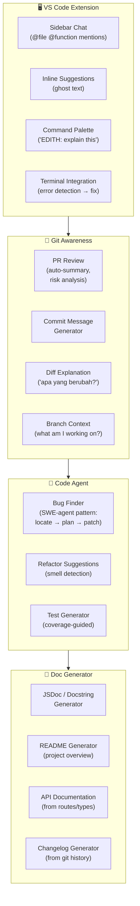
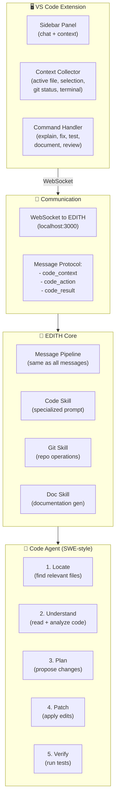
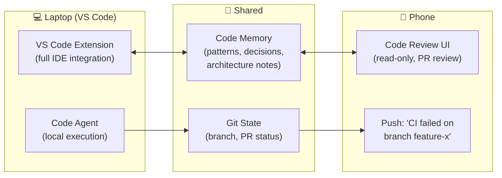
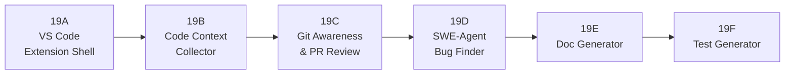
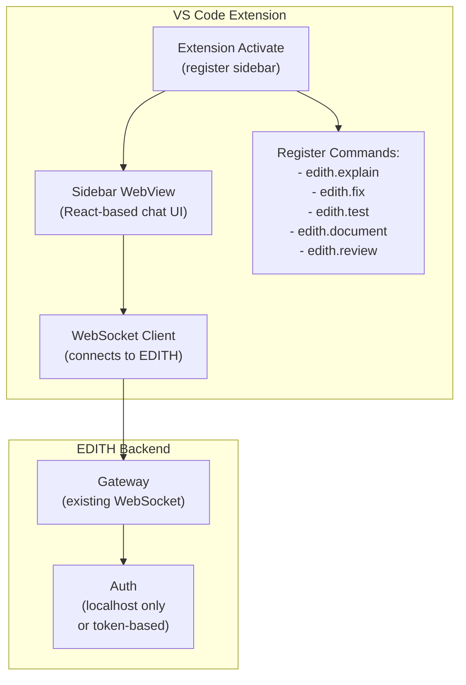
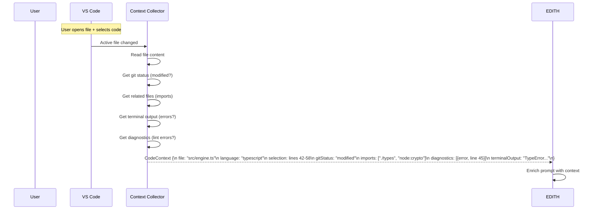
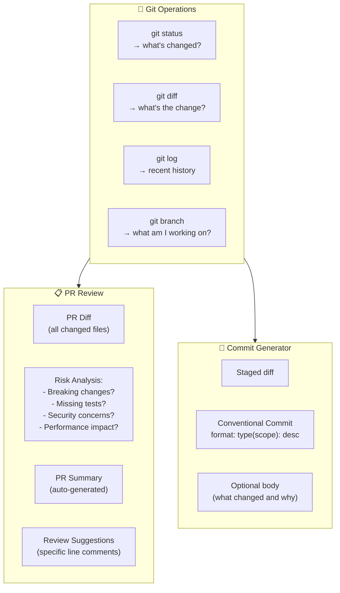
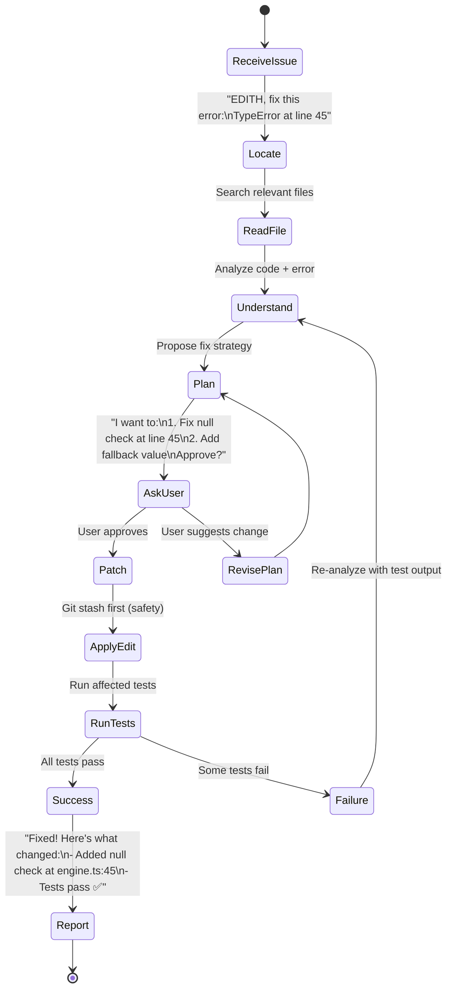
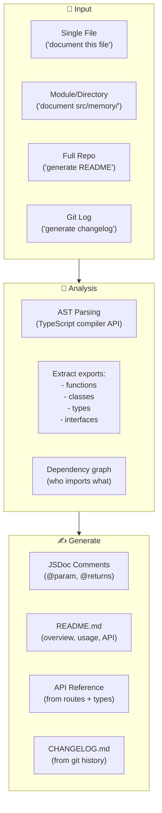
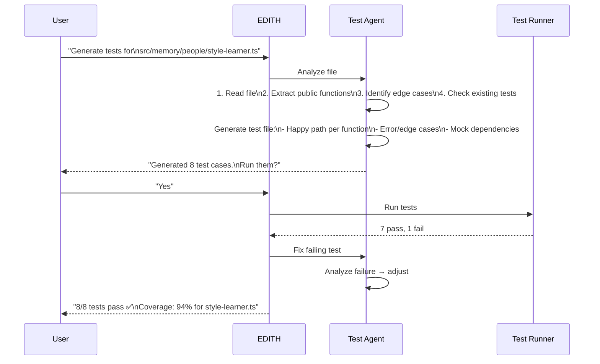

# Phase 19 — Dev & Code Assistant Mode

> "Tony ga pernah coding manual kalau JARVIS bisa bantu. EDITH juga harus bisa."

**Prioritas:** 🟡 MEDIUM — High value untuk user yang developer.
**Depends on:** Phase 13 (Knowledge Base), Phase 15 (Browser Agent), Phase 6 (Memory)
**Status:** ❌ Not started

---

## 1. Tujuan

EDITH sudah bisa ngobrol dan bantu task harian. Tapi kalau user developer, EDITH harus
punya **code awareness**: paham repo, bisa baca code, suggest fix, generate docs,
dan bahkan bantu debug — tanpa perlu pindah ke IDE lain.

Phase ini membangun: VS Code sidebar extension, git awareness (PR/commit),
agentic bug finder (SWE-agent pattern), dan documentation generator.



---

## 2. Research References

| # | Paper / Project | ID | Kontribusi ke EDITH |
|---|-----------------|-----|---------------------|
| 1 | SWE-agent: Agent-Computer Interface | arXiv:2405.15793 | Agentic bug-finding: observe file → plan → edit → test loop |
| 2 | Agentless: LLM-based SE | arXiv:2407.01489 | Localize → repair without complex scaffolding |
| 3 | RepoAgent: Repository-Level Code Doc | arXiv:2402.16667 | Automated documentation from repo structure |
| 4 | CodeR: Issue Resolving with Reviewers | arXiv:2406.01304 | Multi-agent code review: reviewer catches errors |
| 5 | AutoCodeRover: Program Improvement | arXiv:2404.05427 | AST-level code understanding for targeted patches |
| 6 | Aider: AI Pair Programmer | github.com/paul-gauthier/aider | Real-world AI pair programming patterns |
| 7 | Continue.dev | github.com/continuedev/continue | VS Code AI extension architecture reference |

---

## 3. Arsitektur

### 3.1 Kontrak Arsitektur

```
Rule 1: EDITH Dev Mode is an EXTENSION of EDITH, not a separate product.
        Same memory, same personality, same conversation history.
        Code context enriches EDITH's overall understanding.

Rule 2: Code actions are ALWAYS reversible.
        Every edit creates a git stash/checkpoint first.
        User can always: "EDITH, undo that change".

Rule 3: EDITH never pushes code without explicit confirmation.
        Suggest → user reviews → user approves → push.
        "EDITH, push this" requires active confirmation.

Rule 4: Private code stays local.
        EDITH processes code via local LLM (Phase 9) when possible.
        Cloud LLM: only with user consent, and code is not stored.

Rule 5: Dev mode integrates with existing EDITH skills.
        "EDITH, search web for React 19 migration guide" → Phase 15
        "EDITH, remember this pattern" → Phase 6 memory
        "EDITH, explain this to Budi" → Phase 18 social draft
```

### 3.2 System Architecture



### 3.3 Cross-Device (Phase 27 Integration)



---

## 4. Sub-Phase Breakdown



---

### Phase 19A — VS Code Extension Shell

**Goal:** EDITH sidebar panel in VS Code, connected to EDITH backend via WebSocket.



```typescript
/**
 * @module vscode-extension/extension
 * EDITH VS Code extension entry point.
 */

import * as vscode from 'vscode';

export function activate(context: vscode.ExtensionContext) {
  // Register sidebar webview
  const provider = new EdithSidebarProvider(context.extensionUri);
  context.subscriptions.push(
    vscode.window.registerWebviewViewProvider('edith.sidebar', provider),
  );
  
  // Register commands
  const commands = [
    vscode.commands.registerCommand('edith.explain', () => handleCommand('explain')),
    vscode.commands.registerCommand('edith.fix', () => handleCommand('fix')),
    vscode.commands.registerCommand('edith.test', () => handleCommand('test')),
    vscode.commands.registerCommand('edith.document', () => handleCommand('document')),
    vscode.commands.registerCommand('edith.review', () => handleCommand('review')),
  ];
  context.subscriptions.push(...commands);
}

async function handleCommand(action: string) {
  const editor = vscode.window.activeTextEditor;
  if (!editor) return;
  
  const selection = editor.selection;
  const text = editor.document.getText(selection.isEmpty ? undefined : selection);
  const filePath = editor.document.uri.fsPath;
  const language = editor.document.languageId;
  
  // Send to EDITH via WebSocket
  await EdithClient.getInstance().send({
    type: 'code_action',
    action,
    context: { filePath, language, text, selection: !selection.isEmpty },
  });
}
```

**Files:**
| File | Action | Lines |
|------|--------|-------|
| `apps/vscode/src/extension.ts` | CREATE | ~120 |
| `apps/vscode/src/sidebar-provider.ts` | CREATE | ~80 |
| `apps/vscode/src/edith-client.ts` | CREATE | ~100 |
| `apps/vscode/package.json` | CREATE | ~60 |

---

### Phase 19B — Code Context Collector

**Goal:** Automatically collect rich context from the IDE.



```typescript
/**
 * @module vscode-extension/context-collector
 * Collects rich code context from the VS Code workspace.
 */

interface CodeContext {
  file: string;
  language: string;
  content: string;
  selection?: { startLine: number; endLine: number; text: string };
  gitStatus: 'untracked' | 'modified' | 'staged' | 'clean';
  imports: string[];
  diagnostics: { severity: string; message: string; line: number }[];
  terminalOutput?: string;
  relatedFiles: string[];     // files that import/export from this file
  repoRoot: string;
  branch: string;
}

class CodeContextCollector {
  /**
   * Collect full context for the current editor state.
   */
  async collect(): Promise<CodeContext> {
    const editor = vscode.window.activeTextEditor;
    if (!editor) throw new Error('No active editor');
    
    const [gitInfo, diagnostics, terminal, related] = await Promise.all([
      this.getGitInfo(editor.document.uri),
      this.getDiagnostics(editor.document.uri),
      this.getTerminalOutput(),
      this.getRelatedFiles(editor.document),
    ]);
    
    return {
      file: vscode.workspace.asRelativePath(editor.document.uri),
      language: editor.document.languageId,
      content: editor.document.getText(),
      selection: this.getSelection(editor),
      gitStatus: gitInfo.status,
      imports: this.extractImports(editor.document),
      diagnostics,
      terminalOutput: terminal,
      relatedFiles: related,
      repoRoot: gitInfo.root,
      branch: gitInfo.branch,
    };
  }
}
```

**Files:**
| File | Action | Lines |
|------|--------|-------|
| `apps/vscode/src/context-collector.ts` | CREATE | ~200 |
| `apps/vscode/src/import-resolver.ts` | CREATE | ~80 |

---

### Phase 19C — Git Awareness & PR Review

**Goal:** EDITH understands git state, can review PRs, generate commit messages.



```typescript
/**
 * @module skills/git-skill
 * Git-aware skill for EDITH code assistant mode.
 */

interface PRReview {
  summary: string;
  riskLevel: 'low' | 'medium' | 'high';
  breakingChanges: string[];
  missingTests: string[];
  securityConcerns: string[];
  suggestions: { file: string; line: number; comment: string }[];
}

class GitSkill {
  /**
   * Generate a conventional commit message from staged changes.
   */
  async generateCommitMessage(stagedDiff: string): Promise<string> {
    const result = await this.engine.chat([
      { role: 'system', content: COMMIT_SYSTEM_PROMPT },
      { role: 'user', content: `Generate a conventional commit message for this diff:\n\n${stagedDiff}` },
    ]);
    return result.trim();
  }
  
  /**
   * Review a PR diff and generate structured feedback.
   */
  async reviewPR(diff: string, prDescription?: string): Promise<PRReview> {
    const result = await this.engine.chat([
      { role: 'system', content: PR_REVIEW_SYSTEM_PROMPT },
      { role: 'user', content: `Review this PR:\n\nDescription: ${prDescription ?? 'none'}\n\nDiff:\n${diff}` },
    ], { responseFormat: 'json' });
    
    return JSON.parse(result);
  }
  
  /**
   * Explain what changed between two commits.
   */
  async explainDiff(diff: string): Promise<string> {
    return this.engine.chat([
      { role: 'system', content: 'Explain this git diff in plain language. Focus on WHAT changed and WHY (if inferable). Be concise.' },
      { role: 'user', content: diff },
    ]);
  }
}

const COMMIT_SYSTEM_PROMPT = `Generate a conventional commit message.
Format: type(scope): description

Types: feat, fix, refactor, test, docs, chore, perf, security
Scope: the module or area changed
Description: imperative mood, lowercase, no period

If multiple changes, pick the primary one for the title.
Add a body paragraph only if the change is non-obvious.`;
```

**Files:**
| File | Action | Lines |
|------|--------|-------|
| `EDITH-ts/src/skills/git-skill.ts` | CREATE | ~200 |
| `EDITH-ts/src/skills/git-prompts.ts` | CREATE | ~80 |
| `EDITH-ts/src/skills/__tests__/git-skill.test.ts` | CREATE | ~120 |

---

### Phase 19D — SWE-Agent Bug Finder

**Goal:** Agentic code debugging: locate → understand → plan → patch → verify.



```typescript
/**
 * @module agents/code-agent
 * SWE-agent style code debugging agent.
 * Pattern: locate → understand → plan → patch → verify
 */

interface CodeAgentStep {
  type: 'locate' | 'read' | 'understand' | 'plan' | 'patch' | 'verify';
  description: string;
  result?: string;
}

class CodeAgent {
  private steps: CodeAgentStep[] = [];
  
  /**
   * Run the agent loop to fix an issue.
   * @param issue - User's description of the problem
   * @param context - Current code context from IDE
   */
  async solve(issue: string, context: CodeContext): Promise<{
    success: boolean;
    steps: CodeAgentStep[];
    patch?: string;
  }> {
    // Step 1: Locate relevant files
    const files = await this.locate(issue, context);
    
    // Step 2: Read and understand
    const understanding = await this.understand(files, issue);
    
    // Step 3: Plan the fix
    const plan = await this.plan(understanding, issue);
    
    // Step 4: Ask user for approval
    const approved = await this.requestApproval(plan);
    if (!approved) return { success: false, steps: this.steps };
    
    // Safety: create git stash checkpoint
    await this.createCheckpoint();
    
    // Step 5: Apply patch
    const patch = await this.applyPatch(plan);
    
    // Step 6: Verify (run tests)
    const testResult = await this.verify(patch);
    
    if (!testResult.passed) {
      // Rollback and retry with test output as context
      await this.rollback();
      return this.solve(
        `${issue}\n\nPrevious fix attempt failed:\n${testResult.output}`,
        context,
      );
    }
    
    return { success: true, steps: this.steps, patch };
  }
  
  private async locate(issue: string, context: CodeContext): Promise<string[]> {
    // Use ripgrep-style search + AST analysis to find relevant files
    this.steps.push({ type: 'locate', description: 'Searching for relevant files...' });
    
    const searchTerms = await this.extractSearchTerms(issue);
    const files = await this.searchCodebase(searchTerms, context.repoRoot);
    
    return files.slice(0, 10); // Top 10 most relevant
  }
}
```

**Files:**
| File | Action | Lines |
|------|--------|-------|
| `EDITH-ts/src/agents/code-agent.ts` | CREATE | ~300 |
| `EDITH-ts/src/agents/code-agent-prompts.ts` | CREATE | ~100 |
| `EDITH-ts/src/agents/__tests__/code-agent.test.ts` | CREATE | ~150 |

---

### Phase 19E — Documentation Generator

**Goal:** Auto-generate JSDoc, README, API docs, and changelogs.



```typescript
/**
 * @module skills/doc-skill
 * Documentation generator skill for EDITH.
 */

class DocSkill {
  /**
   * Generate JSDoc for all exported functions in a file.
   */
  async documentFile(filePath: string): Promise<{ line: number; jsdoc: string }[]> {
    const content = await readFile(filePath, 'utf-8');
    const exports = this.extractExports(content);
    
    const docs: { line: number; jsdoc: string }[] = [];
    for (const exp of exports) {
      if (exp.hasJSDoc) continue; // skip already documented
      
      const jsdoc = await this.generateJSDoc(exp, content);
      docs.push({ line: exp.line, jsdoc });
    }
    
    return docs;
  }
  
  /**
   * Generate README for a directory/module.
   */
  async generateREADME(dirPath: string): Promise<string> {
    const files = await this.listFiles(dirPath);
    const structure = await this.analyzeStructure(files);
    const exports = await this.collectExports(files);
    
    return this.engine.chat([
      { role: 'system', content: README_SYSTEM_PROMPT },
      { role: 'user', content: `Generate README.md for this module:\n\nStructure:\n${structure}\n\nExports:\n${exports}` },
    ]);
  }
  
  /**
   * Generate CHANGELOG from git history.
   */
  async generateChangelog(since?: string): Promise<string> {
    const commits = await this.getCommitsSince(since ?? '1 month ago');
    const grouped = this.groupByType(commits); // feat, fix, etc.
    
    return this.engine.chat([
      { role: 'system', content: CHANGELOG_SYSTEM_PROMPT },
      { role: 'user', content: `Generate CHANGELOG:\n\n${JSON.stringify(grouped)}` },
    ]);
  }
}
```

**Files:**
| File | Action | Lines |
|------|--------|-------|
| `EDITH-ts/src/skills/doc-skill.ts` | CREATE | ~200 |
| `EDITH-ts/src/skills/doc-prompts.ts` | CREATE | ~80 |

---

### Phase 19F — Test Generator

**Goal:** Coverage-guided test generation.



```typescript
/**
 * @module skills/test-skill
 * Coverage-guided test generator for EDITH.
 */

class TestSkill {
  /**
   * Generate tests for a file.
   * @param filePath - Path to the source file
   * @returns Generated test file content
   */
  async generateTests(filePath: string): Promise<string> {
    const source = await readFile(filePath, 'utf-8');
    const existingTests = await this.findExistingTests(filePath);
    const coverage = await this.getCoverage(filePath);
    
    const testCode = await this.engine.chat([
      { role: 'system', content: TEST_GEN_SYSTEM_PROMPT },
      { role: 'user', content: `Generate Vitest tests for this file.

Source (${filePath}):
\`\`\`typescript
${source}
\`\`\`

Existing tests: ${existingTests ? 'yes, covering: ' + coverage?.coveredFunctions.join(', ') : 'none'}
Uncovered functions: ${coverage?.uncoveredFunctions.join(', ') ?? 'all'}

Rules:
- Use vi.clearAllMocks() in beforeEach (ESM requirement)
- Use vi.hoisted() for mock factory variables
- Test names are behavior specs: "returns fallback when provider fails"
- Cover happy path + at least one failure mode per function` },
    ]);
    
    return testCode;
  }
}

const TEST_GEN_SYSTEM_PROMPT = `You are a test generation expert.
Generate Vitest test files following these conventions:
- import { describe, it, expect, vi, beforeEach } from 'vitest'
- Use vi.clearAllMocks() in beforeEach, NEVER vi.resetAllMocks()
- Use vi.hoisted() for mock factory variables
- Test names describe behavior: "returns X when Y"
- Cover: happy path, error cases, edge cases, boundary values
- Mock external dependencies, test unit logic`;
```

**Files:**
| File | Action | Lines |
|------|--------|-------|
| `EDITH-ts/src/skills/test-skill.ts` | CREATE | ~180 |
| `EDITH-ts/src/skills/test-prompts.ts` | CREATE | ~60 |

---

## 5. Acceptance Gates

```
□ VS Code Extension: sidebar panel loads and connects to EDITH
□ VS Code Extension: "EDITH: explain" → explains selected code
□ Context Collector: active file + selection + git status collected
□ Context Collector: terminal errors detected and included
□ Git: commit message generated in conventional format
□ Git: PR review → summary + risk level + suggestions
□ Git: diff explanation in plain language
□ Code Agent: given error → locates correct file
□ Code Agent: proposes fix → user approves → applies patch
□ Code Agent: creates git checkpoint before patching
□ Code Agent: runs tests after patch → reports result
□ Code Agent: test fail → auto-retry with test output (max 3 attempts)
□ Doc Gen: JSDoc generated for undocumented exports
□ Doc Gen: README generated for module directory
□ Doc Gen: CHANGELOG from git history
□ Test Gen: generates Vitest tests following project conventions
□ Test Gen: runs generated tests → fixes failures
□ Cross-device: code review on phone (Phase 16 push + Phase 27 sync)
```

---

## 6. Koneksi ke Phase Lain

| Phase | Integration | Protocol |
|-------|------------|----------|
| Phase 6 (Proactive) | Code patterns stored in memory for proactive suggestions | memory_fact |
| Phase 9 (Offline) | Local LLM for private code processing | local_inference |
| Phase 13 (Knowledge Base) | Code docs indexed in knowledge base | knowledge_ingest |
| Phase 15 (Browser) | Web research for code solutions | browser_search |
| Phase 16 (Mobile) | PR review push notifications | push_notify |
| Phase 17 (Privacy) | Code never sent to cloud without consent | privacy_gate |
| Phase 18 (Social) | "Explain to Budi" → social-aware explanation | social_draft |
| Phase 22 (Mission) | Multi-step coding tasks as missions | mission_plan |
| Phase 27 (Cross-Device) | Code review sync between laptop ↔ phone | cross_sync |

---

## 7. File Changes Summary

| File | Action | Lines |
|------|--------|-------|
| `apps/vscode/src/extension.ts` | CREATE | ~120 |
| `apps/vscode/src/sidebar-provider.ts` | CREATE | ~80 |
| `apps/vscode/src/edith-client.ts` | CREATE | ~100 |
| `apps/vscode/src/context-collector.ts` | CREATE | ~200 |
| `apps/vscode/src/import-resolver.ts` | CREATE | ~80 |
| `apps/vscode/package.json` | CREATE | ~60 |
| `EDITH-ts/src/skills/git-skill.ts` | CREATE | ~200 |
| `EDITH-ts/src/skills/git-prompts.ts` | CREATE | ~80 |
| `EDITH-ts/src/skills/doc-skill.ts` | CREATE | ~200 |
| `EDITH-ts/src/skills/doc-prompts.ts` | CREATE | ~80 |
| `EDITH-ts/src/skills/test-skill.ts` | CREATE | ~180 |
| `EDITH-ts/src/skills/test-prompts.ts` | CREATE | ~60 |
| `EDITH-ts/src/agents/code-agent.ts` | CREATE | ~300 |
| `EDITH-ts/src/agents/code-agent-prompts.ts` | CREATE | ~100 |
| `EDITH-ts/src/skills/__tests__/git-skill.test.ts` | CREATE | ~120 |
| `EDITH-ts/src/agents/__tests__/code-agent.test.ts` | CREATE | ~150 |
| **Total** | | **~2110** |

**New dependencies:** `vscode` (extension API), `@vscode/webview-ui-toolkit`
