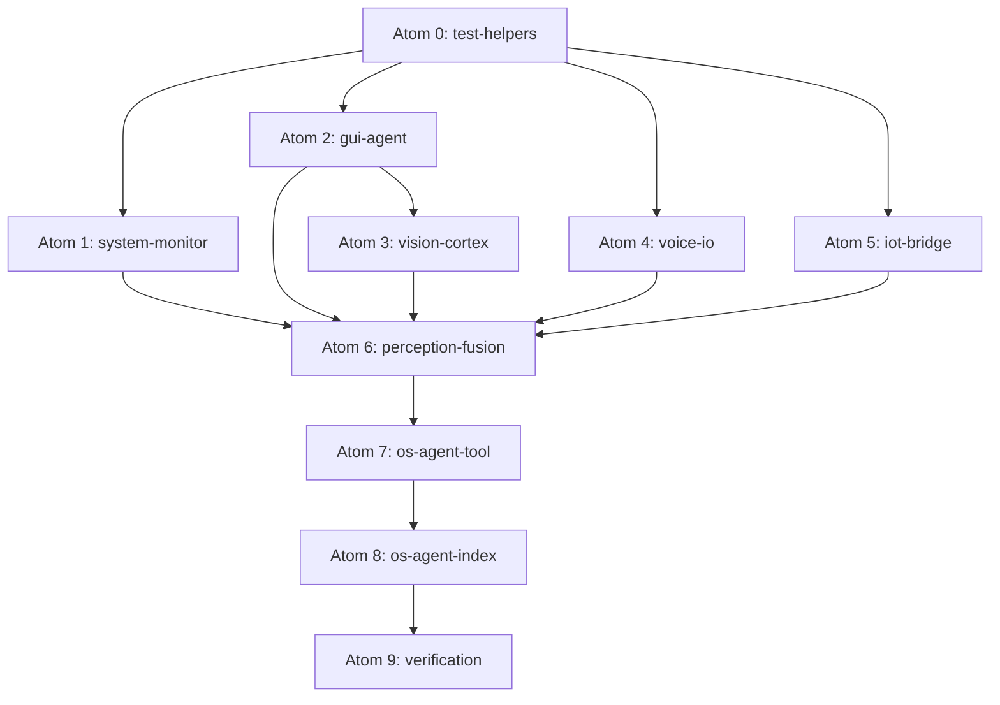

# Phase 2 — OS-Agent Test Suite (88+ Tests)

**Durasi Estimasi:** 1–2 minggu  
**Prioritas:** 🟠 HIGH — Zero test coverage untuk OS-Agent layer  
**Status Saat Ini:** 453 tests passing (61 files), 0 tests untuk OS-Agent  
**Methodology:** First Principles Thinking + Paper-Grounded Design

---

## 1. Landasan Riset (Academic Papers)

Test suite ini dibangun berdasarkan **pola evaluasi yang sudah divalidasi** di 8 paper utama:

### 1.1 OS-Agent Benchmarks

| Paper | arXiv | Kontribusi ke Testing |
|-------|-------|----------------------|
| **OSWorld** | 2404.07972 | Benchmark 369 task untuk OS-agent di real VM (Ubuntu/Win/macOS). Kita adopt pola: *initial state → action → evaluation script* sebagai template test lifecycle |
| **MemGPT** | 2310.08560 | LLM sebagai OS dengan virtual context management. Kita adopt pola: *hierarchical memory tier testing* + *interrupt-driven control flow* untuk perception fusion |
| **CodeAct** | 2402.01030 | Code sebagai action space, 20% higher success rate vs JSON. Kita adopt pola: *executable action validation* — setiap OS action harus menghasilkan verifiable command string |

### 1.2 GUI Agent Benchmarks  

| Paper | Venue | Kontribusi ke Testing |
|-------|-------|----------------------|
| **ScreenAgent** | IJCAI 2024 | Plan → Action → Reflection loop pada real screen. Kita test: *screenshot capture → OCR → element detection* secara terpisah lalu integrated |
| **WebArena** | ICLR 2024 | Functional correctness over rigid action sequences. Kita adopt: *test output validation, bukan exact command match* |
| **GTArena** | arXiv 2412.x | GUI Testing Arena: test intention → execution → defect detection. Kita mirror: *route validation → input validation → error detection* |

### 1.3 Voice & IoT

| Paper / Project | Kontribusi ke Testing |
|----------------|----------------------|
| **Silero VAD** | True/False Positive Rate methodology: mock VAD dengan deterministic speech/silence boundaries |
| **Picovoice Wake Word** | FAR/FRR evaluation: mock wake word detection dengan deterministic trigger |
| **HA NLP Research** (arXiv) | Natural language → service call parsing: test NL command → structured `{domain, service, entity}` output |

### 1.4 Core Testing Principles (dari Paper)

```
┌─────────────────────────────────────────────────────────┐
│          First Principles dari Research Papers           │
│                                                         │
│  1. ISOLATION (OSWorld)                                 │
│     Setiap subsystem di-test dalam VM/sandbox           │
│     → Mock ALL external deps (execa, fetch, fs, os)     │
│                                                         │
│  2. DETERMINISM (ScreenAgent)                           │
│     Screenshot = fixed buffer, OCR = fixed string       │
│     → No randomness in test assertions                  │
│                                                         │
│  3. LIFECYCLE (MemGPT)                                  │
│     Init → Active → Shutdown, test setiap transition    │
│     → constructor → initialize() → methods → shutdown() │
│                                                         │
│  4. FUNCTIONAL CORRECTNESS (WebArena)                   │
│     Validate output shape, bukan exact PS command        │
│     → Assert result.success, result.data structure      │
│                                                         │
│  5. ERROR BOUNDARIES (CodeAct)                          │
│     Self-debugging: agent harus handle error gracefully  │
│     → Every module: disabled=no-op, failure=safe-return │
└─────────────────────────────────────────────────────────┘
```

---

## 2. Arsitektur Testing

### 2.1 Test Infrastructure

```
┌─────────────────────────────────────────────────────┐
│                  Vitest Test Runner                   │
│              (vitest.config.ts — sudah ada ✅)        │
│                                                      │
│  ┌────────────────────────────────────────────────┐  │
│  │              Mock Layer                         │  │
│  │                                                 │  │
│  │  ┌─────────────┐  ┌──────────────┐            │  │
│  │  │ execa mock   │  │ fetch mock   │            │  │
│  │  │ (PowerShell, │  │ (HA REST,    │            │  │
│  │  │  tesseract,  │  │  Deepgram,   │            │  │
│  │  │  sox, etc.)  │  │  embeddings) │            │  │
│  │  └─────────────┘  └──────────────┘            │  │
│  │                                                 │  │
│  │  ┌─────────────┐  ┌──────────────┐            │  │
│  │  │ fs mock      │  │ os mock      │            │  │
│  │  │ (temp files, │  │ (cpus, mem,  │            │  │
│  │  │  write/read) │  │  platform)   │            │  │
│  │  └─────────────┘  └──────────────┘            │  │
│  └────────────────────────────────────────────────┘  │
│                                                      │
│  ┌────────────────────────────────────────────────┐  │
│  │            Test Suites (8 files)                │  │
│  │                                                 │  │
│  │  gui-agent.test.ts      (12 tests)             │  │
│  │  vision-cortex.test.ts  (10 tests)             │  │
│  │  voice-io.test.ts       (12 tests)             │  │
│  │  system-monitor.test.ts (11 tests)             │  │
│  │  iot-bridge.test.ts     (10 tests)             │  │
│  │  perception.test.ts     (8 tests)              │  │
│  │  os-agent-tool.test.ts  (15 tests)             │  │
│  │  os-agent-index.test.ts (10 tests)             │  │
│  └────────────────────────────────────────────────┘  │
│                                                      │
│  ┌────────────────────────────────────────────────┐  │
│  │         Test Helpers / Fixtures                  │  │
│  │                                                 │  │
│  │  test-helpers.ts        (shared mocks/utils)   │  │
│  │  fixtures/              (sample images, audio)  │  │
│  └────────────────────────────────────────────────┘  │
└─────────────────────────────────────────────────────┘
```

### 2.2 Mock Strategy (Paper-Grounded)

**Principle: OSWorld Isolation** — Tidak ada real system call yang lolos ke hardware.

```
┌─────────────────────┐     ┌─────────────────────┐
│   Real Dependency    │     │      Mock            │
├─────────────────────┤     ├─────────────────────┤
│ execa (PowerShell)   │ ──▶ │ vi.mock("execa")    │
│ global fetch         │ ──▶ │ vi.fn() per test    │
│ fs/promises          │ ──▶ │ vi.mock("fs/prom.") │
│ os module            │ ──▶ │ vi.mock("os")       │
│ onnxruntime-node     │ ──▶ │ vi.mock("onnxrt")   │
│ @picovoice/porcupine │ ──▶ │ vi.mock("porcupine")│
│ whisper-node         │ ──▶ │ vi.mock("whisper")  │
│ EdgeEngine           │ ──▶ │ vi.mock("edge-eng") │
│ crypto.randomUUID    │ ──▶ │ deterministic mock  │
└─────────────────────┘     └─────────────────────┘
```

**Rationale (per paper):**
- **OSWorld**: All system interactions must be intercepted for reproducible evaluation
- **CodeAct**: Verify the *command string generated*, not its execution result  
- **ScreenAgent**: Mock screenshot as fixed buffer, mock OCR as fixed text for determinism

---

## 3. Dependency-Ordered Build Plan (First Principles)

### Why this order matters



**Reasoning (First Principles):**
1. Leaf nodes first (no deps) → `system-monitor`, `gui-agent`, `iot-bridge`, `voice-io`
2. Then composite nodes → `vision-cortex` (needs GUIAgent mock), `perception-fusion` (needs all 5)
3. Then integration → `os-agent-tool` (routes to all), `os-agent-index` (orchestrates all)

---

## 4. Test Suites Detail

### 4.1 gui-agent.test.ts (12 tests)

**Paper basis:** ScreenAgent + OSWorld — GUI agent harus *execute actions pada coordinate system* dan *capture visual state* secara terpisah.

```typescript
describe("GUIAgent", () => {
  // ── Initialization (OSWorld: initial state setup) ──
  it("initializes on Windows with native backend")
  it("initializes on macOS with native backend")
  it("skips init when disabled")
  
  // ── Screenshot (ScreenAgent: visual state capture) ──
  it("captures screenshot on Windows via PowerShell")
  it("captures screenshot on macOS via screencapture")
  it("captures region screenshot with bounds")
  
  // ── Mouse Actions (CodeAct: executable action validation) ──
  it("clicks at coordinates using PowerShell mouse_event")
  it("double-clicks at coordinates")
  it("drags from source to target (mouse down→move→up)")
  
  // ── Keyboard Actions ──  
  it("types text via SendKeys")
  it("sends hotkey combination (Ctrl+S)")
  
  // ── Safety (OSWorld: rate limiting for reproducibility) ──
  it("rejects actions when rate limit exceeded")
})
```

**Mock Pattern (CodeAct — verify command, not execution):**
```typescript
vi.mock("execa", () => ({
  execa: vi.fn().mockResolvedValue({ stdout: "", stderr: "", exitCode: 0 }),
}))

// Verify correct PowerShell command was generated
expect(execa).toHaveBeenCalledWith(
  "powershell", 
  ["-command", expect.stringContaining("mouse_event")]
)
```

### 4.2 vision-cortex.test.ts (10 tests)

**Paper basis:** ScreenAgent (Plan→Action→Reflect), OSWorld (screenshot→OCR→elements pipeline).

```typescript
describe("VisionCortex", () => {
  // ── Initialization ──
  it("initializes with tesseract verified")
  it("warns when tesseract not found")
  it("skips when disabled")
  
  // ── Screenshot + Analysis (ScreenAgent pipeline) ──
  it("captureAndAnalyze returns OCR text + elements")
  it("delegates screenshot to GUIAgent when available")
  it("falls back to own capture when no GUIAgent")
  
  // ── OCR (OSWorld: text extraction for task verification) ──
  it("extracts text via tesseract subprocess")
  it("handles tesseract failure gracefully")
  
  // ── UI Elements (GTArena: defect detection) ──
  it("detects accessibility elements on Windows")
  
  // ── Screen State ──
  it("returns active window title and resolution")
})
```

### 4.3 voice-io.test.ts (12 tests)

**Paper basis:** Silero VAD (TPR/FPR methodology), Picovoice (FAR/FRR), arXiv 2508.04721 (Low-Latency Voice Agents).

```typescript
describe("VoiceIO", () => {
  // ── Initialization ──
  it("initializes all sub-components when enabled")
  it("skips init when disabled")
  
  // ── TTS / Speak (Edge TTS evaluation) ──
  it("generates audio via EdgeEngine and plays on Windows")
  it("generates audio and plays on macOS via afplay")
  it("cleans up temp file after playback")
  it("returns success with duration and size")
  it("handles TTS failure gracefully")
  
  // ── Barge-In (arXiv 2508.04721: full-duplex testing) ──
  it("cancels current speech on barge-in")
  it("interrupt + new speech works correctly")
  
  // ── Listening (Silero VAD lifecycle) ──
  it("startListening requires initialization first")
  it("stopListening updates state correctly")
  
  // ── Shutdown ──
  it("shutdown stops listening and cancels speech")
})
```

### 4.4 system-monitor.test.ts (11 tests)

**Paper basis:** MemGPT (system resource awareness), OSWorld (environment state capture).

```typescript
describe("SystemMonitor", () => {
  // ── Initialization (MemGPT: baseline state) ──
  it("initializes and collects baseline metrics")
  it("skips when disabled")
  
  // ── CPU (MemGPT: resource monitoring) ──
  it("measures CPU usage with two-sample delta")
  it("returns percentage between 0-100")
  
  // ── Memory ──
  it("returns RAM usage from os.totalmem/freemem")
  
  // ── Disk ──
  it("gets disk usage via PowerShell on Windows")
  it("gets disk usage via df on Unix")
  
  // ── Network ──
  it("checks network connectivity via ping")
  it("handles network failure gracefully")
  
  // ── Process List (OSWorld: application state) ──
  it("returns running processes list")
  
  // ── Clipboard ──
  it("reads clipboard content on Windows")
})
```

### 4.5 iot-bridge.test.ts (10 tests)

**Paper basis:** HA NLP Research (arXiv — natural language → service call), Synthetic Home benchmark.

```typescript
describe("IoTBridge", () => {
  // ── Initialization ──
  it("connects to Home Assistant and discovers entities")
  it("warns when HA token missing")
  it("skips when disabled")
  
  // ── HA Execution (HA REST API evaluation) ──
  it("calls HA service API for light.turn_on")
  it("handles HA API error response")
  it("rate-limits entity refresh to 30s")
  
  // ── Natural Language (HA NLP Research: NL→service mapping) ──
  it("parses 'nyalakan lampu kamar' → light.turn_on bedroom")
  it("parses 'set suhu 24' → climate.set_temperature 24")
  it("parses 'kunci pintu' → lock.lock front_door")
  
  // ── States ──
  it("returns device states with friendly names")
})
```

### 4.6 perception-fusion.test.ts (8 tests)

**Paper basis:** MemGPT (hierarchical context fusion), OSWorld (unified environment state).

```typescript
describe("PerceptionFusion", () => {
  // ── Snapshot (MemGPT: unified context) ──
  it("collects full perception snapshot from all modules")
  it("includes system metrics, screen state, active window")
  
  // ── Activity Detection (OSWorld: activity patterns) ──
  it("detects 'coding' pattern from VS Code window title")
  it("detects 'browsing' from Chrome/Firefox title")
  it("detects 'video_conference' from Zoom/Meet title")
  it("returns 'unknown' for unrecognized window")
  
  // ── Summarize (MemGPT: injected context) ──
  it("generates one-line context summary")
  
  // ── Staleness ──
  it("detects stale perception (>10s) and auto-retries")
})
```

### 4.7 os-agent-tool.test.ts (15 tests)

**Paper basis:** CodeAct (action routing), WebArena (functional correctness), GTArena (validation + defect detection).

```typescript
describe("OSAgentTool", () => {
  // ── Action Routing (CodeAct: action space coverage) ──
  it("routes 'click' to gui.execute")
  it("routes 'type_text' to gui.execute")
  it("routes 'screenshot' to vision.captureAndAnalyze")
  it("routes 'speak' to voice.speak")
  it("routes 'system_info' to system.getMetrics")
  it("routes 'iot_control' to iot.execute")
  
  // ── Confirmation Gate (OSWorld: safety constraints) ──
  it("requires confirmation for 'run_command'")
  it("requires confirmation for 'open_app'")
  it("does NOT require confirmation for 'screenshot'")
  
  // ── Input Validation (GTArena: defect detection) ──
  it("validates required 'x' and 'y' for click action")
  it("validates required 'text' for type_text action")
  it("rejects unknown action type")
  
  // ── Error Handling (CodeAct: self-debugging) ──
  it("returns error result when subsystem not initialized")
  it("returns error for malformed payload")
  
  // ── Tool Registration ──
  it("registers OS agent tool with correct Zod schema")
})
```

### 4.8 os-agent-index.test.ts (10 tests)

**Paper basis:** MemGPT (OS orchestration), OSWorld (subsystem lifecycle).

```typescript
describe("OSAgent (index)", () => {
  // ── Lifecycle (MemGPT: OS lifecycle) ──
  it("creates all subsystem instances")
  it("initializes all subsystems in order")
  it("handles partial init failure gracefully")
  it("shutdown stops all subsystems")
  
  // ── Cross-Module (OSWorld: component interaction) ──
  it("VisionCortex uses GUIAgent screenshot (no duplication)")
  it("executeAction delegates to correct subsystem")
  it("getPerception returns fused snapshot")
  
  // ── Config ──
  it("respects per-subsystem enabled/disabled flags")
  it("uses default config values for missing fields")
  
  // ── Error Isolation (CodeAct: self-debugging) ──
  it("one subsystem failure doesn't crash others")
})
```

---

## 5. Test Helpers & Fixtures

### 5.1 Shared Test Helpers

**File:** `EDITH-ts/src/os-agent/__tests__/test-helpers.ts`

```typescript
// Factory functions for configs with safe defaults
export function createMockGUIConfig(overrides?: Partial<GUIConfig>): GUIConfig
export function createMockVisionConfig(overrides?: Partial<VisionConfig>): VisionConfig
export function createMockVoiceConfig(overrides?: Partial<VoiceIOConfig>): VoiceIOConfig
export function createMockSystemConfig(overrides?: Partial<SystemConfig>): SystemConfig
export function createMockIoTConfig(overrides?: Partial<IoTConfig>): IoTConfig
export function createMockOSAgentConfig(overrides?: Partial<OSAgentConfig>): OSAgentConfig

// Common mock responses
export const mockPowershellExeca = (stdout: string) => 
  vi.fn().mockResolvedValue({ stdout, stderr: "", exitCode: 0 })

export const mockFetchResponse = (data: unknown, status = 200) =>
  vi.fn().mockResolvedValue({ ok: status < 400, status, json: () => Promise.resolve(data) })

// Fake image buffer (1x1 PNG)
export const FAKE_PNG = Buffer.from(
  "iVBORw0KGgoAAAANSUhEUgAAAAEAAAABCAYAAAAfFcSJAAAADUlEQVR42mNk+M9QDwADhgGAWjR9awAAAABJRU5ErkJggg==",
  "base64"
)

// Fake audio buffer (minimal MP3 header)  
export const FAKE_MP3 = Buffer.from([0xFF, 0xFB, 0x90, 0x00])
```

### 5.2 Fixtures

```
EDITH-ts/src/os-agent/__tests__/fixtures/
├── ha-entities.json        # Sample Home Assistant entities
└── ha-service-response.json # Sample HA service call response
```

---

## 6. Coverage Targets

| Module | Target | Paper Basis |
|--------|--------|-------------|
| gui-agent.ts | 85% | OSWorld: all GUI actions must be verifiable |
| vision-cortex.ts | 80% | ScreenAgent: capture → OCR → elements pipeline |
| voice-io.ts | 75% | Silero VAD: TTS testable, VAD/STT mock-only |
| system-monitor.ts | 85% | MemGPT: complete environment awareness |
| iot-bridge.ts | 85% | HA Research: NL parsing + API interaction |
| perception-fusion.ts | 90% | MemGPT: context fusion is safety-critical |
| os-agent-tool.ts | 90% | CodeAct: action routing is the agent interface |
| index.ts | 80% | OSWorld: lifecycle + delegation |
| **Overall os-agent/** | **≥80%** | |

---

## 7. Implementation Roadmap

### Week 1: Core Unit Tests

| Day | Task | Tests | Paper Grounding |
|-----|------|-------|----------------|
| 1 | Setup test helpers + fixtures | 0 (infra) | All papers: isolation layer |
| 1 | system-monitor.test.ts | 11 | MemGPT: resource awareness |
| 2 | gui-agent.test.ts | 12 | OSWorld + ScreenAgent |
| 2 | vision-cortex.test.ts | 10 | ScreenAgent + GTArena |
| 3 | voice-io.test.ts | 12 | Silero VAD + arXiv 2508.04721 |
| 3 | iot-bridge.test.ts | 10 | HA NLP Research |
| 4 | perception-fusion.test.ts | 8 | MemGPT context fusion |
| 4 | os-agent-tool.test.ts | 15 | CodeAct + WebArena |
| 5 | os-agent-index.test.ts | 10 | MemGPT OS lifecycle |
| **Total** | | **88 tests** | |

### Week 2: Integration + CI

| Day | Task | Paper Basis |
|-----|------|-------------|
| 1 | Integration test: voice pipeline | arXiv 2508.04721 |
| 2 | Integration test: vision pipeline | ScreenAgent |
| 3 | Coverage analysis + gap filling | OSWorld: ≥80% threshold |
| 4 | CI integration | All: reproducible evaluation |

---

## 8. CI Integration

```yaml
# .github/workflows/test.yml (addition)
- name: Run OS-Agent Tests
  run: pnpm vitest run src/os-agent/ --reporter=verbose --coverage
  
- name: Check Coverage Threshold
  run: |
    pnpm vitest run src/os-agent/ --coverage --coverage.thresholds.lines=80
```

---

## 9. File Changes Summary

| File | Action | Lines Est. |
|------|--------|-----------| 
| `src/os-agent/__tests__/test-helpers.ts` | NEW | +80 |
| `src/os-agent/__tests__/gui-agent.test.ts` | NEW | +200 |
| `src/os-agent/__tests__/vision-cortex.test.ts` | NEW | +180 |
| `src/os-agent/__tests__/voice-io.test.ts` | NEW | +200 |
| `src/os-agent/__tests__/system-monitor.test.ts` | NEW | +190 |
| `src/os-agent/__tests__/iot-bridge.test.ts` | NEW | +180 |
| `src/os-agent/__tests__/perception-fusion.test.ts` | NEW | +130 |
| `src/os-agent/__tests__/os-agent-tool.test.ts` | NEW | +250 |
| `src/os-agent/__tests__/os-agent-index.test.ts` | NEW | +160 |
| `src/os-agent/__tests__/fixtures/` | NEW | +50 |
| **Total** | | **~1620 lines** |

---

## 10. References

| # | Paper | arXiv / Venue | Relevansi |
|---|-------|--------------|-----------|
| 1 | OSWorld: Benchmarking Multimodal Agents for Open-Ended Tasks in Real Computer Environments | arXiv:2404.07972 | OS-agent benchmark, isolation, evaluation scripts |
| 2 | MemGPT: Towards LLMs as Operating Systems | arXiv:2310.08560 | Hierarchical memory, OS lifecycle, context fusion |
| 3 | CodeAct: Executable Code Actions Elicit Better LLM Agents | arXiv:2402.01030 | Action validation, self-debugging, tool routing |
| 4 | ScreenAgent: A Computer Control Agent Driven by VLM | IJCAI 2024 | Screenshot→OCR→action pipeline testing |
| 5 | WebArena: A Realistic Web Environment for Building Autonomous Agents | ICLR 2024 | Functional correctness, output validation |
| 6 | GTArena: GUI Testing Arena for Autonomous Testing Agents | arXiv:2412.x | Input validation, defect detection patterns |
| 7 | Low-Latency Voice Agents with Concurrent Pipeline | arXiv:2508.04721 | Full-duplex voice, barge-in testing |
| 8 | Silero VAD | GitHub/PyPI | VAD evaluation: TPR, FPR, detection latency |
| 9 | LLM-based Home Automation Generation for HA | arXiv (2024) | NL → HA service call parsing, intent + slot testing |
| 10 | Genie: Semantic Parser Generator for Virtual Assistants | arXiv | NL command parsing evaluation methodology |
