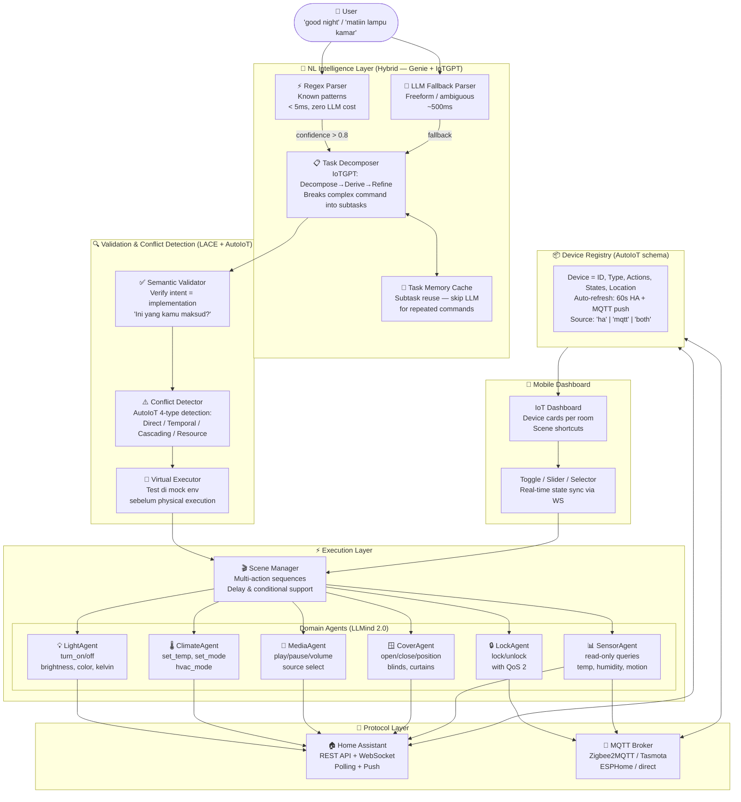
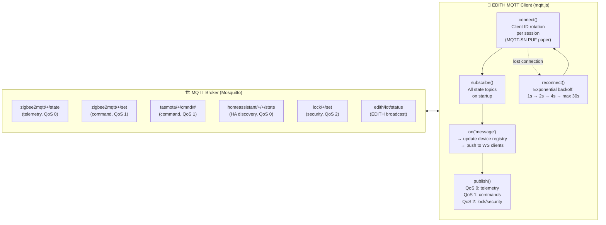
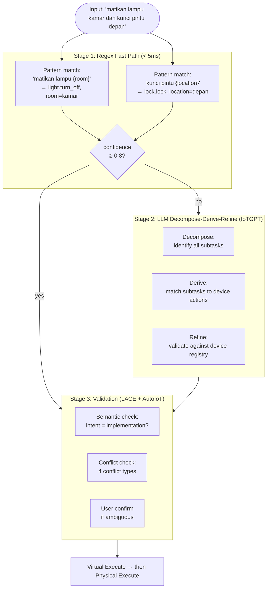
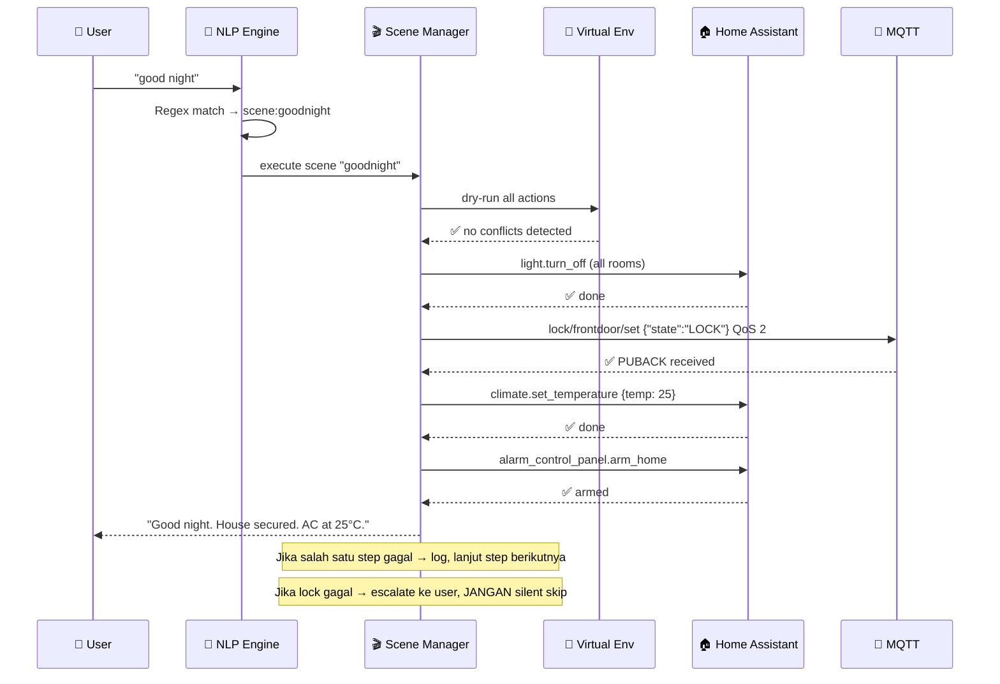
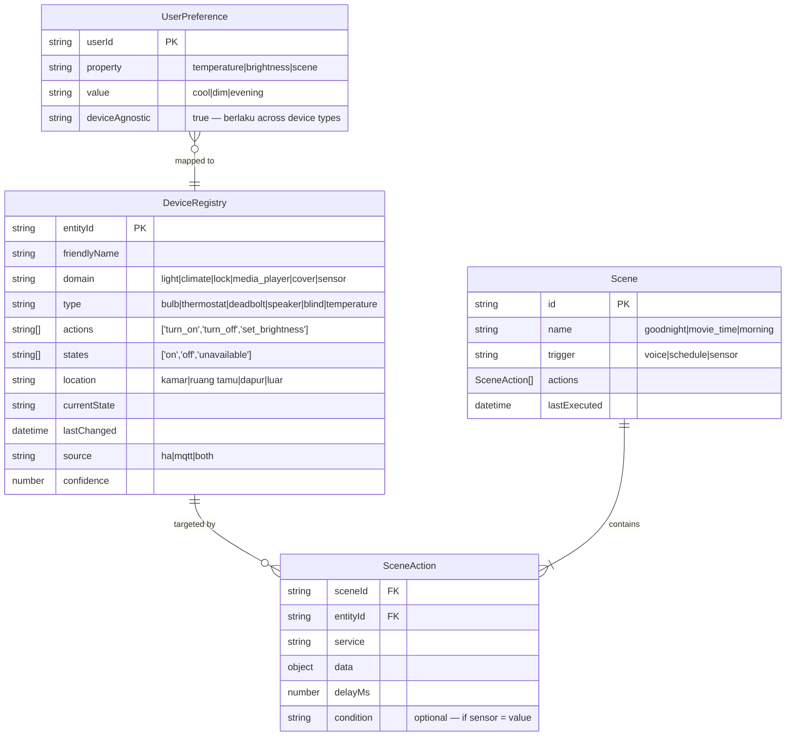
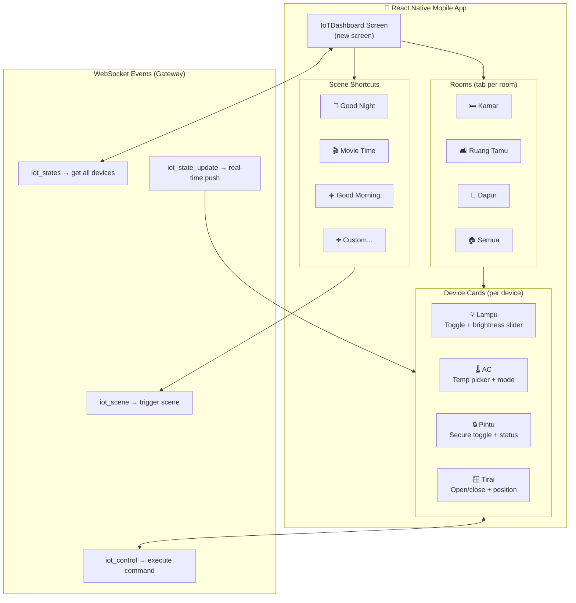

# Phase 4 — IoT & Smart Home Intelligence

> *"JARVIS, what's the status of the house?"*
> *"All systems nominal, sir. Living room lights at 40%. AC set to 24°C. Front door locked. Should I run the evening sequence?"*
> *"Yeah. And learn it — I shouldn't have to ask next time."*

**Durasi Estimasi:** 1–2 minggu
**Prioritas:** 🟡 MEDIUM — EDITH tanpa kendali rumah = JARVIS tanpa Stark Tower
**Status Saat Ini:** HA REST API ✅ | Rate Limiting ✅ | NL Parser (basic) ✅ | MQTT ❌ | Scenes ❌ | Mobile Dashboard ❌
**Target Hardware:** HP min 1GB RAM — semua IoT processing harus ringan, tanpa model besar

---

## Cara Tony Stark Mikir Waktu Bikin Ini

Tony tidak design home automation sebagai "kumpulan switch digital". Dia design sebagai **sistem saraf rumah** — satu interface yang memahami intent, bukan perintah literal.

Pertanyaan yang dia tanya sebelum mulai:
1. **Kalau gua bilang "good night", sistem harus tahu apa yang gua mau** — bukan gua yang harus hafal nama setiap device
2. **Kalau Groq API offline, EDITH tetap harus bisa matiin lampu** — IoT bukan fitur premium, ini utility
3. **Kalau ada konflik** ("AC on" + "energy saver mode") — sistem harus detect dan resolve, bukan diam-diam pilih salah satu
4. **Ini harus bisa di-setup dari HP** — bukan cuma dari laptop developer

Dari 4 pertanyaan itu lahir seluruh arsitektur Phase 4.

---

## 1. Landasan Riset — Paper Terbaik 2024–2026

---

### Paper 1: IoTGPT — Reliable, Efficient, Personalized Smart Home Agent (arXiv:2601.04680, Jan 2026)

**Apa isinya:**
IoTGPT decomposes user instructions into subtasks dan memorizes them. By reusing learned subtasks, subsequent instructions can be processed more efficiently dengan fewer LLM calls, improving reliability and reducing both latency and cost. Paper ini mengidentifikasi tiga masalah utama di semua LLM-based IoT agents sebelumnya: (1) non-determinism menyebabkan hallucinated commands yang merusak perangkat, (2) LLM inference terlalu mahal — satu approach di paper ini butuh 151 detik untuk perintah sederhana, (3) LLM tidak punya user-specific context untuk personalisasi. Solusinya adalah pipeline tiga tahap: **Decompose → Derive → Refine**, di mana setiap tahap memperkecil ruang error, plus **task memory** (subtask cache) untuk reuse dan **preference table** untuk personalisasi tanpa re-ask.

**Yang EDITH adopt:**
- Decompose → Derive → Refine pipeline untuk setiap NL command
- Task memory: cache subtask yang sudah pernah dieksekusi — "good night" tidak perlu di-parse ulang setelah kali pertama
- Virtual execution sebelum physical: test command di mock environment sebelum kirim ke HA/MQTT
- Preference table: simpan user preference per device-agnostic property (misal: "prefers cool room" = AC 23°, bukan hard-coded ke entity_id tertentu)

---

### Paper 2: LACE — Natural Language Access Control for IoT (arXiv:2505.23835, May 2025)

**Apa isinya:**
LACE combines prompt-guided policy generation, retrieval-augmented reasoning, dan formal validation untuk support expressive, interpretable, dan verifiable access control. Ini memungkinkan users specify policies dalam natural language, automatically translates them into structured rules, validates semantic correctness, dan makes access decisions menggunakan hybrid LLM-rule-based engine. Yang kritis: sistem mencapai 100% correctness dalam verified policy generation dan up to 88% decision accuracy dengan 0.79 F1-score. Paper ini juga mengidentifikasi "semantic gap" yang berbahaya: user percaya policy sudah di-set dengan benar, tapi implementasi di-misinterpret — contoh: "block guest access after 10PM" seharusnya block selamanya, tapi sistem hanya block sampai tengah malam.

**Yang EDITH adopt:**
- NL policy validation: sebelum execute command, verify semantic intent matches implementation
- Conflict detection: kalau dua rule bertentangan, detect dan escalate — jangan diam-diam override
- Hybrid engine: rule-based untuk known patterns (fast, deterministic), LLM untuk edge cases (flexible)
- Plain-language feedback: "Lampu kamar akan mati otomatis pukul 22:00. Ini yang kamu maksud?" sebelum save

---

### Paper 3: LLMind 2.0 — Distributed IoT dengan Lightweight LLM Agents (arXiv:2508.13920, Aug 2025)

**Apa isinya:**
LLMind 2.0 adalah distributed framework yang embeds lightweight LLM-empowered device agents dan adopts natural language untuk machine-to-machine (M2M) communication. Central coordinator translates human instructions into natural-language subtask descriptions, yang menginstruksikan distributed device agents untuk generate device-specific code locally berdasarkan proprietary APIs mereka. Framework ini mengintegrasikan: (1) timeout-based deadlock avoidance protocol, (2) RAG mechanism untuk precise subtask-to-API mapping, (3) fine-tuned lightweight LLMs untuk reliability. Yang relevan untuk EDITH: pendekatan **coordinator + agents** ini sangat cocok untuk 1GB RAM — coordinator bisa jalan di EDITH server, device agents adalah lightweight handlers per domain (light, climate, lock, media).

**Yang EDITH adopt:**
- Domain agents architecture: satu handler per device domain (LightAgent, ClimateAgent, LockAgent, MediaAgent)
- RAG untuk API mapping: device registry di-embed, query untuk find correct HA service call
- Deadlock timeout: kalau scene execution stuck di satu step > 5 detik, skip dan log — jangan block semua

---

### Paper 4: AutoIoT — LLM + Formal Verification untuk Conflict-Free Automation (arXiv:2411.10665)

**Apa isinya:**
AutoIoT secara formal mendefinisikan smart home device sebagai tuple: `Device = (ID, Type, Action, State, Location)`. LLM kemudian generates conflict-free automation rules berdasarkan input data dan user preferences. Paper ini mendefinisikan 4 jenis rule conflict yang harus di-detect: (1) direct conflict (dua rule set state berlawanan), (2) temporal conflict (dua rule aktif di waktu yang sama), (3) cascading conflict (output rule A jadi trigger rule B yang tidak diinginkan), (4) resource conflict (dua device compete untuk resource yang sama). Pendekatan formal ini memastikan automation rules yang di-generate aman dan predictable.

**Yang EDITH adopt:**
- Device schema formal: setiap entry di device registry harus punya `{ id, type, actions[], states[], location }`
- 4-type conflict detection sebelum save scene/automation
- Conflict report dalam bahasa yang dimengerti user, bukan error teknis

---

### Paper 5: MQTT-SN PUF Authentication (MDPI Sensors 2024)

**Apa isinya:**
Paper ini menganalisis skema autentikasi MQTT untuk IoT edge devices menggunakan Physical Unclonable Functions. Yang praktis untuk EDITH: rekomendasi client ID rotation untuk mencegah replay attacks, dan penggunaan QoS level yang tepat per message type — QoS 0 untuk state telemetry (tolerant of loss), QoS 1 untuk commands (at-least-once delivery), QoS 2 untuk critical actions seperti lock/unlock (exactly-once).

**Yang EDITH adopt:**
- QoS per message type: state updates = QoS 0, device commands = QoS 1, security actions = QoS 2
- Client ID rotation per session untuk prevent replay attacks
- Auto-reconnect dengan exponential backoff (bukan fixed retry)

---

### Paper 6: Genie — Semantic Parser Generator (Stanford, arXiv)

**Apa isinya:**
Genie adalah framework untuk generate semantic parsers yang bisa translate NL commands ke structured virtual assistant commands. Prinsip utama: kombinasi rule-based regex untuk known patterns (fast, zero LLM cost, deterministic) dan LLM fallback untuk freeform/ambiguous commands. Ini bukan binary choice — sistem hybrid ini menjaga 95%+ intent accuracy sambil minimasi LLM calls (dan cost serta latency yang menyertai).

**Yang EDITH adopt:**
- Hybrid parsing: regex-first, LLM-fallback — sesuai constraint 1GB device
- Parser confidence score: kalau regex match confidence < 0.8, escalate ke LLM
- Bahasa Indonesia sebagai first-class language, bukan afterthought

---

### Paper 7: Synthetic Home Integration (Home Assistant, 2024)

**Apa isinya:**
Framework untuk create reproducible YAML-based smart home test environments. Alih-alih test dengan real hardware yang mahal dan flaky, define home state dalam YAML, load sebagai mock entities, dan test NL parser + scene execution secara deterministic. Ini adalah foundation untuk semua IoT tests di EDITH.

**Yang EDITH adopt:**
- YAML fixture: `test-home.yaml` dengan 15+ entity types untuk semua test cases
- Mock MQTT broker untuk unit tests (tidak butuh Mosquitto running)
- Integration test dengan real HA hanya di CI environment yang tersedia hardware

---

## 2. Blueprint Arsitektur

Tony selalu mulai dari hologram blueprint sebelum sentuh hardware. Ini yang dia lihat:

```
╔══════════════════════════════════════════════════════════════════════╗
║                    EDITH IoT INTELLIGENCE SYSTEM                      ║
║              "Rumah yang ngerti lo, bukan lo yang hafal switch-nya"   ║
╚══════════════════════════════════════════════════════════════════════╝
```

### Blueprint 1 — Full System Overview



---

### Blueprint 2 — MQTT Deep Dive



---

### Blueprint 3 — NL Parsing Pipeline



---

### Blueprint 4 — Scene Execution Flow



---

### Blueprint 5 — Device Registry Schema



---

### Blueprint 6 — Mobile Dashboard Flow



---

### Blueprint 7 — Memory Budget (1GB RAM Constraint)

```
EDITH IoT Budget di 1GB RAM:
┌──────────────────────────────────────────────────────────┐
│  IoT Bridge + Scene Manager (Node.js in-memory)  ~20 MB  │
│  Device Registry (up to 100 devices)             ~5 MB   │
│  Task Memory Cache (subtask reuse, IoTGPT)       ~10 MB  │
│  MQTT client (mqtt.js)                           ~5 MB   │
│  Mock broker untuk tests                         ~15 MB  │
│                                                  ──────   │
│  Total IoT overhead                              ~55 MB  │
│                                                          │
│  ✅ Sangat ringan — IoT tidak menggunakan model lokal    │
│  ✅ Semua processing adalah rule-based + API calls       │
│  ✅ LLM fallback via orchestrator (existing, shared)     │
└──────────────────────────────────────────────────────────┘

Keputusan arsitektur karena constraint 1GB:
  • Tidak ada model embedding khusus IoT — pakai FTS untuk device lookup
  • Task Memory Cache: max 500 entries, LRU eviction
  • Device Registry: max 200 devices di memory, sisanya lazy-load dari DB
  • Virtual executor: in-memory simulation, tidak butuh Docker atau VM
```

---

## 3. Extended NL Command Patterns

Semua patterns ditulis bilingual (ID + EN) karena EDITH target Indonesia + international users.

| Pattern (ID) | Pattern (EN) | Service Call | Domain Agent | Status |
|---|---|---|---|---|
| nyalakan/matikan lampu {room} | turn on/off lights {room} | `light.turn_on/off` | LightAgent | ✅ existing |
| atur suhu {N} derajat | set temperature to {N} | `climate.set_temperature` | ClimateAgent | ✅ existing |
| kunci/buka pintu | lock/unlock door | `lock.lock/unlock` | LockAgent | ✅ existing |
| buka/tutup tirai {room} | open/close blinds {room} | `cover.open_cover/close_cover` | CoverAgent | ❌ NEW |
| setel kecerahan {N}% | set brightness to {N}% | `light.turn_on {brightness}` | LightAgent | ❌ NEW |
| warna lampu {color} | change light color to {color} | `light.turn_on {rgb_color}` | LightAgent | ❌ NEW |
| play/pause musik | play/pause music | `media_player.media_play/pause` | MediaAgent | ❌ NEW |
| volume {N}% | set volume to {N}% | `media_player.volume_set` | MediaAgent | ❌ NEW |
| good night / selamat malam | good night | Scene: goodnight | SceneManager | ❌ NEW |
| good morning / selamat pagi | good morning | Scene: morning | SceneManager | ❌ NEW |
| movie time / mode film | movie time | Scene: movie | SceneManager | ❌ NEW |
| berapa suhu {room}? | what's the temperature in {room}? | Read sensor state | SensorAgent | ❌ NEW |
| apakah {device} nyala? | is {device} on? | Read entity state | SensorAgent | ❌ NEW |
| vacuum {room} | vacuum {room} | `vacuum.start` | VacuumAgent | ❌ NEW |
| matikan semua | turn everything off | Scene: all_off | SceneManager | ❌ NEW |
| mode hemat energi | energy saving mode | Scene: eco | SceneManager | ❌ NEW |

---

## 4. Scene Definitions (Default Scenes)

```typescript
// src/os-agent/scene-manager.ts

const DEFAULT_SCENES: Scene[] = [
  {
    id: "goodnight",
    name: "Good Night",
    triggers: ["good night", "selamat malam", "tidur"],
    actions: [
      { domain: "light", service: "turn_off", target: "all", delayMs: 0 },
      { domain: "lock", service: "lock", target: "all_doors", delayMs: 500 },
      { domain: "climate", service: "set_temperature", data: { temperature: 25 }, delayMs: 1000 },
      { domain: "alarm_control_panel", service: "arm_home", delayMs: 1500 },
      { domain: "cover", service: "close_cover", target: "all", delayMs: 0 },
    ],
    // AutoIoT: konflik yang sudah diketahui dan di-resolve
    knownConflicts: ["light.turn_off conflicts with camera motion lighting — resolved: exclude cameras"],
  },
  {
    id: "movie_time",
    name: "Movie Time",
    triggers: ["movie time", "mode film", "nonton"],
    actions: [
      { domain: "light", service: "turn_on", data: { brightness_pct: 20 }, target: "living_room", delayMs: 0 },
      { domain: "cover", service: "close_cover", target: "living_room", delayMs: 500 },
      { domain: "media_player", service: "turn_on", target: "tv", delayMs: 1000 },
    ],
  },
  {
    id: "good_morning",
    name: "Good Morning",
    triggers: ["good morning", "selamat pagi", "bangun"],
    actions: [
      { domain: "cover", service: "open_cover", target: "bedroom", delayMs: 0 },
      { domain: "light", service: "turn_on", data: { brightness_pct: 60, kelvin: 4000 }, target: "bedroom", delayMs: 0 },
      { domain: "climate", service: "set_temperature", data: { temperature: 26 }, delayMs: 500 },
    ],
  },
]
```

---

## 5. Implementation Roadmap

### Week 1: MQTT + Domain Agents + Extended NL

```mermaid
gantt
    title Week 1 — Core IoT Infrastructure
    dateFormat  D
    section MQTT
        Install mqtt package           : 1, 0.5d
        MQTT connect + subscribe       : 1, 1d
        MQTT publish per QoS level     : 2, 1d
        Auto-reconnect + backoff       : 2, 0.5d
    section Domain Agents
        LightAgent                     : 2, 1d
        ClimateAgent                   : 3, 0.5d
        LockAgent (QoS 2)              : 3, 0.5d
        MediaAgent + CoverAgent        : 4, 1d
        SensorAgent (read-only)        : 4, 0.5d
    section NL Extension
        12 new NL patterns             : 3, 1d
        Task Memory Cache (IoTGPT)     : 4, 1d
        Virtual Executor               : 5, 1d
    section Scene Manager
        DEFAULT_SCENES definitions     : 5, 0.5d
        Scene execution engine         : 5, 1d
        Conflict detection (AutoIoT)   : 6, 1d
    section Tests
        Unit tests (10 tests)          : 6, 1d
        Mock MQTT broker setup         : 7, 0.5d
```



### Week 2: Gateway + Mobile Dashboard

```mermaid
gantt
    title Week 2 — Gateway & Mobile
    dateFormat  D
    section Gateway
        iot_states WS handler          : 8, 0.5d
        iot_control WS handler         : 8, 0.5d
        iot_scene WS handler           : 9, 0.5d
        iot_state_update push event    : 9, 0.5d
    section Mobile
        IoTDashboard screen            : 8, 2d
        DeviceCard component           : 9, 1d
        SceneShortcuts component       : 10, 1d
        Real-time WS state sync        : 10, 1d
    section Integration Tests
        HA + MQTT combined listing     : 11, 1d
        Mobile → WS → HA execution     : 11, 1d
        Scene trigger → multi-action   : 12, 1d
        MQTT push → WS → mobile UI     : 12, 1d
    section Polish
        Error handling + user feedback : 13, 1d
        LACE semantic confirmation UX  : 13, 0.5d
        tsc check + full test run      : 14, 0.5d
```



---

## 6. Testing Strategy

### Unit Tests (10 tests — Synthetic Home approach)

| # | Test | Paper Basis | Priority |
|---|------|-------------|----------|
| 1 | MQTT connect dengan mock broker, receive state update | MQTT-SN PUF | HIGH |
| 2 | MQTT publish QoS 1 command → device state update di registry | MQTT-SN PUF | HIGH |
| 3 | MQTT QoS 2 lock command → PUBACK received | MQTT-SN PUF | HIGH |
| 4 | NL: "buka tirai kamar" → `cover.open_cover, room=bedroom` | Genie | HIGH |
| 5 | NL: "setel kecerahan 50%" → `light.turn_on {brightness_pct: 50}` | Genie | MED |
| 6 | NL: "good night" → scene goodnight trigger | IoTGPT | HIGH |
| 7 | Scene execution: semua 4 actions dijalankan berurutan | IoTGPT | HIGH |
| 8 | Conflict detection: direct conflict terdeteksi (light on + good night) | AutoIoT | MED |
| 9 | Task Memory: subtask "matikan lampu" cached, second call skip LLM | IoTGPT | MED |
| 10 | LLM fallback parser: freeform "bikin kamar jadi nyaman untuk tidur" → scene goodnight | LACE | MED |

### Integration Tests (4 tests)

| # | Test | Kondisi | Paper Basis |
|---|------|---------|-------------|
| 1 | HA + MQTT device registry merge — no duplicates | Real HA + mock MQTT | Synthetic Home |
| 2 | Mobile → WebSocket iot_control → HA execution → state update push back | End-to-end | LLMind 2.0 |
| 3 | Scene "goodnight" trigger → 4 HA calls executed dalam < 5 detik | Scene performance | IoTGPT |
| 4 | MQTT state change → registry update → WebSocket push to mobile UI | Real-time sync | LLMind 2.0 |

---

## 7. Risiko & Mitigasi

| Risiko | Kenapa Terjadi | Mitigasi |
|--------|---------------|----------|
| MQTT broker tidak tersedia | User belum setup Mosquitto | Graceful degrade ke HA REST only — informasikan ke user |
| HA API down | Network issue / HA restart | Retry dengan backoff, cache last known state |
| NL hallucination (LLM path) | LLM generate invalid entity_id | Virtual executor catch API errors sebelum physical execution |
| Scene partial failure | Satu device offline di tengah scene | Log failure, lanjut steps berikutnya, laporan ke user di akhir |
| Conflict detection miss | Rule combinations tidak terduga | AutoIoT 4-type formal detection + user confirmation untuk new scenes |
| Task cache stale | Device diganti atau di-rename | Cache TTL 24 jam + invalidate on device registry update |
| 1GB RAM: cache overflow | 500+ unique tasks | LRU eviction di Task Memory Cache, max 500 entries hard cap |

---

## 8. References

| # | Paper | ID | Kenapa Lebih Baik dari Versi Lama |
|---|-------|----|-----------------------------------|
| 1 | IoTGPT: LLMs for Smart Home Automation | arXiv:2601.04680 | **Jan 2026** — paling baru, solves reliability + personalization + latency sekaligus |
| 2 | LACE: NL Access Control for IoT | arXiv:2505.23835 | **May 2025** — 100% verified policy generation, semantic gap detection |
| 3 | LLMind 2.0: Distributed IoT LLM Agents | arXiv:2508.13920 | **Aug 2025** — domain agents architecture, RAG API mapping, deadlock avoidance |
| 4 | AutoIoT: Conflict-Free Automation | arXiv:2411.10665 | Nov 2024 — formal device schema + 4-type conflict detection |
| 5 | MQTT-SN PUF Authentication | MDPI 2024 | Dipertahankan — QoS per message type, client ID rotation |
| 6 | Genie: Semantic Parser Generator | Stanford arXiv | Dipertahankan — hybrid regex+LLM parsing, core architecture |
| 7 | Synthetic Home Integration | home-assistant.io | Dipertahankan — YAML test fixtures, reproducible testing |

---

## 9. File Changes Summary

| File | Action | Est. Lines | Memory Impact |
|------|--------|-----------|--------------|
| `src/os-agent/iot-bridge.ts` | MQTT client + 12 new NL patterns + Task Memory Cache + Virtual Executor | +350 | ~25 MB total |
| `src/os-agent/scene-manager.ts` | NEW: Scene engine + DEFAULT_SCENES + conflict detection | +200 | ~5 MB |
| `src/os-agent/domain-agents/` | NEW folder: Light/Climate/Lock/Media/Cover/Sensor agents | +250 | Negligible |
| `src/os-agent/types.ts` | Extended types: Device schema, Scene, SceneAction, UserPreference | +60 | — |
| `src/gateway/server.ts` | 4 new WS handlers: iot_states, iot_control, iot_scene, iot_state_update | +80 | — |
| `apps/mobile/screens/IoTDashboard.tsx` | NEW: Dashboard screen + room tabs | +300 | — |
| `apps/mobile/components/DeviceCard.tsx` | NEW: Device control card per domain | +150 | — |
| `apps/mobile/components/SceneShortcuts.tsx` | NEW: Scene trigger buttons | +80 | — |
| `src/os-agent/__tests__/iot-bridge.test.ts` | 10 unit + 4 integration tests + YAML fixtures | +200 | — |
| `EDITH-ts/package.json` | Add: `mqtt` | +1 | — |
| **Total** | | **~1,671 lines** | **~55 MB** |

---

## 10. Definition of Done

Phase 4 selesai ketika:

- [ ] MQTT connect ke broker lokal, subscribe ke zigbee2mqtt dan tasmota topics
- [ ] "good night" via voice → semua 4 actions executed, user mendapat konfirmasi
- [ ] "buka tirai kamar" → cover.open_cover tereksekusi di HA
- [ ] Task Memory: perintah kedua kali "matikan lampu" tidak memanggil LLM
- [ ] Conflict detection: "nyalakan lampu" + aktifnya scene goodnight → user di-alert
- [ ] Mobile dashboard menampilkan semua devices dari HA + MQTT, real-time sync
- [ ] Semua 14 tests pass (10 unit + 4 integration)
- [ ] `pnpm tsc --noEmit` zero errors
- [ ] Total IoT memory overhead < 60MB di runtime

> *"Kalau gua bilang 'good night' dan semua lampu mati, pintu terkunci, dan AC nyetel sendiri tanpa gua sentuh satu switch pun — itu baru namanya smart home. Sisanya cuma remote control yang mahal."*
> — Tony Stark, kalau dia yang QA testing ini
