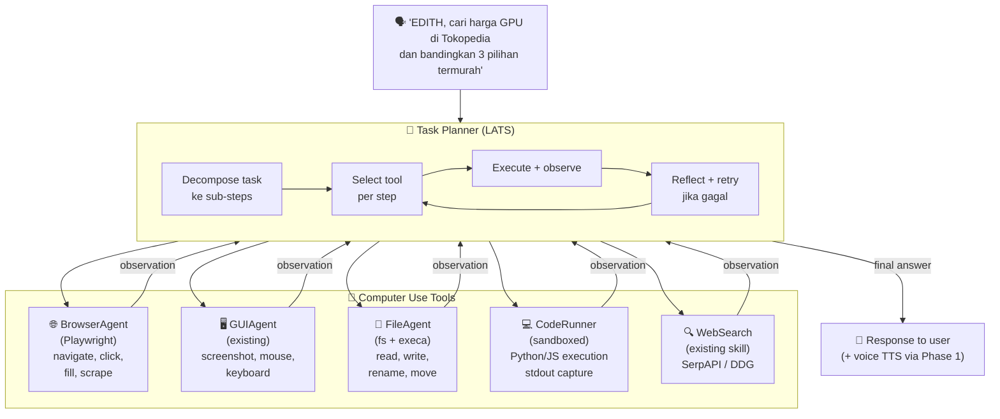
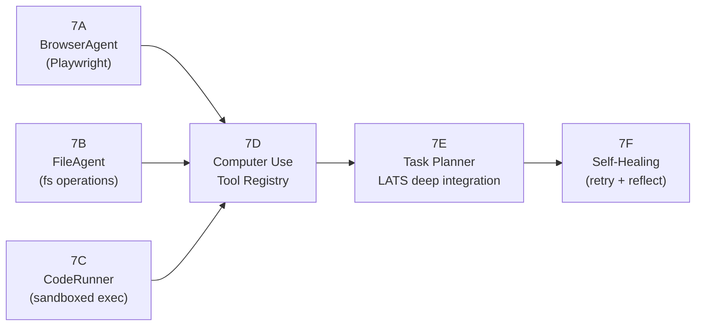
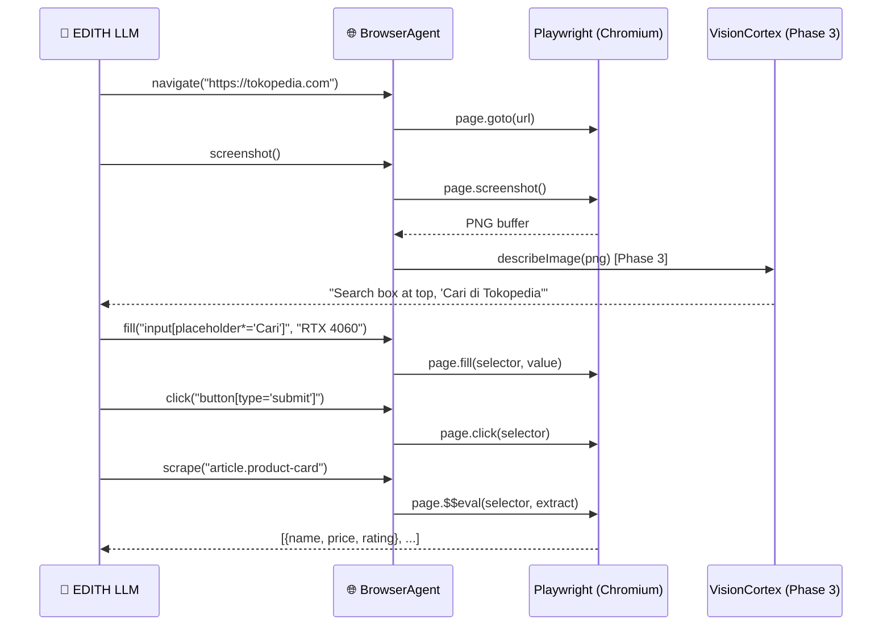
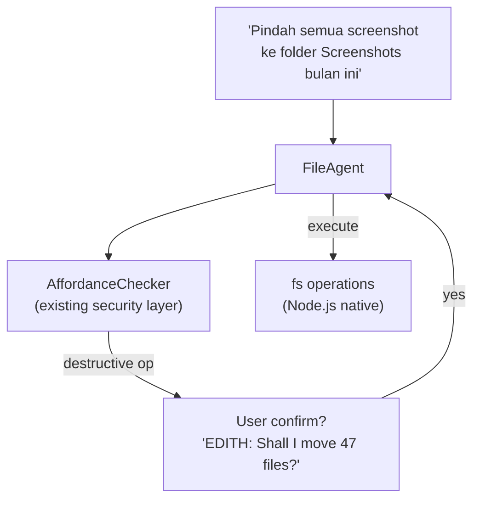

# Phase 7 — Agentic Computer Use (Deep GUI Automation)

**Prioritas:** 🟠 HIGH — Ini yang bikin EDITH beda dari assistant biasa
**Depends on:** Phase 1 (voice), Phase 3 (vision), Phase 6 (macro engine)
**Status Saat Ini:** GUIAgent screenshots + mouse/keyboard ✅ | Browser agent ❌ | Code execution sandbox ❌ | Task planning loop ❌

---

## 1. Tujuan

Jadikan EDITH bisa **benar-benar mengoperasikan komputer** seperti manusia — buka browser, isi form, navigasi file explorer, jalankan code, baca hasil, dan iterasi. Bukan hanya screenshot viewer.



---

## 2. Sub-Phase Breakdown



---

### Phase 7A — BrowserAgent (Playwright)

**Goal:** EDITH bisa buka browser, navigasi URL, klik elemen, isi form, scrape teks, screenshot hasil.

**Research:**
- WebArena (arXiv:2307.13854) — benchmark browser tasks
- SeeAct (arXiv:2401.01614) — GPT-4V + Set-of-Mark for web grounding
- browser-use (GitHub: browser-use/browser-use) — LLM-driven Playwright wrapper



**Tools yang ditambahkan ke tool registry:**
```typescript
navigate(url: string)           // buka URL
click(selector: string)         // klik elemen via CSS selector atau deskripsi
fill(selector: string, text)    // isi input
screenshot()                    // screenshot browser state
scrape(selector: string)        // extract text dari elemen
scroll(direction, amount)       // scroll page
waitForSelector(selector)       // tunggu elemen muncul
executeScript(js: string)       // inject JS ke halaman
```

**edith.json config:**
```json
{
  "computerUse": {
    "browser": {
      "enabled": true,
      "headless": false,
      "executablePath": null,
      "defaultViewport": { "width": 1280, "height": 800 },
      "allowedDomains": [],
      "blockedDomains": ["banking", "payment"]
    }
  }
}
```

**File:** `EDITH-ts/src/agents/tools/browser-agent.ts` (NEW, ~300 lines)
**Dependency:** `pnpm add playwright`

---

### Phase 7B — FileAgent

**Goal:** EDITH bisa baca, tulis, pindah, rename, delete, compress file. Dengan affordance checker (Phase 6 CaMeL) untuk konfirmasi destructive ops.



**Tools:**
```typescript
readFile(path: string)
writeFile(path: string, content: string)
listDir(path: string, recursive?: boolean)
moveFile(src: string, dest: string)        // confirm required
deleteFile(path: string)                   // confirm required
createDir(path: string)
findFiles(pattern: string, dir?: string)   // glob pattern
getFileInfo(path: string)                  // size, mtime, type
```

**File:** `EDITH-ts/src/agents/tools/file-agent.ts` (NEW, ~200 lines)

---

### Phase 7C — CodeRunner (Sandboxed Execution)

**Goal:** EDITH bisa jalankan Python/JavaScript snippet, capture stdout/stderr, dan return hasil ke LLM.

```mermaid
flowchart TD
    Code["code: 'import pandas as pd\ndf = pd.read_csv(\"data.csv\")\nprint(df.describe())'"]
    Runner["CodeRunner"]

    subgraph Sandbox["🔒 Sandbox"]
        T["timeout: 30s"]
        M["memory limit: 256MB"]
        N["no network access"]
        F["restricted fs\n(only /tmp/edith-sandbox/)"]
    end

    Code --> Runner --> Sandbox
    Sandbox -->|"stdout/stderr"| Result["Result back to LLM\n'count: 1000, mean: 42.3...'"]
```

**Sandboxing via `vm2` or Node.js `vm` module + `execa` timeout:**
```typescript
// Python execution
const result = await execa('python3', ['-c', code], {
  timeout: 30_000,
  env: { ...process.env, PYTHONPATH: '/tmp/edith-sandbox' },
  cwd: '/tmp/edith-sandbox',
})
```

**File:** `EDITH-ts/src/agents/tools/code-runner.ts` (NEW, ~150 lines)

---

### Phase 7D — Computer Use Tool Registry

Unified tool registry yang LATS agent bisa query:

```typescript
// EDITH-ts/src/agents/tools/registry.ts
export const COMPUTER_USE_TOOLS = {
  // Existing
  screenshot:      GUIAgent.captureScreen,
  mouseClick:      GUIAgent.click,
  keyboardType:    GUIAgent.type,
  // Phase 7A
  browserNavigate: BrowserAgent.navigate,
  browserClick:    BrowserAgent.click,
  browserScrape:   BrowserAgent.scrape,
  // Phase 7B
  fileRead:        FileAgent.readFile,
  fileWrite:       FileAgent.writeFile,
  fileMove:        FileAgent.moveFile,
  // Phase 7C
  codeRun:         CodeRunner.execute,
  // Existing Phase 6
  triggerMacro:    MacroEngine.run,
}
```

---

### Phase 7E — LATS Deep Integration

`runner.ts` ada tapi shallow. Phase 7E adds proper Computer Use loop:

```mermaid
stateDiagram-v2
    [*] --> PLAN : task received
    PLAN --> ACT : select best tool
    ACT --> OBSERVE : execute tool
    OBSERVE --> REFLECT : process result
    REFLECT --> PLAN : need more steps
    REFLECT --> DONE : task complete
    REFLECT --> ESCALATE : stuck after 3 retries
    ESCALATE --> [*] : ask user for help
    DONE --> [*]

    note right of REFLECT: LLM evaluates:\n- did the action succeed?\n- what changed?\n- what's next?
```

**Max iterations:** Configurable (`computerUse.maxSteps: 20`)
**Research:** LATS (arXiv:2310.04406), ReAct (arXiv:2210.03629), Reflexion (arXiv:2303.11366)

---

### Phase 7F — Self-Healing (Retry + Reflect)

Ketika tool gagal, EDITH coba approach berbeda:

```mermaid
flowchart TD
    Fail["❌ Tool execution failed\n(selector not found,\nnetwork timeout, etc.)"]

    Fail --> Analyze["LLM analyzes failure\nreason + context"]
    Analyze --> Strategy{Retry strategy}

    Strategy -->|"selector changed"| Alt["Try alternative\nselector/approach\n(vision-based grounding)"]
    Strategy -->|"timeout"| Wait["Wait + retry\nwith longer timeout"]
    Strategy -->|"auth required"| Escalate["Escalate to user:\n'Sir, this page requires login'"]
    Strategy -->|"wrong page"| Back["Go back + retry\nfrom previous state"]

    Alt & Wait & Back --> Retry["Retry action"]
    Retry -->|"max 3 times"| Escalate
```



---

## 3. Research References

| Topic | Paper / Source | Key Finding |
|-------|----------------|-------------|
| Browser task benchmark | WebArena arXiv:2307.13854 | 812 realistic web tasks across 6 sites |
| Web agent grounding | SeeAct arXiv:2401.01614 | GPT-4V + Set-of-Mark, 51.1% SR |
| Computer use agent | Anthropic Claude Computer Use (2024) | Screenshot → action → screenshot loop |
| LATS planning | arXiv:2310.04406 | Language Agent Tree Search w/ MCTS |
| ReAct framework | arXiv:2210.03629 | Reason + Act interleaved loop |
| Reflexion | arXiv:2303.11366 | Verbal RL via self-reflection |
| OSWorld grounding | arXiv:2404.07972 | Cross-platform real computer-use benchmark |

---

## 4. File Changes Summary

| File | Action | Est. Lines |
|------|--------|-----------|
| `EDITH-ts/src/agents/tools/browser-agent.ts` | NEW | +300 |
| `EDITH-ts/src/agents/tools/file-agent.ts` | NEW | +200 |
| `EDITH-ts/src/agents/tools/code-runner.ts` | NEW | +150 |
| `EDITH-ts/src/agents/tools/registry.ts` | NEW | +80 |
| `EDITH-ts/src/agents/runner.ts` | Extend LATS loop + tool routing | +150 |
| `EDITH-ts/src/agents/task-planner.ts` | Step decomposition + retry logic | +100 |
| `EDITH-ts/src/config/edith-config.ts` | Add `computerUse` schema | +40 |
| `EDITH-ts/src/agents/__tests__/computer-use.test.ts` | NEW tests | +200 |
| **Total** | | **~1220 lines** |

**New dependencies:**
```bash
pnpm add playwright
pnpm add vm2
```
