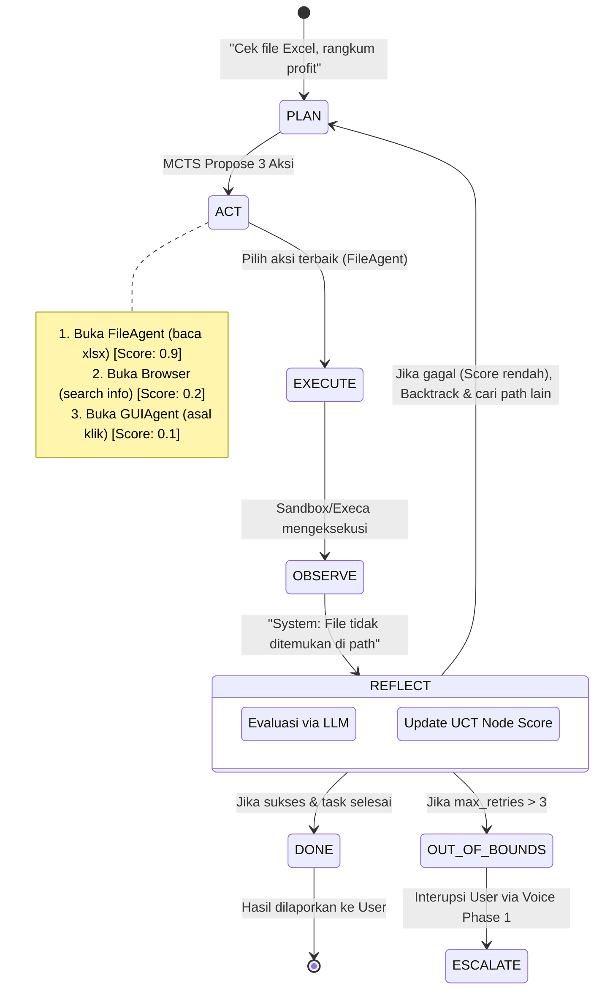
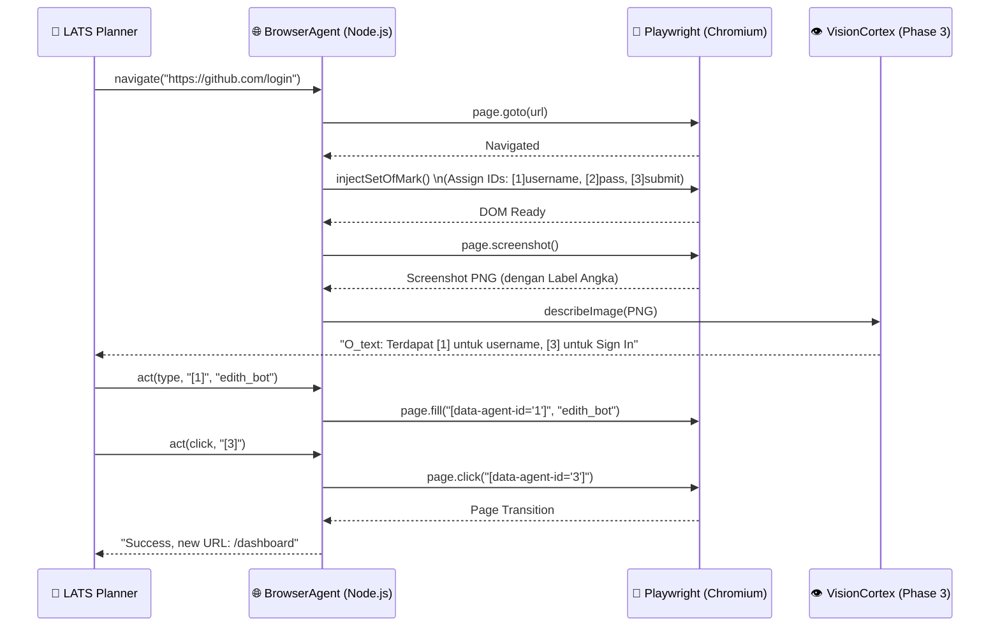
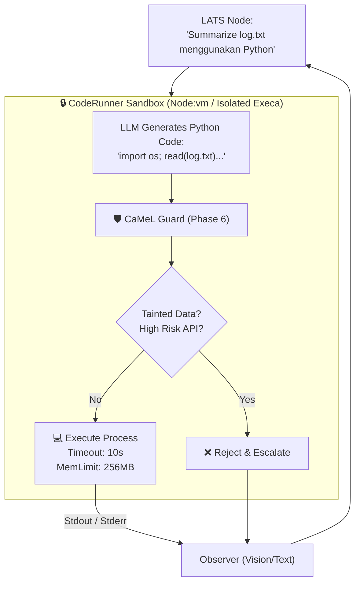

> **CRITICAL REQUIREMENT:** Agent harus selalu membuat clean code, terdokumentasi, dan juga ada komentar. Selalu commit dan push.

# Phase 7 — Agentic Computer Use (Deep GUI Automation)

> "JARVIS, just drop the needle. I don't want to click through 5 menus to play AC/DC."  
> — Tony Stark, Iron Man

**Durasi Estimasi:** 2–3 minggu  
**Prioritas:** 🟠 HIGH — Ini yang membedakan EDITH dari assistant biasa, menjadi autonomous agent yang sejati.  
**Depends on:** Phase 1 (Voice), Phase 3 (Vision), Phase 6 (Macro/Proactive)  
**Status Saat Ini:** GUIAgent screenshots + mouse/keyboard ✅ | Browser agent ❌ | Code execution sandbox ❌ | Task planning loop ❌

---

## 🧠 BAGIAN 0 — FIRST PRINCIPLES THINKING

Tony Stark tidak akan pernah membuat UI dengan 10 tombol tambahan jika AI bisa menguasai mouse dan keyboard-nya langsung dengan efisien. Di sisi lain, Elon Musk akan mem-breakdown "Computer Use" ke tingkat dasar fisikanya (*First Principles*):

**First Principles breakdown:**

```text
MASALAH FUNDAMENTAL:
  Komputer adalah sekumpulan State Machine raksasa.
  UI (User Interface) didesain untuk mata dan tangan manusia, bukan API.
  Membuat integrasi API spesifik untuk setiap aplikasi di desktop itu mustahil (Cost ∞).

SOLUSI YANG OBVIOUS (Elon's Approach):
  Kurangi abstraction layer.
  Agent harus bisa menggunakan antarmuka yang sama persis dengan manusia.
  Agent butuh Sistem Visual (Screen Parsing) dan aktuator mekanik (Mouse/Keyboard emulation).
  Agent butuh loop deterministik: Observe State → Reason → Execute Action.

TONY STARK'S COROLLARY:
  Jangan membuat sistem yang bloatware!
  Eksekusi harus instan, real-time feedback (HUD style).
  Graceful degradation: jika AI bingung, dia mengembalikan kontrol ke user, bukan asal klik.
```

Karena berkesinambungan dengan fase EDITH sebelumnya, *pipeline*-nya adalah:
`User Voice (Phase 1) → Plan (LATS Phase 7) → Execute (CodeAct Phase 7) → Observe (Vision Phase 3) → Reflect (Self-Healing)`

---

## 📚 BAGIAN 1 — RESEARCH PAPERS: FORMULAE & IMPLEMENTATION MAP

> Ini bukan sekadar summary. Ini adalah translasi dari *State-of-the-Art* akademik ke **keputusan engineering konkrit** dalam *codebase* EDITH.

### 1.1 OSWorld — arXiv:2404.07972 (NeurIPS 2024)
**Formalisasi POMDP (Partially Observable Markov Decision Process)**

Paper OSWorld mengevaluasi agen visual pada interaksi OS nyata. Matematika di baliknya mendefinisikan *task* sebagai `(S, O, A, T, R)`:

```text
RUMUS FORMAL POMDP (OSWorld):
S  = state space           → Memori fisik, state filesystem, kernel processes
O  = observation space     → {screenshot, accessibility_tree, OCR_output}
A  = action space          → {click(x,y), type(text), scroll(), hotkey()}
T  = transition function   → T: S × A → S (Sistem berubah state-nya saat aksi dilakukan)
R  = reward function       → 1 jika objektif selesai, 0 jika gagal/timeout

LOOP INTERAKSI EDITH:
t = 0: Agen terima instruksi User dan o₀ ∈ O (Screenshot awal)
loop:
  aₜ   = LLM_Planner.generate(oₜ)       ← Tentukan aksi berdasarkan observasi
  sₜ₊₁ = Exec_Environment(sₜ, aₜ)        ← Komputer merespons aksi (Transition)
  oₜ₊₁ = VisionCortex.observe(sₜ₊₁)      ← Ambil screenshot baru
until: task_complete ATAU t > max_steps (20 steps)
```

**Implikasi ke EDITH TS Code:**
Agen tidak diprogram untuk melacak `S` (state OS sesungguhnya). Semua keputusan *strictly* berdasarkan `O` (observasi visual/teks). `VisionCortex` (Phase 3) menjadi krusial.

---

### 1.2 WebArena & SeeAct — DOM Grounding (arXiv:2401.01614)
**Set-of-Mark (SoM) Visual Prompting**

Model bahasa multikomodal seperti *Gemini 1.5 Pro* sangat buruk memprediksi koordinat `(x,y)` yang akurat pixel-perfect. SeeAct memecahkan ini melalui *Set-of-Mark*.

```text
WEB GROUNDING FORMULA:
daripada VLM(image) → "click at x=450, y=100"
lebih baik VLM(image_with_SoM) → "click element_id=34"

PROSES INJEKSI PLAYWRIGHT DI EDITH:
1. Playwright nge-load halaman web.
2. Inject JS: assign bounding box & unique ID (contoh: [12], [45]) ke semua interactable DOM (a, button, input).
3. VisionCortex membaca layar:
   O_text = "Element [12] is 'Login', Element [45] is 'Search'"
4. LLM Action = click_element("12")
5. Playwright execute: document.querySelector("[data-edith-id='12']").click()
```

**Implikasi ke EDITH TS Code:**
Akan dibuat file `src/agents/tools/browser-agent.ts` yang *meng-inject* skrip CSS/JS untuk memberikan label angka pada tampilan peramban.

---

### 1.3 CodeAct — ICML 2024 (arXiv:2402.01030)
**Executable Code Actions vs JSON Outputs**

Bagaimana agen berinteraksi? Kebanyakan agen lama memakai JSON: `{"action": "click", "target": "submit"}`. *CodeAct* membuktikan bahwa mengeksekusi *raw code* Python/JS jauh lebih kuat karena *Turing-complete*.

```text
CODEACT SELF-DEBUGGING MATRIKS:
Agen men-generate kode eksekusi:
  element = driver.find("[12]")
  element.click()

Jika Interpreter mengeluarkan Error E:
  if E != None:
    LLM_Observe(E) → "Error: Element [12] is strictly hidden by overlay"
    LLM_Generate_Fix() → "driver.execute_script('document.querySelector(\".overlay\").remove()')"
```

**Implikasi ke EDITH TS Code:**
Phase 7 mendelegasikan environment *sandbox* di `src/agents/tools/code-runner.ts` (pakai Node `vm` atau `execa` isolated).

---

### 1.4 LATS (Language Agent Tree Search) — arXiv:2310.04406
**The Brain / Task Planner**

LATS menggabungkan *Reasoning* (CoT), *Acting* (ReAct), dan *Planning* (MCTS). Jika menemui jalan buntu, agen bisa mundur (*backtrack*) ke *state* sebelumnya.

```text
UPPER CONFIDENCE BOUND (UCT) FORMULA UNTUK NODE SELECTION:
UCT(v) = Q(v)/N(v) + c * sqrt(ln(N(v_parent)) / N(v))

dimana:
Q(v) = Total value (score LLM reflection) dari node v
N(v) = Berapa kali node v dikunjungi
c    = Konstanta eksplorasi (biasanya 1.414)

EDITH IMPLEMENTATION (LATS Planner):
- Setiap observasi (Screenshot baru) adalah sebuah Node di Tree.
- LLM mem-propose 3 kemungkinan aksi (Expand).
- Pilih aksi dengan skor probabilitas keberhasilan tertinggi (UCT).
- Jika aksi menghasilkan Error (Reflect score = 0), Node di-prune, sistem mencoba aksi ke-2.
```

---

## 🏗️ BAGIAN 2 — BLUEPRINT ARSITEKTUR KOMPUTER

Diagram berikut membedah secara menyeluruh setiap pergerakan data.

### 2.1 The Grand LATS Execution Loop (Self-Healing Planner)

Ini adalah otak utama Phase 7. Berfungsi di `src/agents/lats-planner.ts`.



### 2.2 BrowserAgent Architecture (Playwright + SoM)

Ini rincian eksekusi jika agen memilih membuka web. Terletak di `src/agents/tools/browser-agent.ts`.



### 2.3 FileAgent & CodeRunner Sandbox (CaMeL Guarded)

Ini rincian untuk menjalankan skrip lokal dan manajemen file yang sudah di-guard oleh keamanan Phase 6. Terletak di `src/agents/tools/code-runner.ts`.



---

## ⚙️ BAGIAN 3 — SPESIFIKASI FILE & KONTRAK IMPLEMENTASI

### 3.1 Kontrak Config (edith.json)
Sesuai constraint Tony Stark, tidak boleh ada pengaturan hard-code. Semua harus dari UI Onboarding.

```json
{
  "computerUse": {
    "enabled": true,
    "strategy": "LATS", 
    "maxTaskRetries": 3,
    "browser": {
      "engine": "playwright",
      "executablePath": null,     // null = auto
      "injectSetOfMark": true,
      "blockedDomains": ["bank", "paypal", "crypto"]
    },
    "sandbox": {
      "engine": "process_isolation",
      "memoryLimitMb": 256,
      "timeoutMs": 15000
    }
  }
}
```

### 3.2 Alur File Modification
| Modul | File Path | Estimasi Baris | Tanggung Jawab |
|---|---|---|---|
| **Browser Execution** | `src/agents/tools/browser-agent.ts` | ~350 baris | Membungkus Playwright, injeksi DOM JS (SoM), navigasi. |
| **Code Isolation** | `src/agents/tools/code-runner.ts` | ~150 baris | `execa` dengan timeout, env isolation, pencegahan network. |
| **File FS Safe** | `src/agents/tools/file-agent.ts` | ~120 baris | Pembacaan/penulisan file, di-wrap dengan izin CaMeL guard. |
| **Planning Brain** | `src/agents/lats-planner.ts` | ~400 baris | Mengimplementasi formula UCT MCTS, memory state tree, backtrack logic. |
| **Tool Registry** | `src/agents/tools/index.ts` | ~100 baris | Registerisasi *tools* dengan deskripsi detail untuk LLM Prompting. |

### 3.3 Acceptance Gates (Definition of Done)
1. LATS Tracker harus dapat menunjukkan *pruning* node. Jika skrip *CodeRunner* error (stderr terdeteksi), agen tidak *crash*, melainkan menulis log *"Attempt Failed, retrying with new logic"*, lalu memperbaiki kodenya.
2. *BrowserAgent* harus bisa login ke sebuah website simulasi tanpa menggunakan metode *coordinate clicking* lama (Phase 3 asli), melainkan wajib menggunakan *Set-of-Mark ID injected by Playwright*.
3. Sistem mendengarkan *CaMeL Guard (Phase 6)*. Jika LATS men-generate perintah `rm -rf` atau akses `blockedDomains`, *Tool Exec* langsung diblokir sebelum mencapai sistem OS.
4. > **CRITICAL REQUIREMENT:** Agent selalu membuat clean code, terdokumentasi, dan ada komentar, selalu komit, dan push ke repo. Semua kodingan TypeScript mematuhi aturan linting dan testing (`src/agents/__tests__/lats-planner.test.ts` wajib pass).

> *"We are building an agent that doesn't just look at the screen, it understands the operating system physics."*
