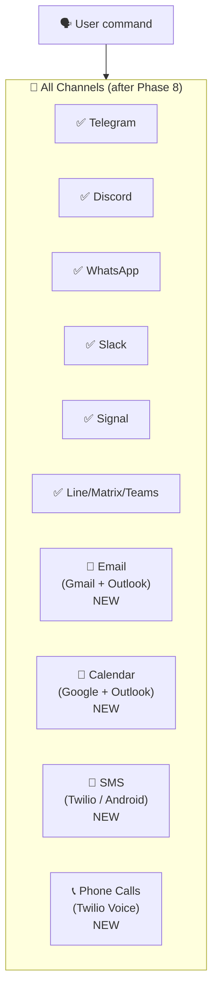
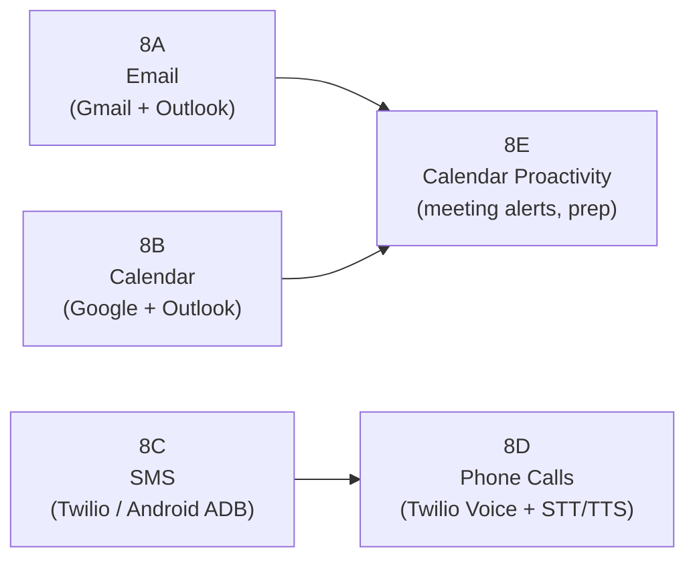
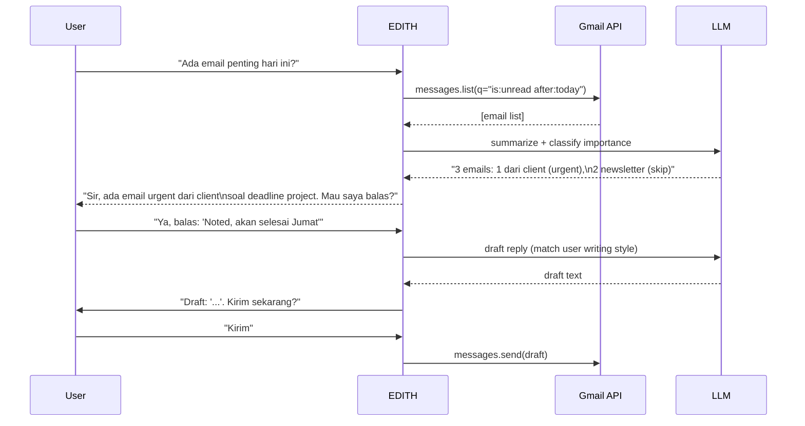
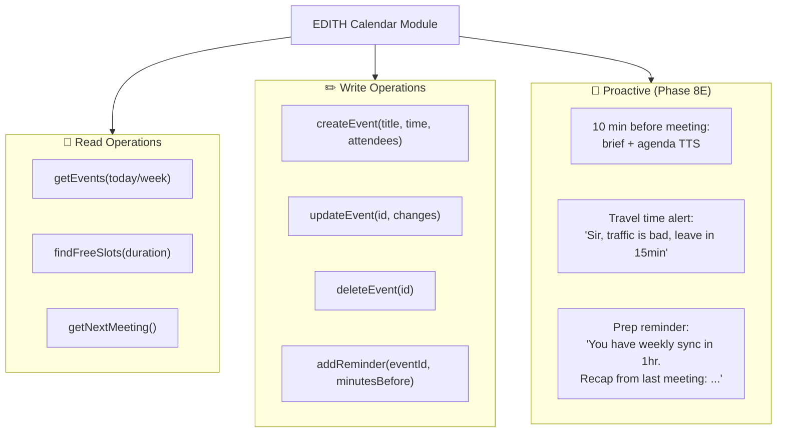
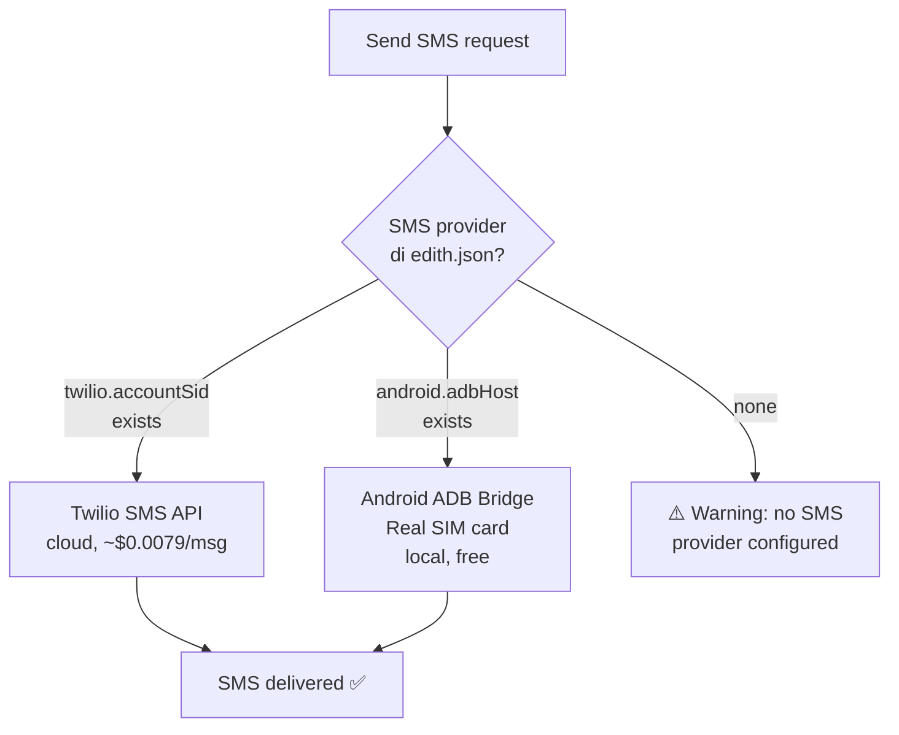
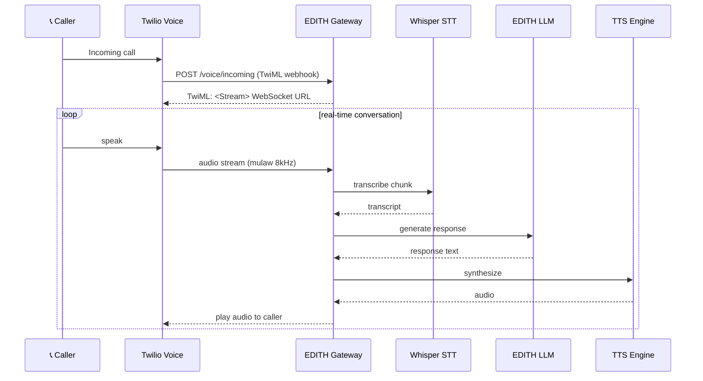
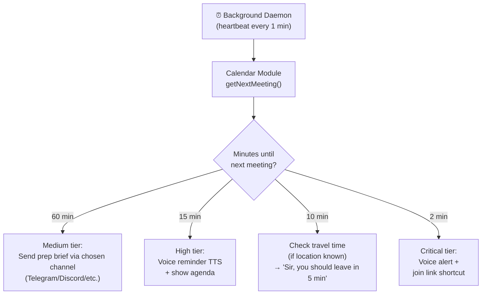

# Phase 8 — Extended Channels (Email, Calendar, SMS, Phone Calls)

**Prioritas:** 🟡 MEDIUM-HIGH — Lengkapi EDITH sebagai communication hub
**Depends on:** Phase 1 (voice untuk phone calls), Phase 6 (notifications)
**Status Saat Ini:** Telegram/Discord/WhatsApp/Signal/Slack/LINE/Matrix/Teams ✅ | Email ❌ | Calendar ❌ | SMS ❌ | Phone Calls ❌

---

## 1. Tujuan

EDITH saat ini bisa chat via 9+ messaging platforms tapi **tidak bisa email, SMS, atau telepon**. Phase ini menjadikan EDITH sebagai komunikasi hub yang benar-benar komprehensif — seperti JARVIS yang bisa "Email Ms. Potts" atau "Call the Pentagon."



---

## 2. Sub-Phase Breakdown



---

### Phase 8A — Email (Gmail + Outlook)

**Goal:** EDITH bisa baca, kirim, search, dan summarize email.



**Providers:** Gmail API (OAuth2) + Microsoft Graph API (Outlook/Office365)

**edith.json config:**
```json
{
  "env": {
    "GMAIL_CLIENT_ID": "...",
    "GMAIL_CLIENT_SECRET": "...",
    "GMAIL_REFRESH_TOKEN": "...",
    "OUTLOOK_CLIENT_ID": "...",
    "OUTLOOK_CLIENT_SECRET": "...",
    "OUTLOOK_REFRESH_TOKEN": "..."
  },
  "channels": {
    "email": {
      "enabled": true,
      "provider": "gmail",
      "checkIntervalMinutes": 15,
      "importanceFilter": "high",
      "autoSummarize": true,
      "draftBeforeSend": true
    }
  }
}
```

**File:** `EDITH-ts/src/channels/email.ts` (NEW, ~250 lines)
**Dependency:** `pnpm add googleapis @microsoft/microsoft-graph-client`

---

### Phase 8B — Calendar Integration

**Goal:** EDITH tahu jadwal user, bisa buat event, beri reminder proaktif sebelum meeting.



**File:** `EDITH-ts/src/channels/calendar.ts` (NEW, ~200 lines)

---

### Phase 8C — SMS (Twilio + Android ADB fallback)

**Self-hosted path:** Untuk SMS tanpa Twilio, bisa pakai Android phone yang connected via ADB sebagai SMS gateway — truly free, no API needed.



**Android ADB SMS (fully self-hosted):**
```typescript
// Send SMS via connected Android phone — no API cost
await execa('adb', ['shell', 'am', 'start',
  '-a', 'android.intent.action.SENDTO',
  '-d', `sms:${phoneNumber}`,
  '--es', 'sms_body', message,
  '--ez', 'exit_on_sent', 'true',
])
```

**edith.json config:**
```json
{
  "env": {
    "TWILIO_ACCOUNT_SID": "optionali jika mau Twilio",
    "TWILIO_AUTH_TOKEN": "...",
    "TWILIO_PHONE_NUMBER": "+1..."
  },
  "channels": {
    "sms": {
      "enabled": true,
      "provider": "auto",
      "android": {
        "adbHost": "127.0.0.1",
        "adbPort": 5037
      }
    }
  }
}
```

**File:** `EDITH-ts/src/channels/sms.ts` (NEW, ~150 lines)

---

### Phase 8D — Phone Calls (Twilio Voice)

**Goal:** EDITH bisa menerima dan melakukan telepon dengan **real-time STT + TTS bridge** — user bicara di phone, EDITH jawab via LLM, text-to-speech ke caller.



**Self-hosted alternative:** Tanpa Twilio, bisa pakai **FreePBX + Asterisk (VoIP)** sebagai self-hosted phone server, EDITH connect via SIP. Gratis, no per-call cost.

**edith.json config:**
```json
{
  "env": {
    "TWILIO_ACCOUNT_SID": "...",
    "TWILIO_AUTH_TOKEN": "..."
  },
  "channels": {
    "voice": {
      "enabled": false,
      "provider": "twilio",
      "webhookUrl": "https://your-edith-server/voice",
      "selfHosted": {
        "sip": {
          "enabled": false,
          "server": "sip.local:5060",
          "username": "edith",
          "password": ""
        }
      }
    }
  }
}
```

**File:** `EDITH-ts/src/channels/phone.ts` (NEW, ~200 lines)
**Dependency:** `pnpm add twilio` (optional, only if using Twilio)

---

### Phase 8E — Calendar Proactivity

Integrasikan dengan Phase 1E proactivity framework:



---

## 3. File Changes Summary

| File | Action | Est. Lines |
|------|--------|-----------|
| `EDITH-ts/src/channels/email.ts` | NEW | +250 |
| `EDITH-ts/src/channels/calendar.ts` | NEW | +200 |
| `EDITH-ts/src/channels/sms.ts` | NEW | +150 |
| `EDITH-ts/src/channels/phone.ts` | NEW | +200 |
| `EDITH-ts/src/config/edith-config.ts` | Add email/calendar/sms/phone schema | +60 |
| `EDITH-ts/src/background/triggers.ts` | Calendar proactivity triggers | +80 |
| `EDITH-ts/src/channels/__tests__/email.test.ts` | NEW | +100 |
| **Total** | | **~1040 lines** |

**New deps (all optional):**
```bash
pnpm add googleapis                          # Gmail + Google Calendar
pnpm add @microsoft/microsoft-graph-client  # Outlook + Office 365
pnpm add twilio                             # Phone calls + SMS (optional)
```
