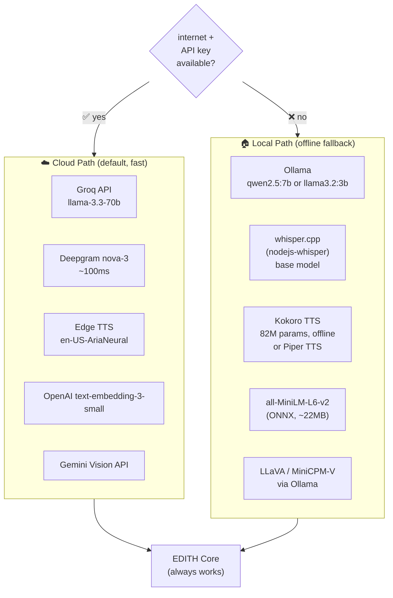
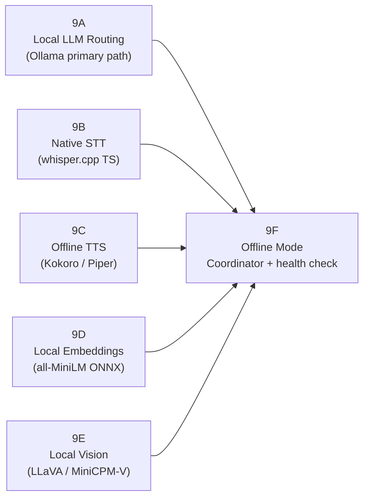
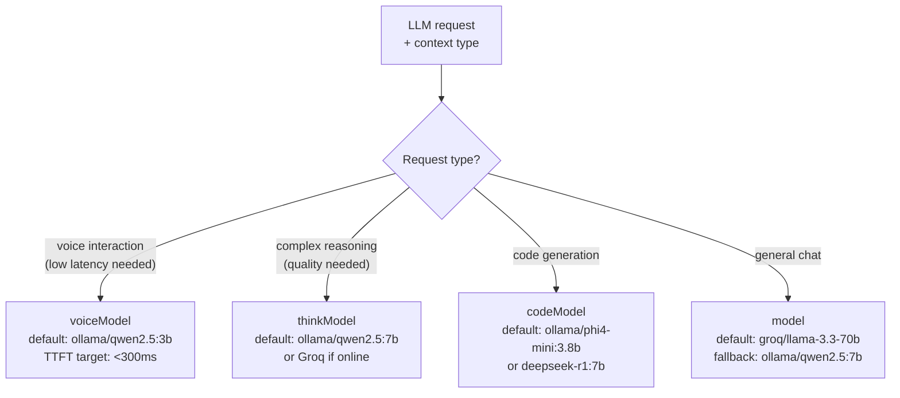
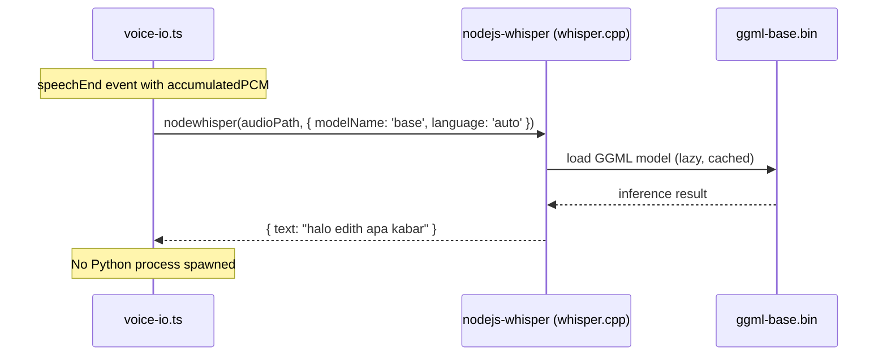
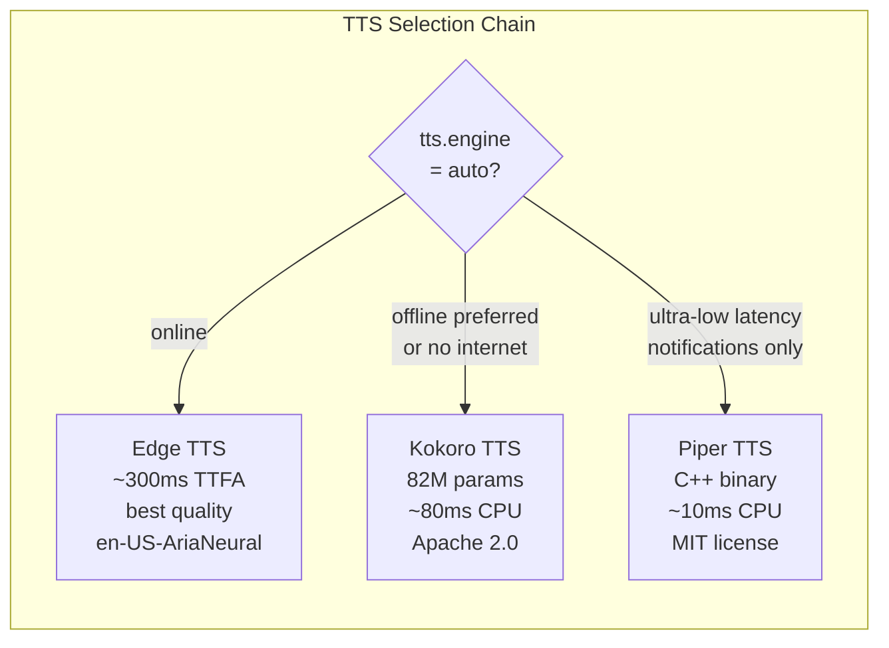
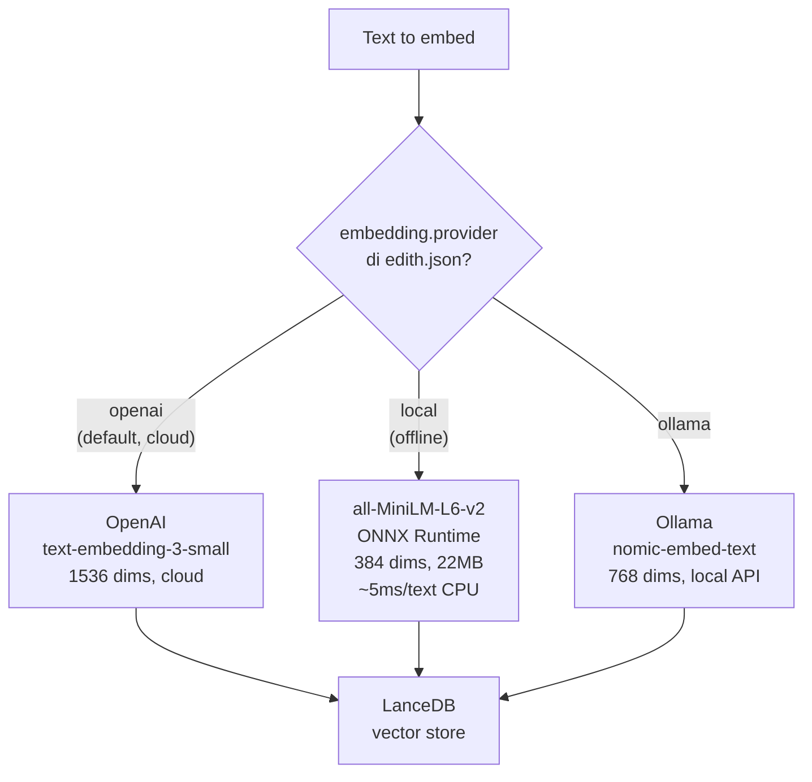
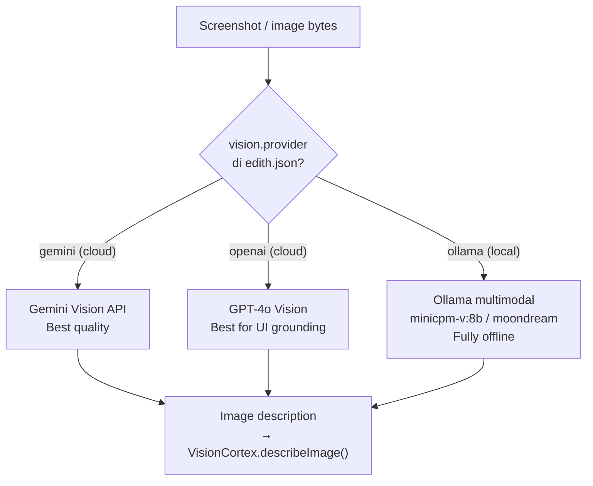
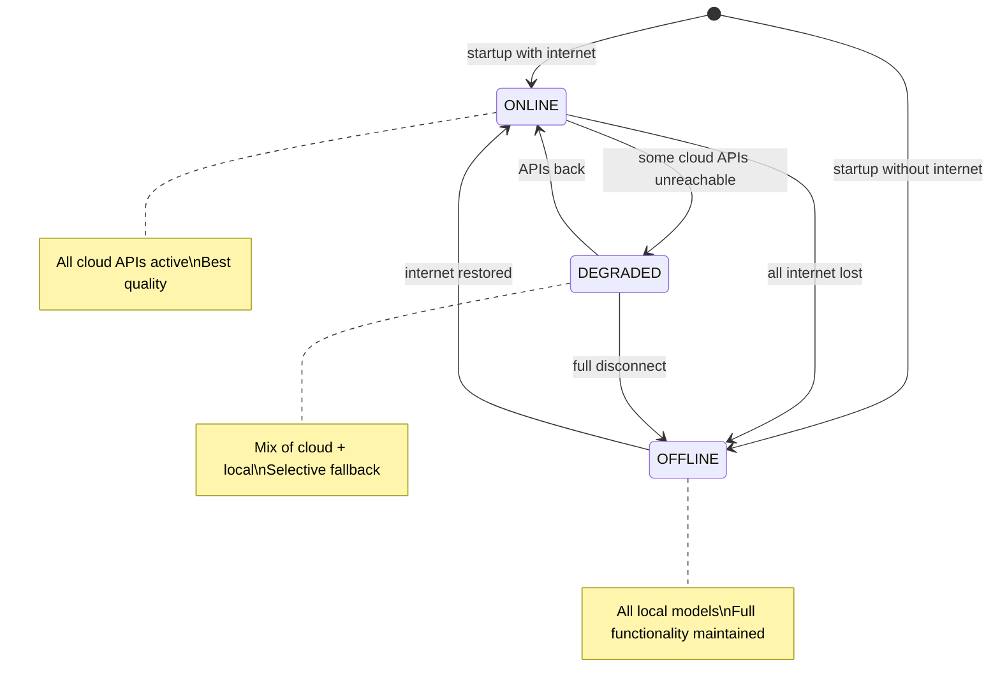
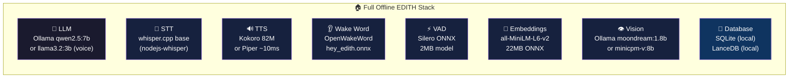

# Phase 9 — Full Offline / Self-Hosted Mode (Zero-Cloud)

**Prioritas:** 🔴 HIGH — Core goal: EDITH harus bisa jalan 100% tanpa internet
**Depends on:** Phase 1 (voice), Phase 3 (vision)
**Status Saat Ini:** 100% cloud-dependent (Groq, Edge TTS, Deepgram, dsb.) | Local LLM (Ollama) ✅ ada tapi belum jadi primary path | Zero-cloud mode ❌

---

## 1. Tujuan

Setiap komponen EDITH punya **local fallback** — sehingga saat internet mati, EDITH tetap berfungsi penuh. "EDITH offline mode" = JARVIS di bunker tanpa internet.



---

## 2. Sub-Phase Breakdown



---

### Phase 9A — Local LLM Routing (Ollama as Primary)

**Goal:** Jadikan Ollama bukan sekedar fallback tapi configurable sebagai **primary LLM provider** dengan model selection per use case.

**Model tiers untuk EDITH:**

```mermaid
quadrantChart
    title Local Model Selection (Speed vs Quality)
    x-axis Low Quality --> High Quality
    y-axis Slow --> Fast
    quadrant-1 "Best for voice"
    quadrant-2 "Too slow for voice"
    quadrant-3 "Not good enough"
    quadrant-4 "Best balance"
    llama3.2:3b: [0.55, 0.90]
    qwen2.5:3b: [0.60, 0.88]
    qwen2.5:7b: [0.75, 0.65]
    llama3.1:8b: [0.72, 0.60]
    gemma3:4b: [0.62, 0.80]
    mistral:7b: [0.68, 0.62]
    deepseek-r1:7b: [0.80, 0.45]
    phi4-mini:3.8b: [0.65, 0.78]
```

**Config routing logic:**



**edith.json:**
```json
{
  "llm": {
    "provider": "auto",
    "model": "groq/llama-3.3-70b-versatile",
    "voiceModel": "ollama/qwen2.5:3b",
    "thinkModel": "ollama/qwen2.5:7b",
    "codeModel": "ollama/phi4-mini:3.8b",
    "offlineMode": false,
    "ollama": {
      "baseUrl": "http://localhost:11434",
      "keepAlive": "10m",
      "numCtx": 4096
    }
  }
}
```

**File:** `EDITH-ts/src/engines/orchestrator.ts` — extend routing logic ~+80 lines

---

### Phase 9B — Native STT: whisper.cpp (TypeScript Native)

**Goal:** Ganti Python subprocess untuk STT dengan `nodejs-whisper` — bindings langsung ke whisper.cpp. **No Python required.**



**Model download size:**
| Model | Disk | RAM | Latency (5s audio, CPU) |
|-------|------|-----|------------------------|
| tiny | 75 MB | 273 MB | ~0.3s |
| base | 142 MB | 388 MB | ~0.5s ← **recommended** |
| small | 466 MB | 852 MB | ~1.2s |

**Bahasa Indonesia support:** Whisper `base` supports `id` language with reasonable accuracy. Use `language: "auto"` untuk auto-detect.

**Files:** `EDITH-ts/src/voice/providers.ts` — add `whisperCpp` provider option
**Dependency:** `pnpm add nodejs-whisper`

---

### Phase 9C — Offline TTS: Kokoro + Piper

**Goal:** Dua level offline TTS — Kokoro untuk kualitas, Piper untuk ultra-low latency.



**Kokoro Python sidecar integration** (tambahan ke voice.py existing):
```python
# python/delivery/voice.py — add alongside existing pipeline
from kokoro import KPipeline
_kokoro_pipeline = None

def get_kokoro():
    global _kokoro_pipeline
    if _kokoro_pipeline is None:
        _kokoro_pipeline = KPipeline(lang_code='a')
    return _kokoro_pipeline

def synthesize_offline(text: str, voice: str = 'af_heart') -> bytes:
    pipeline = get_kokoro()
    audio, sr = pipeline(text, voice=voice, speed=1.0)
    # returns raw PCM bytes at 24kHz
    return audio.tobytes()
```

**Piper setup (Windows/Linux/Mac binary):**
```bash
# Download piper binary + voice model
curl -L https://github.com/rhasspy/piper/releases/latest/download/piper_windows_amd64.zip -o piper.zip
unzip piper.zip -d tools/piper/
# Voice model (en, high quality, ~65MB)
curl -L .../en_US-lessac-high.onnx -o models/piper-en.onnx
```

```typescript
// Integration in EdgeEngine or new OfflineTTSEngine
await execa('tools/piper/piper', [
  '--model', 'models/piper-en.onnx',
  '--output_file', '/tmp/edith-tts.wav',
], { input: text })
```

---

### Phase 9D — Local Embeddings (all-MiniLM ONNX)

**Goal:** Ganti `text-embedding-3-small` (OpenAI API, needs internet) dengan model ONNX lokal untuk vector search di memory.

**Model:** `all-MiniLM-L6-v2` (sentence-transformers) — 22MB, 384 dims, MIT license



**Note:** Dimensi berbeda (384 vs 1536) — perlu migration atau separate index per provider. Gunakan `embeddings.dimension` di config untuk handle ini.

**Dependency:** `pnpm add @xenova/transformers` — runs ONNX models via Hugging Face Transformers.js

**File:** `EDITH-ts/src/memory/store.ts` — add local embedding provider path ~+60 lines

---

### Phase 9E — Local Vision (LLaVA / MiniCPM-V via Ollama)

**Goal:** Ganti Gemini Vision API dengan local multimodal LLM untuk `describeImage()`.

**Models via Ollama:**
| Model | Size | Quality | VRAM |
|-------|------|---------|------|
| `llava:7b` | 4.7 GB | Good | 6 GB |
| `llava:13b` | 8.0 GB | Better | 10 GB |
| `minicpm-v:8b` | 5.5 GB | Best (OCR+detail) | 8 GB |
| `moondream:1.8b` | 1.1 GB | Basic | 2 GB ← **low-spec recommended** |



**File:** `EDITH-ts/src/os-agent/vision-cortex.ts` — implement `describeImage()` with provider routing (currently a stub!) ~+80 lines
**Dependency:** Already have Ollama in engine (just need base64 image support in the Ollama adapter)

---

### Phase 9F — Offline Mode Coordinator

Central health checker yang monitor semua services dan route ke offline alternatives:



```typescript
// EDITH-ts/src/core/offline-coordinator.ts (NEW)
export class OfflineCoordinator {
  private status: 'online' | 'degraded' | 'offline' = 'online'

  async checkConnectivity(): Promise<void> {
    const checks = await Promise.allSettled([
      this.pingGroq(),
      this.pingDeepgram(),
      this.pingEdgeTTS(),
    ])
    // Update status + emit event for re-routing
  }

  getProvider(type: 'llm' | 'stt' | 'tts' | 'embed'): string {
    if (this.status === 'offline') return this.localProviders[type]
    return this.config[type].preferred
  }
}
```

**TTS/STT/LLM availability dashboard va EDITH voice:**
```
"Sir, Groq API is currently unreachable.
 Switching to local Ollama (qwen2.5:3b) for this session.
 All features remain available."
```

---

## 3. Self-Hosted Stack Overview



**Minimum hardware untuk full offline:**
| Component | Minimum | Recommended |
|-----------|---------|-------------|
| RAM | 8 GB | 16 GB |
| VRAM | 0 GB (CPU only) | 6 GB GPU |
| Storage | 8 GB | 20 GB |
| CPU | i5/Ryzen 5 | i7/Ryzen 7 |

---

## 4. File Changes Summary

| File | Action | Est. Lines |
|------|--------|-----------|
| `EDITH-ts/src/engines/orchestrator.ts` | Route by request type + offline fallback | +80 |
| `EDITH-ts/src/voice/providers.ts` | Add whisperCpp provider | +60 |
| `EDITH-ts/src/voice/bridge.ts` | Offline TTS chain (Kokoro/Piper) | +80 |
| `EDITH-ts/src/memory/store.ts` | Local embedding provider | +60 |
| `EDITH-ts/src/os-agent/vision-cortex.ts` | Implement describeImage() with Ollama | +80 |
| `EDITH-ts/src/core/offline-coordinator.ts` | NEW — health check + routing | +150 |
| `EDITH-ts/src/config/edith-config.ts` | offlineMode, voiceModel, localModel schemas | +50 |
| `python/delivery/voice.py` | Add Kokoro TTS synthesize_offline() | +40 |
| `EDITH-ts/src/__tests__/offline.test.ts` | NEW — offline mode tests | +100 |
| **Total** | | **~700 lines** |

**New deps:**
```bash
pnpm add nodejs-whisper          # whisper.cpp TS native STT
pnpm add @xenova/transformers    # local ONNX embeddings
pip install kokoro soundfile     # offline TTS (Python sidecar)
# piper — binary download, no npm package
```
